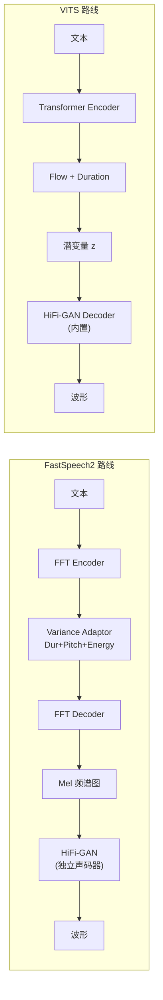
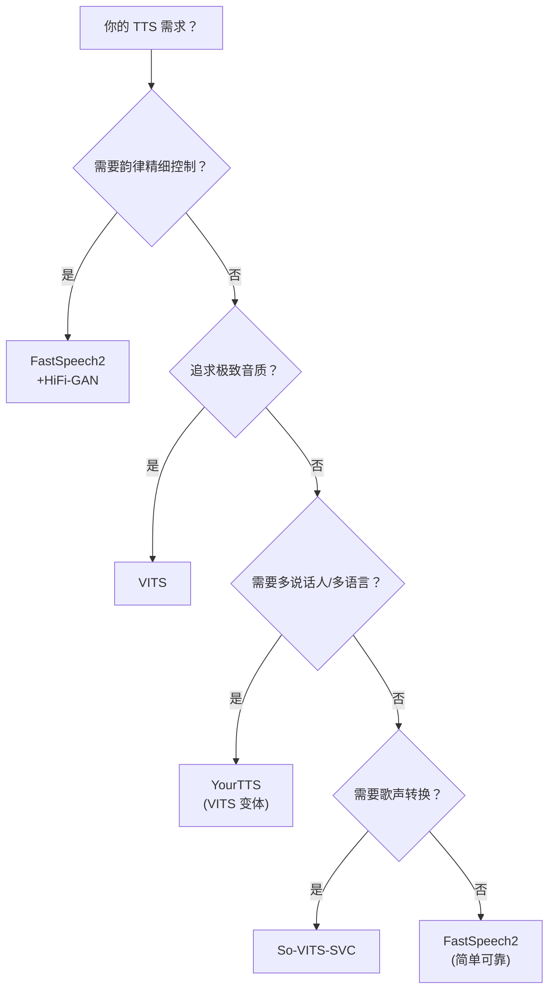

## 定位

> 架构理念、训练复杂度、推理速度、音质、可控性、适用场景的系统对比

---

## 1. 架构理念对比

---

## 2. 全方位对比矩阵

|**维度**|**FastSpeech2 + HiFi-GAN**|**VITS**|**胜出**|
|---|---|---|---|
|**MOS 音质**|~3.8 (Mel mismatch)|**~4.4 (端到端)**|VITS|
|**推理速度**|快 (声学) + 快 (声码器)|**更快 (单模型)**|VITS|
|**Pitch 可控**|**显式 Pitch Predictor**|无（隐式在 z 中）|FastSpeech2|
|**Energy 可控**|**显式 Energy Predictor**|无|FastSpeech2|
|**Duration 可控**|**确定性 Duration**|随机 Duration（SDP）|各有优势|
|**训练复杂度**|简单（MSE 损失）|复杂（ELBO+GAN+Flow）|FastSpeech2|
|**模块可替换**|**声码器可独立升级**|需整体重训|FastSpeech2|
|**韵律多样性**|确定性（同输入同输出）|**随机性（同输入不同输出）**|VITS|
|**生态成熟度**|极高（ESPnet等）|高（VITS/so-vits-svc）|FastSpeech2|

---

## 3. 选型决策树

> [!important]
> 
> **思辨：2024+ 还该选 VITS / FastSpeech2 吗？**
> 
> 随着 LLM-based TTS（VALL-E / CosyVoice / F5-TTS）的兴起，VITS 和 FastSpeech2 在**零样本能力**上已被超越。但它们仍有不可替代的价值：
> 
> - **FastSpeech2**：训练简单、可控性强，适合**定制化单说话人 TTS**（如语音助手、导航播报）
> 
> - **VITS**：MOS 高、推理快，适合**高质量单/少说话人 TTS**，且是 So-VITS-SVC 等歌声转换系统的基础架构
> 
> **不要追新而忘旧**——在不需要零样本能力的场景，这两个「经典」系统仍是性价比最高的选择。

[[5.1 架构理念与设计哲学对比]]

[[5.2 训练与工程实践对比]]

[[5.3 适用场景与选型指南]]