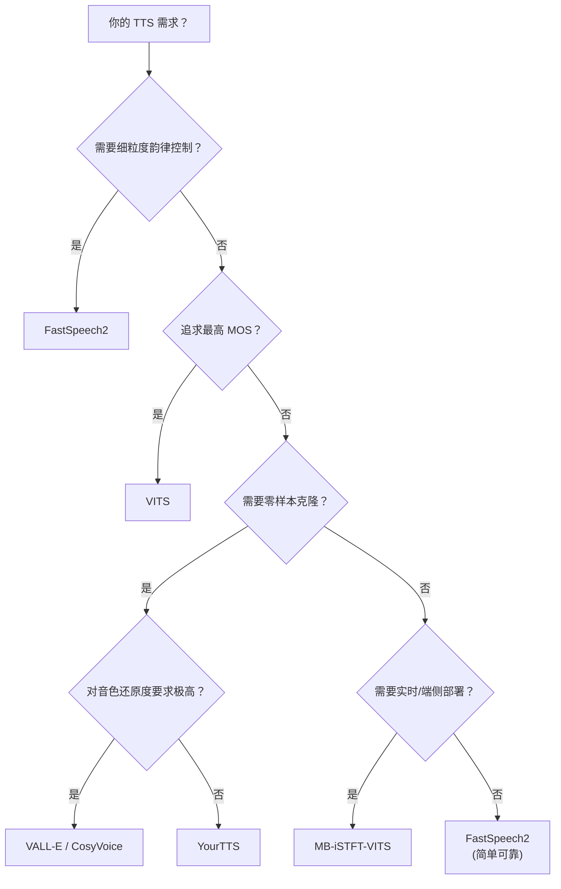

## 定位

> 不同应用场景下的最佳选择、决策矩阵、未来趋势

---

## 1. 场景决策矩阵

|**场景**|**推荐方案**|**理由**|
|---|---|---|
|语音助手 / 导航|**FastSpeech2**|可控性强，语速/音高可调|
|有声书朗读|**FastSpeech2**|需要精细韵律控制|
|高质量单说话人 TTS|**VITS**|MOS 最高，推理快|
|歌声转换 (SVC)|**So-VITS-SVC**|VITS 架构天然适合|
|多说话人/多语言|**YourTTS**|零样本能力 + VITS 底座|
|零样本语音克隆|**VALL-E / CosyVoice**|LLM 路线零样本更强|
|端侧轻量部署|**MB-iSTFT-VITS**|3 倍加速，质量损失可忽略|

> [!important]
> 
> **思辨：2024+ 的大趋势。** LLM-based TTS（VALL-E / CosyVoice / F5-TTS）正在定义新范式，但 VITS 和 FastSpeech2 并不会消亡。它们在**不需要零样本能力**的垂直场景（定制单说话人、SVC、嵌入式部署）中仍然是性价比最高的选择。技术选型的关键不是追求最新，而是**匹配需求**。