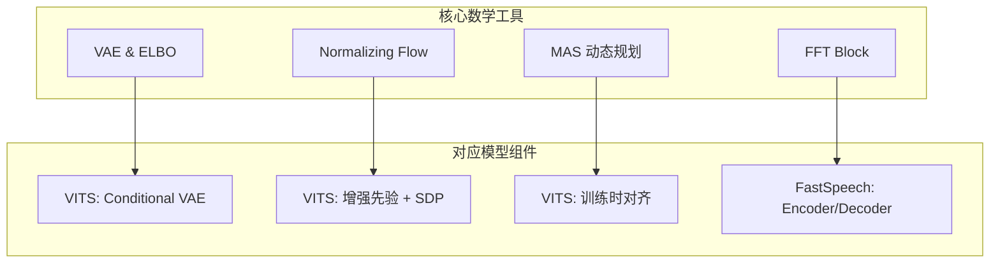

## 定位

> VITS 和 FastSpeech 共享的数学基础：VAE、Normalizing Flow、MAS、FFT Block

---

## 1. 数学工具与模型对应

---

## 2. 难度层级

|**概念**|**难度**|**前置知识**|**用于**|
|---|---|---|---|
|FFT Block|⭐⭐|Transformer 基础|FastSpeech|
|VAE & ELBO|⭐⭐⭐|概率论、变分推断|VITS 核心|
|Normalizing Flow|⭐⭐⭐⭐|Jacobian 行列式|VITS 先验增强|
|MAS|⭐⭐⭐|动态规划|VITS 对齐|

---

## 子页面

[[6.1 VAE 与 ELBO 数学基础]]

[[6.2 Normalizing Flow 数学基础]]

[[6.3 MAS 动态规划对齐]]

[[6.4 FFT Block 与 Transformer 在 TTS 中的应用]]