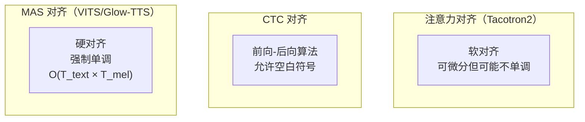

## 定位

> MAS 的数学定义、动态规划算法、与 CTC/Attention 对齐的对比

---

## 1. 对齐问题定义

TTS 中文本和音频的对齐是**单调的**（文本从左到右对应音频从前到后）。MAS 利用这个先验：

$$A^* = \arg\max_{A \in \mathcal{A}_{\text{mono}}} \sum_{j=1}^{T_{\text{mel}}} \log p(z_j | c_{A(j)})$$

其中 $\mathcal{A}_{\text{mono}}$ 是所有单调对齐路径的集合。

---

## 2. 三种对齐方式对比

|**对齐方式**|**单调性**|**硬/软**|**用于**|
|---|---|---|---|
|Attention|不保证|软对齐|Tacotron2|
|CTC|不保证|软对齐|ASR|
|**MAS**|**强制保证**|**硬对齐**|**VITS, Glow-TTS**|

> [!important]
> 
> **思辨：MAS 是「硬对齐」，不可微分，为什么能训练？** MAS 本身在 no_grad 中执行，不参与反向传播。它的作用是**提供对齐监督信号**（给 Duration Predictor 和 KL 损失）。梯度通过 KL 损失传回 Text Encoder 和 Flow，而 MAS 只是每步重新计算最优对齐。这种**交替优化**（固定对齐优化模型，固定模型优化对齐）是 EM 算法的变体。