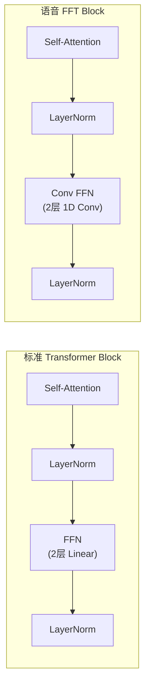

## 定位

> FastSpeech 的 FFT Block 设计、TTS 中 Transformer 的变体、与原版的差异

---

## 1. FFT Block vs 标准 Transformer

关键区别：FFN 用 **1D Conv** 替代 **Linear**，引入局部感受野，更适合语音的序列连续性。

> [!important]
> 
> **思辨：TTS 中的 Transformer 为什么层数较少？** NLP 中的 Transformer（BERT/GPT）通常 12-96 层，但 FastSpeech 只用 4 层，VITS 用 6 层。原因：(1) TTS 的输入序列较短（几十个音素 vs 几百个 token）；(2) 音素间的依赖关系较简单（主要是局部连续性）；(3) TTS 的主要复杂度在 Decoder 和对齐，而非文本编码。