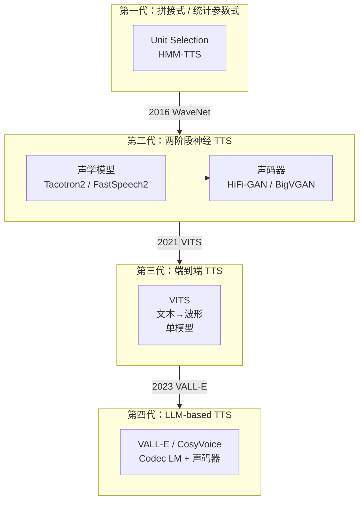

## 前置知识

> [!important]
> 
> 阅读本页前建议了解：基本的 TTS 概念（文本→语音）、深度学习基础（Encoder-Decoder、Attention）、声码器基础（Mel→波形）。
> 
> - → [📖GAN 声码器深度解析：HiFi-GAN 与 BigVGAN 总纲](https://www.notion.so/GAN-HiFi-GAN-BigVGAN-a2915ab271bb4e548edb34b2e7b93a1b?pvs=21)（声码器部分）

---

## 0. 定位

> 从两阶段 TTS 到端到端 TTS 的范式演进、VITS / FastSpeech 家族全景、工程选型决策树

本总纲覆盖两大端到端 TTS 家族：**FastSpeech**（非自回归并行 TTS 先驱）和 **VITS**（VAE+Flow+GAN 端到端 TTS 里程碑），以及它们的后续演进。

---

## 1. TTS 范式演进全景

---

## 2. 核心对比矩阵

|**维度**|**Tacotron2 + HiFi-GAN**|**FastSpeech2 + HiFi-GAN**|**VITS**|
|---|---|---|---|
|**范式**|两阶段 AR|两阶段 NAR|端到端 NAR|
|**声学模型**|Tacotron2（自回归）|FastSpeech2（非自回归）|VAE + Normalizing Flow|
|**声码器**|独立 HiFi-GAN|独立 HiFi-GAN|内置 HiFi-GAN Decoder|
|**对齐方式**|Attention（隐式）|外部 Duration（显式）|MAS（显式单调对齐）|
|**训练**|声学+声码器分别训练|声学+声码器分别训练|**端到端联合训练**|
|**推理速度**|慢（自回归逐帧）|快（并行生成 Mel）|快（并行文本→波形）|
|**MOS**|~4.0|~3.8|**~4.4（接近真人）**|
|**可控性**|低|**高**（Pitch/Energy/Duration）|中（随机时长）|
|**Mel Mismatch**|有|有|**无**（端到端消除）|

> [!important]
> 
> **思辨：端到端一定优于两阶段吗？**
> 
> VITS 通过端到端训练消除了 Mel mismatch，MOS 显著提升。但 FastSpeech2 的两阶段方案提供了**更强的可控性**（Pitch / Energy / Duration 独立调节）和**更简单的训练**。在需要精细韵律控制的场景（如有声书朗读、情感语音），FastSpeech2 可能比 VITS 更实用。**范式的先进性不等于工程最优性**。

---

## 3. 章节导航

> [!important]
> 
> **范式基础：**
> 
> - → [[1. TTS 范式演进：从两阶段到端到端]]
> 
> **两大核心架构：**
> 
> - → [[2. FastSpeech 家族：非自回归并行 TTS]]
> 
> - → [[3. VITS：条件 VAE + 对抗学习的端到端 TTS]]
> 
> **演进与变体：**
> 
> - → [[4. VITS 后续演进与变体]]
> 
> **系统对比：**
> 
> - → [[5. VITS vs FastSpeech2 全方位对比]]
> 
> **数学基础：**
> 
> - → [[DL/TTS/端到端 TTS 深度解析：VITS 与 FastSpeech 总纲/6 核心数学与基础概念/6. 核心数学与基础概念|6. 核心数学与基础概念]]

---

## 参考文献

- [1] Ren, Y. et al. (2019). "FastSpeech: Fast, Robust and Controllable Text to Speech." NeurIPS 2019.

- [2] Ren, Y. et al. (2020). "FastSpeech 2: Fast and High-Quality End-to-End Text to Speech." ICLR 2021.

- [3] Kim, J. et al. (2021). "Conditional Variational Autoencoder with Adversarial Learning for End-to-End Text-to-Speech." ICML 2021.

- [4] Kong, J. et al. (2020). "HiFi-GAN." NeurIPS 2020.

- [5] Kim, J. et al. (2020). "Glow-TTS." NeurIPS 2020.

[[1. TTS 范式演进：从两阶段到端到端]]

[[2. FastSpeech 家族：非自回归并行 TTS]]

[[3. VITS：条件 VAE + 对抗学习的端到端 TTS]]

[[4. VITS 后续演进与变体]]

[[5. VITS vs FastSpeech2 全方位对比]]

[[DL/TTS/端到端 TTS 深度解析：VITS 与 FastSpeech 总纲/6 核心数学与基础概念/6. 核心数学与基础概念|6. 核心数学与基础概念]]