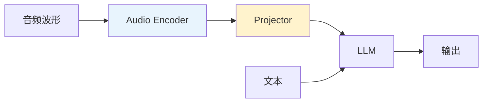

# 语音与音频 LLM 微调
语音/音频 LLM 微调的目标：让 LLM **听懂声音、理解语音、甚至生成语音**。核心挑战是如何将连续的音频信号转化为 LLM 能处理的离散表示。

---
## 核心架构模式
### 模式一：连续编码器 + Projector + LLM

- **Audio Encoder**：Whisper / Conformer / w2v-BERT 等，将音频转为连续特征序列
- **Projector**：线性层或 MLP，映射到 LLM token 空间
- 代表：Qwen-Audio、SALMONN
### 模式二：离散 Codec Token + LLM

- **Neural Codec**（如 EnCodec、SoundStream）将音频编码为离散 token
- LLM 直接在统一的 token 空间中处理文本和语音
- 代表：AudioLM、SpeechGPT、VALL-E
### 模式三：混合式
连续编码器用于理解（输入侧），Codec 用于生成（输出侧），结合两种优势。

---
## 主流音频编码器

| 编码器 | 特点 | 适用场景 |
| --- | --- | --- |
| Whisper Encoder | 大规模 ASR 预训练，语音理解强 | 语音理解 / QA / 翻译 |
| Conformer | CNN + Transformer 混合，建模局部+全局 | ASR / 通用音频 |
| w2v-BERT / HuBERT | 自监督预训练，语义特征好 | 语音表示 / 下游任务 |
| EnCodec / SoundStream | VQ 编码为离散 token | 语音生成 / TTS |

---

## 微调策略
### 语音理解方向
- **冻结 LLM + 训练 Audio Encoder/Adapter**：最常用
- **LoRA on cross-modal layers**：在跨模态注意力层加 LoRA
- **多任务联合微调**：同时训练 ASR / 语音翻译（AST）/ QA / Caption / Chat

### 语音生成方向（TTS）
常见微调点：
- **Speaker Adapter**：适配新说话人音色
- **Style/Emotion Adapter**：控制语音风格/情感
- **Acoustic Decoder Finetune**：微调声学解码器
- **Codec LM Finetune**：微调离散语音 token 的语言模型

---
## 📂 子页面导航
- [语音理解：连续编码器 + Projector + LLM](%E8%AF%AD%E9%9F%B3%E7%90%86%E8%A7%A3%EF%BC%9A%E8%BF%9E%E7%BB%AD%E7%BC%96%E7%A0%81%E5%99%A8%20+%20Projector%20+%20LLM%20ac7418f52ecb48c88b1f9b1ebe5bc031.md)
- [Codec Token LM 与语音生成微调](Codec%20Token%20LM%20%E4%B8%8E%E8%AF%AD%E9%9F%B3%E7%94%9F%E6%88%90%E5%BE%AE%E8%B0%83%2093e5c8fda2b64f709dc7aca73235caab.md)

**相关页面**：[多模态 LLM 微调](多模态%20LLM%20微调.md) · [PEFT 参数高效微调方案族](PEFT%20%E5%8F%82%E6%95%B0%E9%AB%98%E6%95%88%E5%BE%AE%E8%B0%83%E6%96%B9%E6%A1%88%E6%97%8F%2007bcd7a7aa894f4984c232d57a0e7376.md) · [LLM 微调技术全景指南](LLM%20%E5%BE%AE%E8%B0%83%E6%8A%80%E6%9C%AF%E5%85%A8%E6%99%AF%E6%8C%87%E5%8D%97%207e735b1a7eeb413cbd143fbfc5ec23cd.md)
[语音理解：连续编码器 + Projector + LLM](%E8%AF%AD%E9%9F%B3%E7%90%86%E8%A7%A3%EF%BC%9A%E8%BF%9E%E7%BB%AD%E7%BC%96%E7%A0%81%E5%99%A8%20+%20Projector%20+%20LLM%20ac7418f52ecb48c88b1f9b1ebe5bc031.md)
[Codec Token LM 与语音生成微调](Codec%20Token%20LM%20%E4%B8%8E%E8%AF%AD%E9%9F%B3%E7%94%9F%E6%88%90%E5%BE%AE%E8%B0%83%2093e5c8fda2b64f709dc7aca73235caab.md)