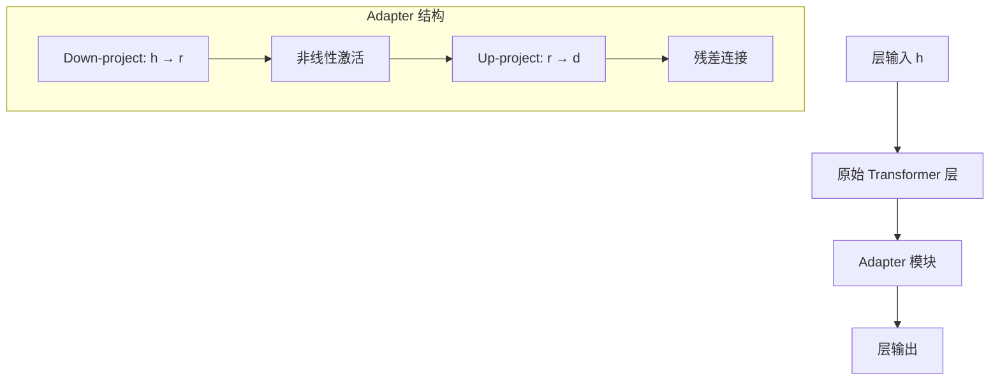

# Adapter 系列与其他 PEFT 方法

Adapter 是最早的 PEFT 方法之一，以及 IA³、BitFit 等其他参数选择/缩放方法。

---

## Adapter Tuning

在 Transformer 每层中插入一个**小型 bottleneck 模块**：

Adapter 的前向过程：

$$
\text{Adapter}(h) = h + f(h W_{\text{down}}) W_{\text{up}}
$$

- $W_{text{down}} in mathbb{R}^{d times r}$，$W_{text{up}} in mathbb{R}^{r times d}$，$r ll d$
- 只训练 Adapter 参数，冻结其余所有层
- 与 LoRA 区别：Adapter 是**串联**的（在层输出后），LoRA 是**并联**的（旁路加到原权重上）

---

## Compacter

Adapter 的压缩版本，用 **Kronecker 积** 进一步减少参数：

$$
W = A_1 \otimes A_2
$$

- 将 Adapter 中的 down/up 矩阵分解为两个小矩阵的 Kronecker 积
- 参数量比标准 Adapter 再减少一个数量级

---

## IA³（Infused Adapter by Inhibiting and Amplifying Inner Activations）

学习三组**缩放向量**，分别缩放 Key、Value 和 FFN 的激活值：

$$
K' = l_K \odot K, \quad V' = l_V \odot V, \quad \text{FFN}'(h) = l_{\text{ff}} \odot \text{FFN}(h)
$$

- $l_K, l_V, l_{\text{ff}}$ 是可学习向量（与隐层维度同长）
- 参数极少（几千到几万），但对某些任务效果不错

---

## BitFit

**只训练所有 bias 参数**，冻结其余权重。

- 可训练参数量约为总参数的 0.05%
- 在 BERT 类中等模型上效果不错
- 在大型 LLM 上不如 LoRA

---

## 前沿研究方法

| 方法 | 核心思想 | 状态 |
| --- | --- | --- |
| **VeRA** | 共享随机矩阵 + 可训练缩放向量 | 研究阶段 |
| **FourierFT** | 在频域做低秩更新 | 研究阶段 |
| **OFT / BOFT** | 正交微调，保持权重矩阵的正交性 | 特定场景 |
| **Layer Replication + LoRA** | 复制层 + LoRA 做扩容式轻量微调 | 研究阶段 |

---

## 📂 子页面（叶子层，含代码与公式）

`子页面创建后补充`