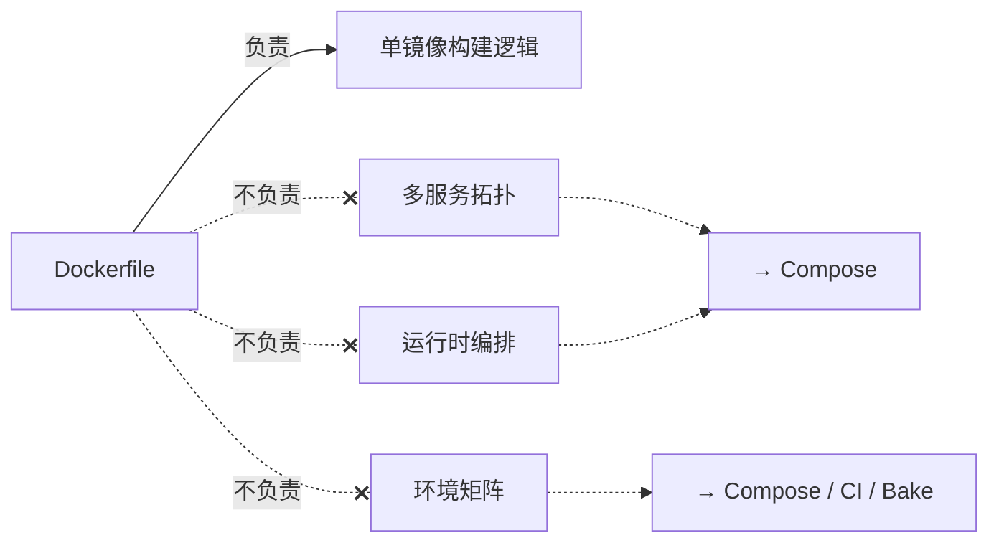
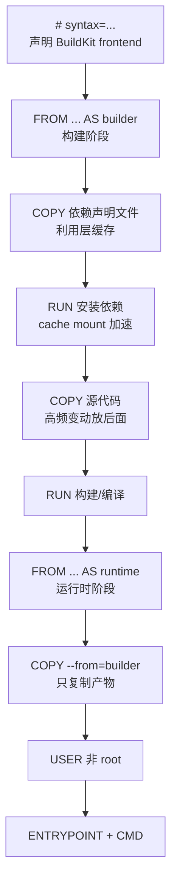
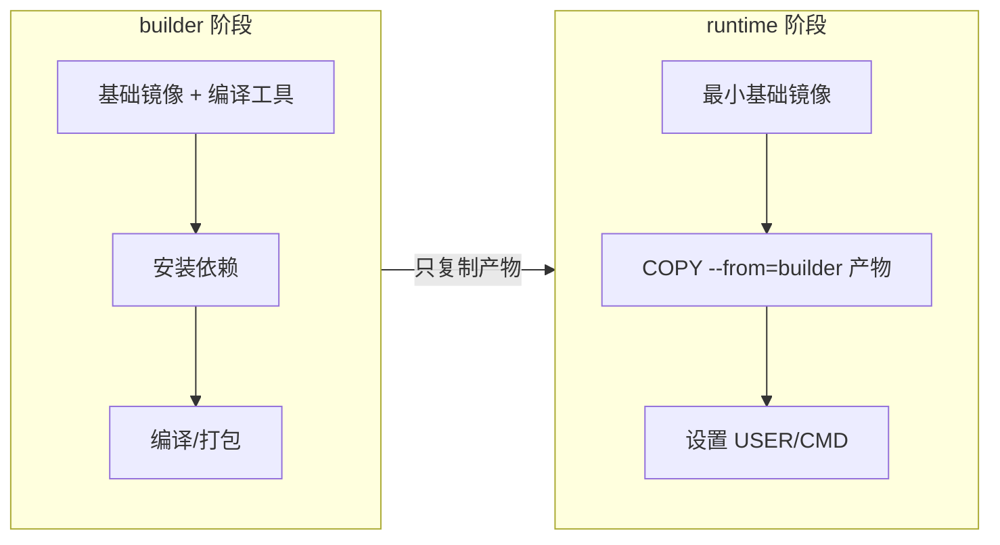
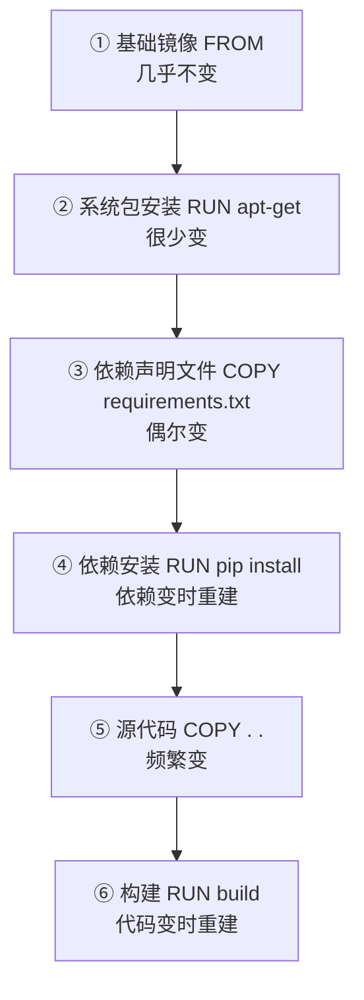

## 前置知识

> [!important]
> 
> 阅读本页前建议先读：[[1 Docker 基础对象：必须讲清的边界]]——理解 Image 的分层本质、ENTRYPOINT/CMD 机制与关键属性。

---

## 0. 定位

> Dockerfile 的完整指令体系、现代结构模板、多阶段构建、BuildKit 高阶能力（cache/secret/ssh mount）、项目级最佳实践。本页覆盖**单镜像构建逻辑的全部知识**，不涉及多服务编排（属于 §3 Compose）。

---

## 1. Dockerfile 的职责边界

> [!important]
> 
> **Dockerfile（Docker 构建文件）** 是一份**声明式的构建脚本**，定义了从基础镜像到最终镜像的每一步操作。它的职责是且仅是：**单镜像的构建逻辑**。



|维度|Dockerfile 负责|Dockerfile 不负责|
|---|---|---|
|**构建范围**|单个镜像的所有构建步骤|多镜像之间的关系|
|**依赖安装**|系统包、语言包、编译工具|运行时服务依赖（DB、Redis）|
|**环境变量**|镜像默认值（`ENV`）|运行时覆盖（Compose `environment`）|
|**机密**|构建期 `--mount=type=secret`|运行期 Secret 管理|

---

## 2. 现代 Dockerfile 结构模板

> [!important]
> 
> **工程判断**：以下模板是 2026 年推荐的 Dockerfile 标准结构。所有新项目的 Dockerfile 应遵循此顺序，除非有明确理由调整。

```Docker
# 1. 显式声明 Dockerfile frontend（BuildKit 语法版本）
# syntax=docker/dockerfile:1

# 2. 构建阶段：安装编译工具与构建依赖
FROM python:3.12-slim-bookworm AS builder

WORKDIR /app

# 3. 先复制依赖声明文件，优先利用缓存
COPY requirements.txt .

# 4. 安装依赖（使用 cache mount 加速）
RUN --mount=type=cache,target=/root/.cache/pip \
    pip install --no-cache-dir -r requirements.txt

# 5. 复制源代码
COPY . .

# 6. 构建步骤（如编译、打包等）
RUN python -m compileall .

# ---- 运行时阶段 ----
FROM python:3.12-slim-bookworm AS runtime

WORKDIR /app

# 7. 只从 builder 复制产物
COPY --from=builder /app /app
COPY --from=builder /usr/local/lib/python3.12/site-packages /usr/local/lib/python3.12/site-packages

# 8. 安全：非 root 用户
RUN groupadd -r appuser && useradd -r -g appuser appuser
USER appuser

# 9. 声明端口（仅元数据）
EXPOSE 8000

# 10. 启动命令
ENTRYPOINT ["python"]
CMD ["app.py"]
```

**结构要点解析**：



---

## 3. 必学指令详解

### 3.1 FROM

**作用**：指定基础镜像（Base Image），是 Dockerfile 的第一条有效指令。

```Docker
# 推荐：固定版本 + slim 变体
FROM python:3.12-slim-bookworm

# 多阶段构建中命名阶段
FROM node:20-alpine AS frontend-builder

# 使用 ARG 参数化基础镜像
ARG BASE_IMAGE=python:3.12-slim-bookworm
FROM ${BASE_IMAGE}
```

> [!important]
> 
> **常见误区：使用** `**latest**` **标签**
> 
> `FROM python:latest` 看似方便，但会导致：
> 
> - 不同时间构建的镜像内容不同（不可复现）
> 
> - 上游更新可能引入不兼容变化
> 
> - 无法精确回溯问题版本
> 
> **始终使用固定版本标签**，如 `python:3.12-slim-bookworm`。

### 3.2 ARG 与 ENV

**ARG（构建参数，Build Argument）** 和 **ENV（环境变量，Environment Variable）** 是最容易混淆的两条指令：

|维度|`ARG`|`ENV`|
|---|---|---|
|**生效范围**|仅构建期（build time）|构建期 + 运行时（runtime）|
|**是否进入镜像**|不进入最终镜像环境变量|进入镜像，容器启动时可见|
|**外部传入方式**|`docker build --build-arg KEY=VAL`|运行时 `-e KEY=VAL` 或 Compose `environment`|
|**典型用途**|基础镜像版本、编译选项、代理地址|应用运行时配置默认值|
|**安全注意**|值会出现在 `docker history` 中，**不可传机密**|同样不可传机密（值存储在镜像元数据中）|

```Docker
# ARG：构建期参数
ARG PYTHON_VERSION=3.12
FROM python:${PYTHON_VERSION}-slim-bookworm

# ENV：运行时默认值
ENV APP_PORT=8000
ENV LOG_LEVEL=info

# 机密不要这样传！
# ARG SECRET_KEY=xxx   ← ❌
# ENV API_TOKEN=xxx    ← ❌
```

> [!important]
> 
> **工程判断优先级**：
> 
> 1. **构建参数**（基础镜像版本、编译选项）→ `ARG`
> 
> 1. **运行参数**（端口、日志级别、特性开关）→ `ENV`（提供默认值）+ Compose `environment`（覆盖）
> 
> 1. **机密**（密钥、token、证书）→ **绝不**用 `ARG`/`ENV`，构建期用 `--mount=type=secret`，运行期用 Compose `secrets`

### 3.3 WORKDIR、COPY、ADD

```Docker
# WORKDIR：设置工作目录（不存在会自动创建）
WORKDIR /app

# COPY：复制文件到镜像（最常用）
COPY requirements.txt .          # 单文件
COPY src/ ./src/                  # 目录
COPY --chown=appuser:appuser . .  # 复制并设置所有者

# ADD：功能更多但慎用
ADD archive.tar.gz /app/          # 自动解压 tar（COPY 不会）
ADD https://example.com/file /app/ # 远程 URL 下载（不推荐）
```

> [!important]
> 
> **常见误区：**`**ADD**` **和** `**COPY**` **混用**
> 
> `ADD` 比 `COPY` 多了两个隐含行为：自动解压 tar 归档、支持远程 URL 下载。这些隐含行为会带来不可预期的结果。**除非明确需要自动解压语义，否则始终使用** `**COPY**`**。**

### 3.4 RUN

```Docker
# exec 格式（推荐）
RUN ["apt-get", "update"]

# shell 格式（更常用，支持 && 链式调用）
RUN apt-get update && \
    apt-get install -y --no-install-recommends curl && \
    rm -rf /var/lib/apt/lists/*

# BuildKit cache mount（加速包管理器）
RUN --mount=type=cache,target=/var/cache/apt \
    apt-get update && apt-get install -y python3
```

### 3.5 USER、EXPOSE、ENTRYPOINT、CMD

```Docker
# USER：切换运行用户（安全基线）
RUN groupadd -r app && useradd -r -g app app
USER app

# EXPOSE：声明端口（仅文档作用）
EXPOSE 8000

# ENTRYPOINT + CMD 组合（推荐 exec 格式）
ENTRYPOINT ["python", "-m", "uvicorn"]
CMD ["main:app", "--host", "0.0.0.0", "--port", "8000"]
```

---

## 4. 多阶段构建（Multi-stage Build）

### 4.1 核心思想

> [!important]
> 
> **多阶段构建（Multi-stage Build）** 是在一个 Dockerfile 中定义多个 `FROM` 阶段，每个阶段可以使用不同的基础镜像。最终镜像只包含最后一个阶段（或指定阶段）的内容，前面阶段的构建工具、中间产物**不会进入最终镜像**。

**为什么重要**：

- **缩小镜像体积**：构建工具（gcc、node、cargo）通常占数百 MB，运行时不需要

- **降低攻击面**：最终镜像中没有编译器、调试工具，减少可被利用的组件

- **提升缓存效率**：依赖安装与代码编译分阶段，各自独立缓存

### 4.2 标准模式



### 4.3 多语言示例

- Python 项目多阶段构建
    
    ```Docker
    # syntax=docker/dockerfile:1
    FROM python:3.12-slim-bookworm AS builder
    WORKDIR /app
    COPY requirements.txt .
    RUN --mount=type=cache,target=/root/.cache/pip \
        pip install --prefix=/install -r requirements.txt
    COPY . .
    
    FROM python:3.12-slim-bookworm AS runtime
    WORKDIR /app
    COPY --from=builder /install /usr/local
    COPY --from=builder /app /app
    RUN groupadd -r app && useradd -r -g app app
    USER app
    CMD ["python", "main.py"]
    ```
    

- Go 项目多阶段构建（极致精简）
    
    ```Docker
    # syntax=docker/dockerfile:1
    FROM golang:1.22-alpine AS builder
    WORKDIR /src
    COPY go.mod go.sum ./
    RUN go mod download
    COPY . .
    RUN CGO_ENABLED=0 go build -o /app/server .
    
    # 最终镜像：scratch 或 distroless（无 OS 层）
    FROM gcr.io/distroless/static-debian12
    COPY --from=builder /app/server /server
    ENTRYPOINT ["/server"]
    ```
    

- Node.js 前端 + Nginx 静态部署
    
    ```Docker
    # syntax=docker/dockerfile:1
    FROM node:20-alpine AS frontend-builder
    WORKDIR /app
    COPY package.json pnpm-lock.yaml ./
    RUN corepack enable && pnpm install --frozen-lockfile
    COPY . .
    RUN pnpm build
    
    FROM nginx:alpine AS runtime
    COPY --from=frontend-builder /app/dist /usr/share/nginx/html
    EXPOSE 80
    ```
    

### 4.4 适用场景

|语言/框架|builder 阶段典型内容|runtime 阶段基础镜像|典型体积压缩比|
|---|---|---|---|
|**Go**|go build（静态编译）|`scratch` / `distroless`|~1 GB → ~10 MB|
|**Rust**|cargo build --release|`debian-slim` / `distroless`|~2 GB → ~20 MB|
|**Node.js 前端**|npm/pnpm build|`nginx:alpine`|~1 GB → ~30 MB|
|**Python**|pip install wheels|`python:slim`|~1.5 GB → ~200 MB|
|**Java**|Maven/Gradle build|`eclipse-temurin:jre`|~1 GB → ~200 MB|

---

## 5. BuildKit 高阶能力

> [!important]
> 
> **BuildKit** 是 Docker 的下一代构建引擎（Next-gen Build Engine），从 Docker 23.0 起已成为默认构建器。它提供了多项传统 builder 不具备的能力：并行阶段执行、构建期挂载（cache/secret/ssh/tmpfs）、外部缓存导入导出等。

### 5.1 `RUN --mount=type=cache`：包管理器缓存

**是什么**：在构建期将指定目录挂载为持久化缓存，跨构建复用，**不进入最终镜像层**。

**为什么重要**：`pip install`、`npm install`、`apt-get install` 每次都重新下载包极其浪费时间。cache mount 让这些下载结果跨构建保留。

```Docker
# pip 缓存
RUN --mount=type=cache,target=/root/.cache/pip \
    pip install -r requirements.txt

# apt 缓存
RUN --mount=type=cache,target=/var/cache/apt \
    --mount=type=cache,target=/var/lib/apt \
    apt-get update && apt-get install -y curl

# npm 缓存
RUN --mount=type=cache,target=/root/.npm \
    npm ci

# Go 模块缓存
RUN --mount=type=cache,target=/go/pkg/mod \
    go mod download
```

### 5.2 `RUN --mount=type=secret`：构建期机密

**是什么**：在构建期将机密文件临时挂载到指定路径，**该文件不会出现在任何镜像层中**。

**为什么重要**：构建期可能需要访问私有包仓库（npm/PyPI/Maven）、拉取私有 Git 仓库、使用云服务凭证。传统做法是通过 `ARG` 传入，但这会泄露在 `docker history` 中。

```Docker
# Dockerfile 中使用 secret
RUN --mount=type=secret,id=pypi_token \
    pip install --index-url https://$(cat /run/secrets/pypi_token)@pypi.example.com/simple/ -r requirements.txt

# 构建时传入 secret
# docker build --secret id=pypi_token,src=./pypi_token.txt .
```

### 5.3 `RUN --mount=type=ssh`：构建期 SSH 访问

**是什么**：将宿主机的 SSH agent 转发到构建期，用于访问私有 Git 仓库，**SSH 密钥不进入镜像**。

```Docker
RUN --mount=type=ssh \
    git clone git@github.com:private-org/private-repo.git

# 构建时启用 SSH 转发
# docker build --ssh default .
```

### 5.4 挂载类型汇总

|挂载类型|用途|是否进入镜像层|典型场景|
|---|---|---|---|
|`cache`|持久化构建缓存|❌|pip/npm/apt/cargo/go 缓存|
|`secret`|构建期临时机密|❌|私有仓库 token、云凭证|
|`ssh`|SSH agent 转发|❌|私有 Git 仓库克隆|
|`tmpfs`|临时内存文件系统|❌|临时敏感数据、大文件处理|

---

## 6. Dockerfile 项目级最佳实践

### 6.1 `.dockerignore`

> [!important]
> 
> **不写** `**.dockerignore**` **是高频反模式之一**
> 
> 没有 `.dockerignore` 时，`docker build` 会把整个项目目录作为构建上下文（Build Context）发送给 daemon——包括 `.git`（可能数百 MB）、`node_modules`、`venv`、模型大文件、测试数据。这会严重拖慢构建速度并可能泄露敏感信息。

```Plain
# .dockerignore 推荐模板
.git
.github
.vscode
.idea
__pycache__
*.pyc
node_modules
venv
.env
.env.*
*.log
tmp/
data/
models/
*.tar.gz
README.md
docker-compose*.yml
compose*.yaml
Dockerfile*
```

### 6.2 层顺序优化

> [!important]
> 
> **层缓存黄金法则**：变动频率低的操作放前面，变动频率高的操作放后面。这样当源代码变更时，前面的依赖安装层可以命中缓存，不需要重新执行。



### 6.3 安全实践清单

- ✅ 使用固定且可信的基础镜像（指定版本 + digest）

- ✅ 显式设置 `USER` 为非 root

- ✅ 安装依赖后清理缓存（`rm -rf /var/lib/apt/lists/*`）

- ✅ 机密使用 `--mount=type=secret`，不用 `ARG`/`ENV`

- ✅ 配置 `.dockerignore` 排除无关文件

- ❌ 不使用 `latest` 标签

- ❌ 不在镜像中包含 `.git`、测试数据、大模型文件

- ❌ 不在镜像中安装调试工具（生产镜像）

---

## 7. 何时需要多个 Dockerfile

> [!important]
> 
> **「一个 Dockerfile 包打天下 vs 多个 Dockerfile」**
> 
> 当以下差异足够大时，拆分为多个 Dockerfile 比在一个文件中用 `ARG` 控制分支更清晰、更可维护：
> 
> - **开发镜像 vs 生产镜像**：开发需要调试工具、热重载支持；生产需要最小化
> 
> - **API 服务 vs Worker**：入口点不同、依赖可能不同
> 
> - **CPU 推理 vs GPU 推理**：基础镜像完全不同（debian vs nvidia/cuda）
> 
> - **Debug 镜像 vs Release 镜像**：Debug 可能需要额外的诊断工具
> 
> 不是强制拆分，但比「一个 Dockerfile + 十几个 ARG 控制所有逻辑」更清晰。

**推荐命名约定**：

```Plain
services/
  api/
    Dockerfile           # 生产镜像（默认）
    Dockerfile.dev       # 开发镜像
  worker/
    Dockerfile
  model-serving/
    Dockerfile.cpu       # CPU 推理
    Dockerfile.gpu       # GPU 推理
```

---

## 延伸阅读

> [!important]
> 
> - [[1 Docker 基础对象：必须讲清的边界]] — Image 的分层本质与 ENTRYPOINT/CMD 机制
> 
> - §3 Docker Compose — 多服务编排，Dockerfile 的运行时搭档
> 
> - §7 高阶构建能力 — BuildKit 缓存策略、Bake 多镜像编排、多平台构建
> 
> - §6 安全 — 运行时安全基线与机密管理全貌

## 参考文献

- [1] Dockerfile reference — [https://docs.docker.com/reference/dockerfile/](https://docs.docker.com/reference/dockerfile/)

- [2] Best practices for writing Dockerfiles — [https://docs.docker.com/develop/develop-images/dockerfile_best-practices/](https://docs.docker.com/develop/develop-images/dockerfile_best-practices/)

- [3] BuildKit — [https://docs.docker.com/build/buildkit/](https://docs.docker.com/build/buildkit/)

- [4] Multi-stage builds — [https://docs.docker.com/build/building/multi-stage/](https://docs.docker.com/build/building/multi-stage/)

- [5] Build secrets — [https://docs.docker.com/build/building/secrets/](https://docs.docker.com/build/building/secrets/)