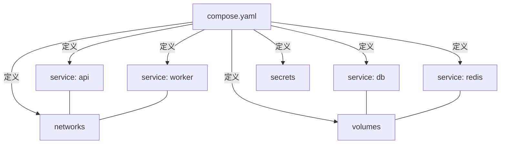
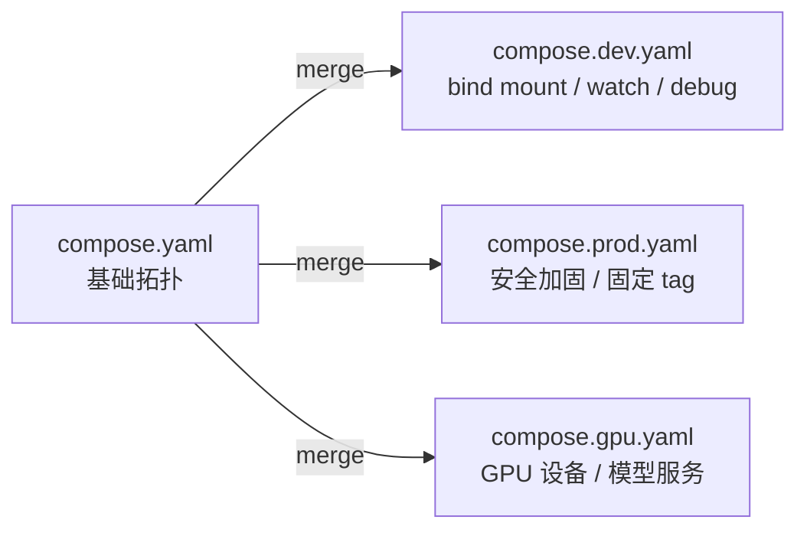
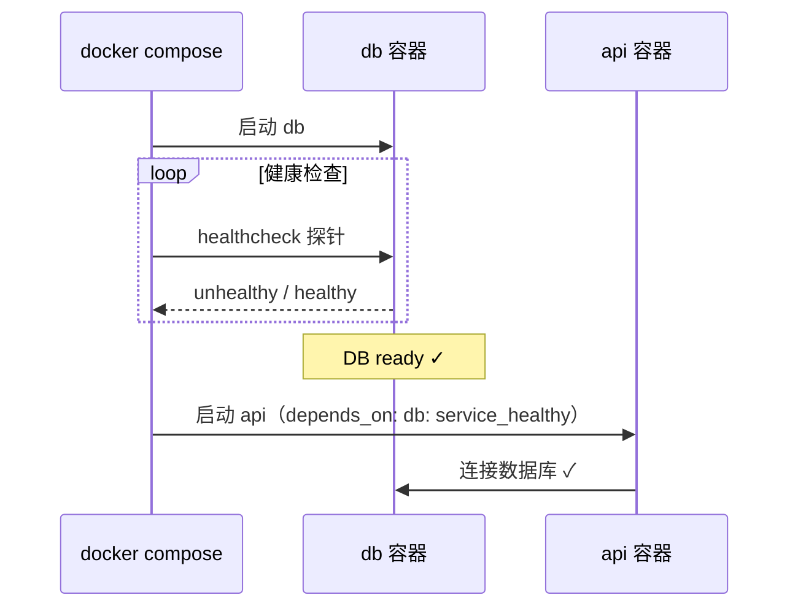

## 前置知识

> [!important]
> 
> 阅读本页前建议先读：
> 
> - [[2 Dockerfile：当前应掌握的完整知识框架]]——理解单镜像构建逻辑，Compose 在其之上编排多服务
> 
> - [[1 Docker 基础对象：必须讲清的边界]]——理解 Image / Container / Volume / Network 的基本模型

---

## 0. 定位

> Compose Specification 的当前定位、compose.yaml 文件结构、服务级关键字段、多文件合并策略（profiles / include / fragments）、启动顺序与健康检查、开发增强能力（watch / init）、GPU 与 AI 相关能力。本页覆盖**多服务编排的完整知识**。

---

## 1. 当前定位

> [!important]
> 
> **Docker Compose** 是 Docker 官方的**多容器应用定义与编排工具**。当前应按 **Compose Specification**（Compose 规范）理解，不要再用旧版 v2/v3 文件格式思维。`compose.yaml` 是首选的规范文件名（Canonical Filename），取代旧的 `docker-compose.yml`。

**为什么重要**：真实项目不是单容器能解决的——Web、API、DB、缓存、队列、模型服务需要统一编排。Compose 用一个 YAML 文件声明所有服务及其拓扑、依赖、网络、存储，`docker compose up` 一条命令启动整个项目。



> [!important]
> 
> **常见误区：「Compose 只能用于开发环境」**
> 
> Compose 的适用范围远不止本地开发。它同样适用于：CI 集成测试环境、Staging 环境、中小规模生产部署。只有在需要跨多主机自动调度（如 Kubernetes 级别）时，Compose 才不够用。对于单机或少量主机的项目，Compose 是完全合格的生产编排工具。

---

## 2. Compose 解决什么

|能力|具体解决的问题|没有 Compose 时|
|---|---|---|
|**多容器应用拓扑**|声明式定义所有服务及其关系|手写 shell 脚本串 `docker run`|
|**服务依赖与启动顺序**|`depends_on` • `healthcheck` 确保依赖就绪|sleep 轮询、启动脚本混乱|
|**网络隔离**|自动创建项目级 bridge 网络|手动创建网络并逐个 `--network`|
|**存储编排**|统一声明 volumes|手动创建 volume 并逐个 `-v`|
|**环境切换**|多文件合并 + profiles + env_file|维护多套脚本或 Makefile|
|**机密管理**|`secrets` • `configs` 声明|环境变量传密钥或手动挂文件|

---

## 3. Compose 文件顶层结构

```YAML
# compose.yaml —— 顶层结构示意
name: my-project          # 项目名（影响容器/网络/卷前缀）

services:                 # 核心：所有服务定义
  api: ...
  worker: ...
  db: ...

networks:                 # 自定义网络
  app: ...
  data: ...

volumes:                  # 命名卷
  db-data: ...
  model-cache: ...

secrets:                  # 机密文件
  db-password: ...

configs:                  # 配置文件
  nginx-conf: ...

include:                  # 模块化引入其他 Compose 文件
  - path: ./infra/compose.yaml
```

|顶层项|作用|备注|
|---|---|---|
|`services`|所有服务容器的定义|**必须项**，Compose 文件的核心|
|`networks`|自定义网络拓扑|不声明时自动创建默认 bridge|
|`volumes`|命名卷声明|持久化数据的推荐方式|
|`secrets`|敏感数据|挂载为容器内文件（默认 `/run/secrets/`）|
|`configs`|非敏感配置文件|类似 secrets 但无加密语义|
|`name`|项目名|影响容器/网络/卷的命名前缀|
|`include`|模块化引入子 Compose 文件|大项目拆分、团队分模块维护|

---

## 4. Service 级关键字段

### 4.1 核心字段

```YAML
services:
  api:
    image: myapp:latest           # 使用现有镜像
    build:                         # 或从 Dockerfile 构建
      context: ./services/api
      dockerfile: Dockerfile
    command: ["uvicorn", "main:app"]  # 覆盖 CMD
    entrypoint: ["/entrypoint.sh"]    # 覆盖 ENTRYPOINT
    environment:                   # 环境变量
      - LOG_LEVEL=info
      - DB_HOST=db
    env_file: .env                 # 从文件加载环境变量
    ports:                         # 端口发布
      - "127.0.0.1:8000:8000"     # 仅本机访问
    expose:                        # 内部端口（不发布到宿主机）
      - "8000"
    volumes:                       # 挂载
      - ./src:/app/src:ro          # bind mount（开发态）
      - model-cache:/models        # 命名卷
    user: "1000:1000"              # 运行用户
    working_dir: /app
```

### 4.2 依赖与生命周期

```YAML
services:
  api:
    depends_on:                    # 依赖关系
      db:
        condition: service_healthy  # 等待 DB 健康
      redis:
        condition: service_started  # 只等启动
    healthcheck:                   # 健康检查
      test: ["CMD", "curl", "-f", "http://localhost:8000/health"]
      interval: 10s
      timeout: 5s
      retries: 3
      start_period: 30s
    restart: unless-stopped        # 重启策略
```

### 4.3 安全字段

```YAML
services:
  api:
    read_only: true                # 只读根文件系统
    tmpfs: /tmp                    # 可写临时目录
    cap_drop:                      # 移除所有 Linux capabilities
      - ALL
    security_opt:                  # 禁止提权
      - no-new-privileges:true
    secrets:                       # 机密挂载
      - db-password
    configs:                       # 配置挂载
      - source: nginx-conf
        target: /etc/nginx/nginx.conf
```

### 4.4 profiles

```YAML
services:
  api:
    # 无 profiles → 始终启动
  
  debug-tools:
    profiles: [debug]              # 仅 --profile debug 时启动
  
  model-serving:
    profiles: [gpu]                # 仅 --profile gpu 时启动
  
  prometheus:
    profiles: [observability]      # 仅 --profile observability 时启动
```

```Bash
# 启动基础服务
docker compose up

# 启动基础 + GPU 服务
docker compose --profile gpu up

# 启动基础 + 调试工具 + 可观测性
docker compose --profile debug --profile observability up
```

---

## 5. 多文件合并策略

### 5.1 核心思路

> [!important]
> 
> **工程判断**：1 项目 = 1 主 `compose.yaml`。按场景叠加覆盖文件，通过 `-f` 合并，不要复制粘贴多个近似文件。



```Bash
# 开发环境
docker compose -f compose.yaml -f compose.dev.yaml up

# 生产环境
docker compose -f compose.yaml -f compose.prod.yaml up -d

# GPU 开发
docker compose -f compose.yaml -f compose.dev.yaml -f compose.gpu.yaml up
```

### 5.2 include：模块化

**include（模块化引入）** 适合把大项目拆为多个子域 Compose 文件，让团队各模块分别维护：

```YAML
# compose.yaml
include:
  - path: ./services/api/compose.yaml
  - path: ./services/worker/compose.yaml
  - path: ./infra/compose.yaml
    env_file: ./infra/.env
```

### 5.3 fragments / YAML anchors / extensions

**YAML 锚点（Anchor）与别名（Alias）** 用于消除重复配置：

```YAML
# 定义可复用片段
x-common-security: &security-baseline
  read_only: true
  cap_drop: [ALL]
  security_opt: ["no-new-privileges:true"]

x-common-healthcheck: &healthcheck-http
  healthcheck:
    test: ["CMD", "curl", "-f", "http://localhost:${PORT:-8000}/health"]
    interval: 10s
    timeout: 5s
    retries: 3

services:
  api:
    <<: *security-baseline
    <<: *healthcheck-http
    image: myapp-api:latest
  
  worker:
    <<: *security-baseline
    image: myapp-worker:latest
```

> [!important]
> 
> `**x-**` **前缀扩展（Extension）** 是 Compose Specification 中的自定义字段，以 `x-` 开头的顶层键会被 Compose 忽略，专门用于存放可复用片段。结合 YAML 锚点，可以实现配置模板化。

---

## 6. 启动顺序与健康检查

### 6.1 问题

> [!important]
> 
> **常见误区：「**`**depends_on**` **能保证服务 ready」**
> 
> `depends_on` 默认只保证依赖容器**已启动**（进程已运行），不保证服务**已就绪**（如 DB 已完成初始化、API 已开始监听端口）。如果 API 在 DB 尚未就绪时就尝试连接，会报错。

### 6.2 正确方案：depends_on + healthcheck + condition



```YAML
services:
  db:
    image: postgres:16-alpine
    healthcheck:
      test: ["CMD-SHELL", "pg_isready -U postgres"]
      interval: 5s
      timeout: 3s
      retries: 5
      start_period: 10s
    volumes:
      - db-data:/var/lib/postgresql/data

  api:
    build: ./services/api
    depends_on:
      db:
        condition: service_healthy
    environment:
      - DATABASE_URL=postgresql://postgres:secret@db:5432/app
```

### 6.3 常见服务的健康检查模板

|服务|healthcheck test 命令|
|---|---|
|**PostgreSQL**|`pg_isready -U postgres`|
|**MySQL**|`mysqladmin ping -h localhost`|
|**Redis**|`redis-cli ping`|
|**HTTP 服务**|`curl -f http://localhost:PORT/health`|
|**gRPC 服务**|`grpc_health_probe -addr=:PORT`|

---

## 7. 开发增强能力

### 7.1 docker compose watch

> [!important]
> 
> **docker compose watch** 是 Compose 的**文件监视功能**，监视宿主机上的代码变化并自动触发容器内同步、重建或重启。它替代了传统的 `nodemon`、`watchmedo` 等工具，直接在 Compose 层面实现热更新。

```YAML
# compose.dev.yaml
services:
  api:
    develop:
      watch:
        - action: sync           # 同步文件到容器
          path: ./src
          target: /app/src
        - action: rebuild        # 依赖变化时重新构建
          path: ./requirements.txt
        - action: sync+restart   # 同步后重启服务
          path: ./config
          target: /app/config
```

```Bash
docker compose -f compose.yaml -f compose.dev.yaml watch
```

### 7.2 docker compose config

```Bash
# 渲染最终合并后的配置（排查变量插值问题）
docker compose -f compose.yaml -f compose.dev.yaml config

# 验证配置是否合法
docker compose config --quiet
```

### 7.3 docker init

```Bash
# 为现有项目生成 Dockerfile / compose.yaml / .dockerignore 骨架
docker init
```

---

## 8. GPU 与 AI 相关能力

```YAML
services:
  model-serving:
    image: my-model:latest
    deploy:
      resources:
        reservations:
          devices:
            - driver: nvidia
              count: 1            # 请求 1 块 GPU
              capabilities: [gpu]
    volumes:
      - model-cache:/models
    profiles: [gpu]
```

> [!important]
> 
> **工程判断**：
> 
> - GPU 服务应单独 profile 或独立 compose 文件
> 
> - CPU 服务与 GPU 服务分离——不要把所有服务塞到 GPU 镜像中
> 
> - 模型缓存用 volume 持久化，避免每次重新下载

---

## 延伸阅读

> [!important]
> 
> - [[2 Dockerfile：当前应掌握的完整知识框架]] — Compose 的构建基础
> 
> - §4 挂载 — Volume / Bind / tmpfs 的深入选型
> 
> - §5 网络模式 — bridge / host / overlay 的选择与隔离
> 
> - §8 项目设置推荐 — Compose 文件组织与目录结构
> 
> - §10 AI/Agent/LLM 项目 Docker — GPU 与模型服务的完整方案

## 参考文献

- [1] Compose Specification — [https://docs.docker.com/compose/compose-file/](https://docs.docker.com/compose/compose-file/)

- [2] docker compose watch — [https://docs.docker.com/compose/file-watch/](https://docs.docker.com/compose/file-watch/)

- [3] Compose profiles — [https://docs.docker.com/compose/profiles/](https://docs.docker.com/compose/profiles/)

- [4] Compose include — [https://docs.docker.com/compose/multiple-compose-files/include/](https://docs.docker.com/compose/multiple-compose-files/include/)

- [5] Compose GPU support — [https://docs.docker.com/compose/gpu-support/](https://docs.docker.com/compose/gpu-support/)