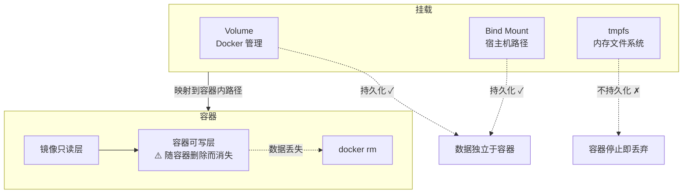
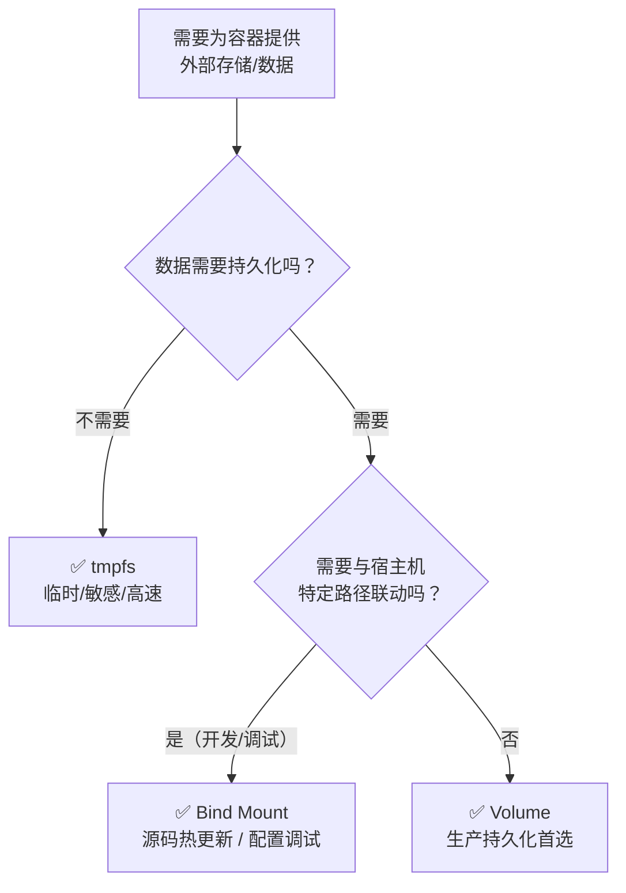
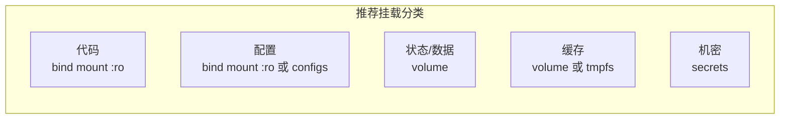

## 前置知识

> [!important]
> 
> 阅读本页前建议先读：
> 
> - [[1 Docker 基础对象：必须讲清的边界]]——理解 Container 的可写层本质与数据易失性
> 
> - [[3 Docker Compose：当前推荐的项目主入口]]——理解 Compose 中 `volumes` 顶层项与服务级 `volumes` 字段

---

## 0. 定位

> 三大挂载类型（Volume / Bind Mount / tmpfs）的本质区别、选型准则、典型使用场景、设计原则。本页覆盖**数据持久化与共享机制的完整知识**，不涉及构建期挂载（属于 §2 Dockerfile 的 BuildKit 能力）。

---

## 1. 为什么需要挂载

> [!important]
> 
> 容器的文件系统由**镜像只读层 + 容器可写层**组成。可写层随容器删除而消失——这意味着容器内产生的所有数据（数据库文件、用户上传、日志、缓存）默认是**短暂的**。**挂载（Mount）** 是 Docker 提供的机制，将宿主机或 Docker 管理的存储区域映射到容器内路径，使数据可以**持久化、共享、独立于容器生命周期**。



---

## 2. 三大挂载类型

### 2.1 Volume（卷）

> [!important]
> 
> **Volume（卷）** 是由 Docker 引擎管理的存储单元，数据存储在宿主机上由 Docker 控制的目录中（通常是 `/var/lib/docker/volumes/`）。用户不直接操作底层路径，而是通过 Docker API / CLI / Compose 声明和使用。

**为什么重要**：Volume 是生产环境持久化数据的首选方案。它与宿主机目录结构低耦合，支持跨平台，可被 Docker 备份/迁移工具管理。

**核心特性**：

- Docker 引擎全权管理生命周期

- 与宿主机目录结构解耦——不依赖特定宿主机路径

- 可在多个容器间共享

- 支持 volume driver 扩展（远程存储、云存储等）

- 内容在容器删除后仍然保留

```YAML
# Compose 中声明和使用 Volume
volumes:
  db-data:         # 命名卷声明
  model-cache:

services:
  db:
    image: postgres:16-alpine
    volumes:
      - db-data:/var/lib/postgresql/data   # 命名卷挂载
  
  model-serving:
    image: my-model:latest
    volumes:
      - model-cache:/models                # 模型缓存卷
```

```Bash
# CLI 操作
docker volume create my-data
docker volume ls
docker volume inspect my-data
docker volume rm my-data
docker volume prune   # 清理未使用的卷
```

### 2.2 Bind Mount（绑定挂载）

> [!important]
> 
> **Bind Mount（绑定挂载）** 将宿主机上的**指定路径**直接映射到容器内路径。容器内对该路径的读写操作等同于直接操作宿主机文件系统。

**为什么重要**：Bind Mount 是开发环境的核心工具——本地编辑代码，容器内即时可见，实现热重载开发流。

**核心特性**：

- 直接映射宿主机上的文件或目录

- 容器内外双向可见（除非加 `:ro` 只读）

- 与宿主机路径强耦合——换机器路径可能不同

- 不由 Docker 管理生命周期——宿主机删除文件就没了

```YAML
# Compose 中使用 Bind Mount
services:
  api:
    build: ./services/api
    volumes:
      - ./src:/app/src:ro          # 只读 bind mount
      - ./config:/app/config       # 可写 bind mount（开发调试）
```

> [!important]
> 
> **常见误区：远程 daemon 时 Bind Mount 的路径**
> 
> 当 Docker CLI 连接远程 daemon 时，Bind Mount 挂载的路径是 **daemon 所在主机的路径**，不是客户端机器的路径。例如 `-v /data:/app/data` 中的 `/data` 指的是远程服务器上的 `/data`，而不是你本地机器上的。

### 2.3 tmpfs

> [!important]
> 
> **tmpfs** 是一种**内存文件系统挂载**，数据存储在宿主机内存（RAM）中，不写入磁盘。容器停止或删除后，tmpfs 中的数据即刻消失。

**为什么重要**：tmpfs 适合存放临时敏感数据、高速临时缓存等不需要持久化且希望高性能的场景。由于数据不写入磁盘，也降低了泄露风险。

```YAML
services:
  api:
    image: myapp:latest
    read_only: true       # 只读根文件系统
    tmpfs:
      - /tmp              # 为 /tmp 提供可写内存文件系统
      - /run:size=64m     # 限制大小
```

---

## 3. 三类挂载对比

|维度|**Volume**|**Bind Mount**|**tmpfs**|
|---|---|---|---|
|**管理者**|Docker 引擎|用户 / 宿主机|内核（内存）|
|**数据持久化**|✅ 容器删除后保留|✅ 宿主机文件保留|❌ 容器停止即丢弃|
|**与宿主机耦合**|低（路径由 Docker 管理）|高（依赖特定宿主机路径）|无（纯内存）|
|**多容器共享**|✅|✅（需注意并发写）|❌（每个容器独立）|
|**性能**|磁盘 I/O|磁盘 I/O（可能受文件系统影响）|内存速度（极快）|
|**可迁移性**|高（Docker 备份/迁移）|低（路径绑定到宿主机）|不适用|
|**典型用途**|DB 数据、模型缓存、上传文件|开发源码、配置文件调试|临时文件、敏感中间数据|

---

## 4. 选型决策树



> [!important]
> 
> **工程判断总结**：
> 
> - **生产持久化** → Volume（首选）
> 
> - **开发改代码** → Bind Mount（首选）
> 
> - **临时敏感 / 高速临时数据** → tmpfs（首选）

---

## 5. 典型使用场景

### 5.1 Volume 典型场景

|场景|挂载目标|说明|
|---|---|---|
|PostgreSQL / MySQL 数据|`/var/lib/postgresql/data`|数据库文件必须持久化|
|Redis 持久化|`/data`|RDB / AOF 文件|
|向量数据库索引|`/data` 或 `/index`|Qdrant / Milvus / Chroma 索引|
|模型缓存|`/models` 或 `/root/.cache`|避免每次启动重新下载大模型|
|用户上传文件|`/uploads`|用户生成内容持久化|
|CI 缓存|`/cache`|加速 CI 构建|

### 5.2 Bind Mount 典型场景

|场景|Compose 写法|说明|
|---|---|---|
|本地源码热更新|`./src:/app/src`|编辑代码即时生效|
|配置文件调试|`./nginx.conf:/etc/nginx/nginx.conf:ro`|修改配置无需重建镜像|
|日志目录导出|`./logs:/app/logs`|宿主机直接查看日志|
|证书/脚本共享|`./certs:/certs:ro`|SSL 证书等只读共享|

### 5.3 tmpfs 典型场景

- `/tmp`：通用临时目录

- 敏感中间文件（解密后的临时文件、临时 token）

- 高速临时编译目录

- 浏览器 / Agent 临时会话数据

- 运行结束即丢弃的缓存

---

## 6. Mount 设计原则

### 6.1 分类挂载

> [!important]
> 
> **代码、配置、状态、缓存、机密要分开挂**——不要把所有东西混在一个挂载点里。每种数据有不同的生命周期、访问模式和安全需求。



### 6.2 安全原则

- ✅ 尽量给只读挂载加 `:ro`

- ✅ DB / 索引 / 缓存目录使用独立 volume，不要混挂

- ✅ 需要可迁移性时优先 volume；需要可见性/联动时才 bind

- ❌ 不要把整个项目根目录大面积可写挂入生产容器

- ❌ 不要把宿主机关键目录（`/`, `/etc`, `/var`）挂入容器

- ❌ 不要在生产环境用 bind mount 挂载源码

### 6.3 Compose 中的写法对比

```YAML
services:
  app:
    volumes:
      # Volume（推荐用于持久化）
      - db-data:/var/lib/postgresql/data
      
      # Bind Mount（短语法）
      - ./src:/app/src:ro
      
      # Bind Mount（长语法，更明确）
      - type: bind
        source: ./config
        target: /app/config
        read_only: true
      
      # Volume（长语法）
      - type: volume
        source: model-cache
        target: /models
      
      # tmpfs（长语法）
      - type: tmpfs
        target: /tmp
        tmpfs:
          size: 67108864   # 64 MB

volumes:
  db-data:
  model-cache:
```

---

## 思辨与对比

> [!important]
> 
> **「Volume vs Bind Mount：生产环境该选哪个？」**
> 
> 很多开发者因为 Bind Mount 在开发时的便利性，直接延续到生产环境。但 Bind Mount 在生产中有明显劣势：
> 
> - **路径耦合**：不同服务器的目录结构可能不同
> 
> - **权限问题**：宿主机 UID/GID 与容器内不匹配导致权限错误
> 
> - **安全风险**：可写 bind mount 意味着容器可以修改宿主机文件
> 
> - **可迁移性差**：无法通过 Docker 工具链备份/迁移
> 
> **结论**：开发用 Bind Mount，生产用 Volume。这不是偏好，是工程判断。

---

## 延伸阅读

> [!important]
> 
> - [[1 Docker 基础对象：必须讲清的边界]] — 容器可写层与数据易失性
> 
> - [[3 Docker Compose：当前推荐的项目主入口]] — Compose 中 volumes 的声明与使用
> 
> - §6 安全 — 挂载相关的安全最佳实践
> 
> - §8 项目设置推荐 — 数据与状态目录的完整组织方案

## 参考文献

- [1] Docker storage overview — [https://docs.docker.com/storage/](https://docs.docker.com/storage/)

- [2] Volumes — [https://docs.docker.com/storage/volumes/](https://docs.docker.com/storage/volumes/)

- [3] Bind mounts — [https://docs.docker.com/storage/bind-mounts/](https://docs.docker.com/storage/bind-mounts/)

- [4] tmpfs mounts — [https://docs.docker.com/storage/tmpfs/](https://docs.docker.com/storage/tmpfs/)