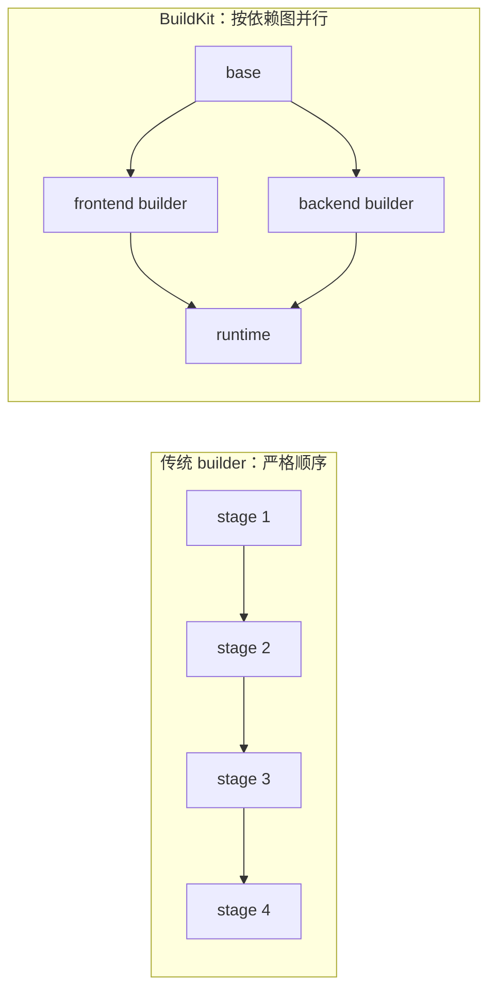
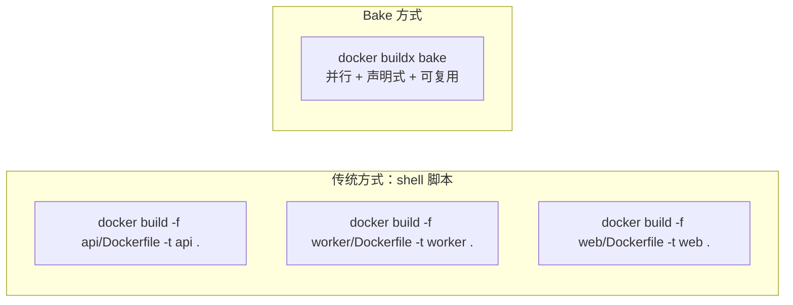

## 前置知识

> [!important]
> 
> 阅读本页前建议先读：
> 
> - [[2 Dockerfile：当前应掌握的完整知识框架]]——理解多阶段构建、BuildKit 基本挂载类型

---

## 0. 定位

> BuildKit 思维详解（分层缓存、并行阶段、外部缓存）、缓存优化策略、Bake 多镜像编排、多平台构建。本页覆盖 **当前高阶构建能力的完整知识**，是 §2 Dockerfile 中 BuildKit 内容的深化延伸。

---

## 1. BuildKit 思维

> [!important]
> 
> **BuildKit** 是 Docker 的下一代构建引擎，从 Docker 23.0 起已是默认构建器。与传统 builder 相比，BuildKit 的核心优势是：**按依赖图并行执行**、**细粒度缓存控制**、**安全的构建期挂载**。

### 1.1 核心能力一览

|能力|说明|传统 builder|
|---|---|---|
|**并行阶段执行**|无依赖的 stage 同时构建|严格顺序执行|
|**分层缓存**|基于内容哈希的精确缓存|基于层顺序的粗粒度缓存|
|**cache mount**|包管理器缓存跨构建复用|不支持|
|**secret mount**|构建期机密不进入镜像层|不支持|
|**ssh mount**|SSH agent 转发|不支持|
|**外部缓存**|导入/导出缓存到 registry / 本地目录|不支持|
|**多平台构建**|一次构建多架构镜像|不支持|

### 1.2 并行构建流程



---

## 2. 缓存优化策略

### 2.1 层顺序优化

> [!important]
> 
> **缓存优化的核心原则：变动少的放前面，变动多的放后面**。这样当源代码变更时，依赖安装层可以命中缓存。

```Docker
# ✅ 正确顺序：依赖声明先于源代码
COPY requirements.txt .     # 变动低→缓存命中率高
RUN pip install -r requirements.txt
COPY . .                    # 变动高→放最后

# ❌ 错误顺序：代码一变所有层都失效
COPY . .                    # 代码变了→后面全部重建
RUN pip install -r requirements.txt
```

### 2.2 cache mount 深入

```Docker
# Python
RUN --mount=type=cache,target=/root/.cache/pip \
    pip install -r requirements.txt

# Node.js
RUN --mount=type=cache,target=/root/.npm \
    npm ci --production

# Go
RUN --mount=type=cache,target=/go/pkg/mod \
    --mount=type=cache,target=/root/.cache/go-build \
    go build -o /app/server .

# Rust
RUN --mount=type=cache,target=/usr/local/cargo/registry \
    --mount=type=cache,target=/app/target \
    cargo build --release

# apt
RUN --mount=type=cache,target=/var/cache/apt \
    --mount=type=cache,target=/var/lib/apt \
    apt-get update && apt-get install -y curl
```

### 2.3 外部缓存导入导出

> [!important]
> 
> **外部缓存（External Cache）** 允许将构建缓存导出到外部存储（如 Docker Registry、本地目录），并在后续构建中导入复用。这对 **CI/CD 场景**尤其重要——CI runner 通常每次从干净环境开始，没有本地缓存。

```Bash
# 导出缓存到 registry
docker build \
  --cache-to type=registry,ref=myregistry.com/myapp:cache \
  --cache-from type=registry,ref=myregistry.com/myapp:cache \
  -t myapp:latest .

# 导出缓存到本地目录
docker build \
  --cache-to type=local,dest=./cache \
  --cache-from type=local,src=./cache \
  -t myapp:latest .
```

### 2.4 .dockerignore

```Plain
# 减小 build context，提升缓存命中率
.git
node_modules
venv
__pycache__
*.pyc
data/
models/
.env
.env.*
```

---

## 3. Bake：多镜像构建编排

> [!important]
> 
> **Docker Bake** 是 BuildKit 提供的**多镜像构建编排工具**，通过 `docker-bake.hcl`（或 JSON/YAML）声明式定义多个构建目标及其关系。它解决的问题是：当项目有多个 Dockerfile、多个目标平台、多个构建变体时，用 shell 脚本维护构建命令变得混乱且不可维护。

### 3.1 为什么需要 Bake



### 3.2 基本用法

```HCL
// docker-bake.hcl
group "default" {
  targets = ["api", "worker", "web"]
}

target "api" {
  context    = "."
  dockerfile = "services/api/Dockerfile"
  tags       = ["myregistry.com/myapp-api:latest"]
}

target "worker" {
  context    = "."
  dockerfile = "services/worker/Dockerfile"
  tags       = ["myregistry.com/myapp-worker:latest"]
}

target "web" {
  context    = "."
  dockerfile = "services/web/Dockerfile"
  tags       = ["myregistry.com/myapp-web:latest"]
}
```

```Bash
# 并行构建所有目标
docker buildx bake

# 构建特定目标
docker buildx bake api

# 多平台构建
docker buildx bake --set "*.platform=linux/amd64,linux/arm64"
```

### 3.3 适用场景

- 多镜像项目（微服务架构）

- 多目标构建（dev / prod / test）

- 多平台构建（amd64 + arm64）

- CI/CD 中统一构建入口

- 测试/制品/镜像一起编排

---

## 4. 多平台构建

> [!important]
> 
> **多平台构建（Multi-platform Build）** 是指一次构建操作同时产生多个 CPU 架构的镜像（如 `linux/amd64` + `linux/arm64`），并包装成一个多架构清单（Manifest List）。拉取时 Docker 会自动选择与当前架构匹配的镜像。

**为什么重要**：

- Mac（ARM）开发 + Linux（x86）部署是当前最常见的混合架构场景

- 边缘设备（ARM）+ 服务器（x86）的混合部署

- 云厂商提供 ARM 实例（如 AWS Graviton），性价比更高

```Bash
# 创建多平台 builder
docker buildx create --name multibuilder --use

# 构建并推送多平台镜像
docker buildx build \
  --platform linux/amd64,linux/arm64 \
  -t myregistry.com/myapp:latest \
  --push .
```

### 4.1 典型目标平台

|平台|典型硬件|场景|
|---|---|---|
|`linux/amd64`|Intel / AMD 服务器、多数云实例|生产部署主力|
|`linux/arm64`|Apple Silicon Mac、AWS Graviton、树莓派|开发环境、边缘、低成本云|

---

## 思辨与对比

> [!important]
> 
> **「Bake vs shell 脚本 vs Makefile」**
> 
> 当项目只有 1-2 个 Dockerfile 时，直接 `docker build` 或 Makefile 就够了。但当构建目标超过 3 个、需要多平台、需要共享变量和构建参数时，Bake 的声明式配置比 shell 脚本更清晰、更可维护、且支持并行执行。
> 
> **结论**：小项目用 Makefile，中大项目用 Bake。

---

## 延伸阅读

> [!important]
> 
> - [[2 Dockerfile：当前应掌握的完整知识框架]] — 多阶段构建与 BuildKit 基础挂载
> 
> - §2 Dockerfile §5 BuildKit 高阶能力 — cache/secret/ssh mount 详解
> 
> - §8 项目设置推荐 — docker-bake.hcl 在项目中的位置

## 参考文献

- [1] BuildKit — [https://docs.docker.com/build/buildkit/](https://docs.docker.com/build/buildkit/)

- [2] Build cache — [https://docs.docker.com/build/cache/](https://docs.docker.com/build/cache/)

- [3] Bake — [https://docs.docker.com/build/bake/](https://docs.docker.com/build/bake/)

- [4] Multi-platform builds — [https://docs.docker.com/build/building/multi-platform/](https://docs.docker.com/build/building/multi-platform/)