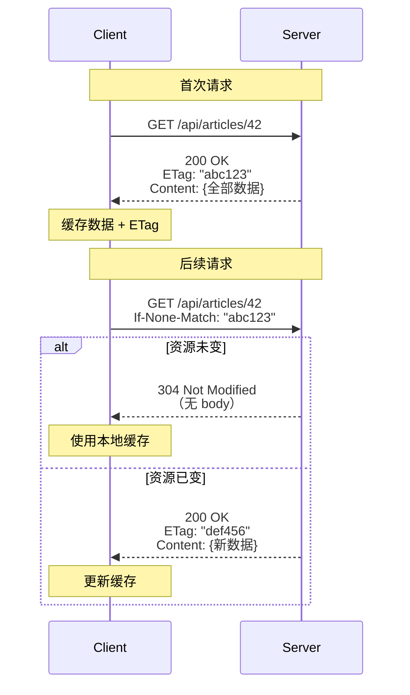
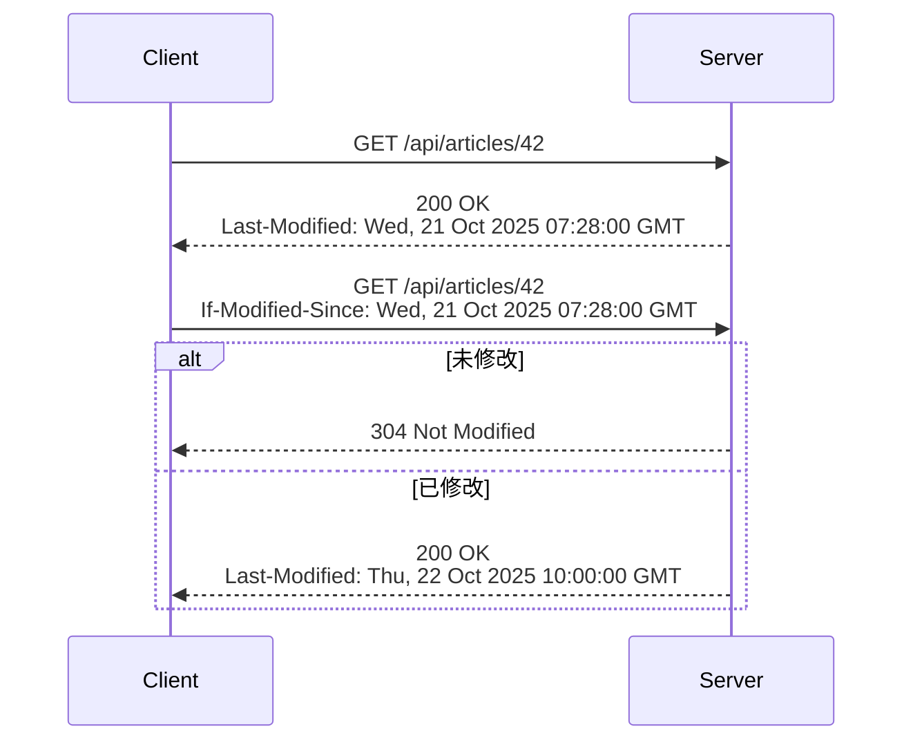

## 缓存协商的本质

HTTP 缓存协商解决一个核心问题：**如何在不传输完整资源的情况下确认资源是否变化**。304 Not Modified 是这个机制的关键状态码。

---

## 两种协商机制

### 机制 1: ETag + If-None-Match（强校验）



**ETag 生成策略**：

```Python
import hashlib
import json

def generate_etag(data: dict) -> str:
    """基于内容哈希生成 ETag"""
    content = json.dumps(data, sort_keys=True).encode()
    return hashlib.md5(content).hexdigest()

# 强 ETag（字节级精确）
etag = f'"{generate_etag(article_data)}"'

# 弱 ETag（语义等价，允许细微差异）
weak_etag = f'W/"{generate_etag(article_data)}"'
```

> [!important] 强 ETag vs 弱 ETag

> - **强 ETag**（`"abc123"`）：资源的**每个字节**都相同。用于 Range 请求、字节级缓存。

> - **弱 ETag**（`W/"abc123"`）：资源在**语义上**等价。允许格式化差异（如时间戳字段不同但业务数据相同）。

> 大多数 API 场景用弱 ETag 就够了。强 ETag 主要用于文件下载/断点续传。

---

### 机制 2: Last-Modified + If-Modified-Since（弱校验）



> [!faq] 为什么 Last-Modified 是"弱校验"？

> 因为 `Last-Modified` 的精度只到**秒**。如果资源在同一秒内被修改两次，`Last-Modified` 无法区分。而 ETag 基于内容哈希，可以检测到任何变化。

---

## FastAPI 实现

```Python
from fastapi import FastAPI, Request, Response, HTTPException
import hashlib
import json
from datetime import datetime

app = FastAPI()


def compute_etag(data: dict) -> str:
    content = json.dumps(data, sort_keys=True, default=str).encode()
    return f'"{hashlib.md5(content).hexdigest()}"'


@app.get("/articles/{article_id}")
async def get_article(article_id: int, request: Request):
    # 获取数据
    article = await article_repo.get(article_id)
    if not article:
        raise HTTPException(status_code=404)
    
    article_data = article.dict()
    etag = compute_etag(article_data)
    last_modified = article.updated_at
    
    # ETag 协商
    if_none_match = request.headers.get("if-none-match")
    if if_none_match and if_none_match == etag:
        return Response(
            status_code=304,
            headers={
                "ETag": etag,
                "Cache-Control": "private, max-age=0, must-revalidate"
            }
        )
    
    # Last-Modified 协商
    if_modified_since = request.headers.get("if-modified-since")
    if if_modified_since:
        ims_dt = datetime.strptime(if_modified_since, "%a, %d %b %Y %H:%M:%S GMT")
        if last_modified <= ims_dt:
            return Response(
                status_code=304,
                headers={"ETag": etag, "Last-Modified": last_modified.strftime("%a, %d %b %Y %H:%M:%S GMT")}
            )
    
    # 正常返回
    return Response(
        content=json.dumps(article_data),
        media_type="application/json",
        headers={
            "ETag": etag,
            "Last-Modified": last_modified.strftime("%a, %d %b %Y %H:%M:%S GMT"),
            "Cache-Control": "private, max-age=0, must-revalidate"
        }
    )
```

---

## 304 的约束

RFC 9110 §15.4.5 明确规定：

1. **不能有 body**

1. **必须**包含以下头（如果 200 响应中会包含的话）：
    
    - `Cache-Control`
    
    - `Content-Location`
    
    - `Date`
    
    - `ETag`
    
    - `Expires`
    
    - `Vary`
    

1. 304 的作用是**更新客户端缓存的元数据**（头字段），而不仅仅是说"没变"

> [!tip] 304 不只是"没变"的通知

> 304 携带的头可以**更新缓存策略**。比如服务器可以通过 304 响应中的新 `Cache-Control` 值来延长或缩短客户端的缓存有效期，而不需要重新传输整个资源。

---

## ETag 在乐观锁中的复用

缓存协商用 `If-None-Match`（GET），乐观锁用 `If-Match`（PUT/PATCH/DELETE）。同一个 ETag 值服务两个目的：

|场景|请求头|方法|含义|
|---|---|---|---|
|缓存协商|`If-None-Match: "abc"`|GET|"如果 ETag 不匹配，给我新数据"|
|乐观锁|`If-Match: "abc"`|PUT/PATCH|"只有 ETag 匹配时才执行更新"|

> [!important] 一个 ETag，两个用途

> 这是 HTTP 设计的精妙之处——同一个版本标识既用于缓存优化（节省带宽），又用于并发控制（防止丢失更新）。这两个看似不同的需求本质上都是在问同一个问题："资源有没有变？"