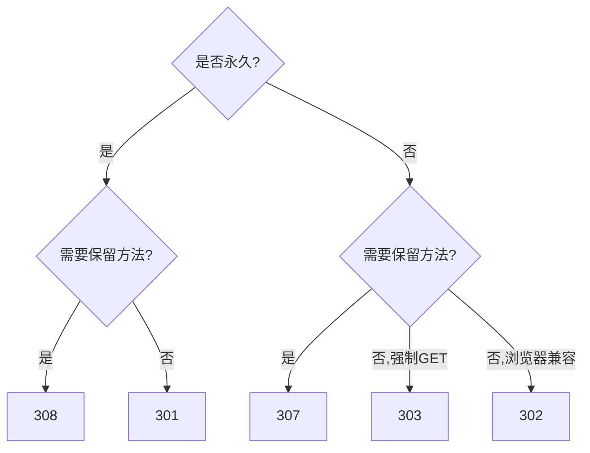

## 概述

3xx 状态码指示客户端需要采取进一步操作才能完成请求。核心问题是**重定向后是否保留原始 HTTP 方法和请求体**。

> [!important] 3xx 的核心分裂

> 3xx 家族的设计问题源于 HTTP/1.0 时代的**规范不严谨**。301/302 没有明确规定重定向后的方法变更行为，导致不同浏览器实现不一致。这个历史包袱最终催生了 303/307/308 来"修复"语义。

---

## 301 Moved Permanently

**语义**：资源已永久移动到新 URI。

**问题**：RFC 2616 说"除非 GET/HEAD，否则不应自动重定向"，但实际上**几乎所有浏览器都会把 POST 变成 GET**。

**适用**：纯 GET 场景的永久迁移（域名迁移、URL 重构、SEO）。

---

## 302 Found

**语义**：资源临时在另一个 URI。

**历史混乱**：RFC 2616 期望 302 保留方法，但浏览器普遍把 POST 改成 GET。RFC 9110 承认了这个现实："For historical reasons, a user agent MAY change the request method from POST to GET."

**适用**：仅浏览器场景的临时跳转，不应用于 API。

---

## 303 See Other

**语义**：**强制客户端用 GET** 访问另一个 URI。

**典型场景**：POST 表单提交后跳转到结果页（PRG 模式：Post-Redirect-Get）。

```JavaScript
POST /orders → 处理订单
303 See Other → Location: /orders/12345
GET /orders/12345 → 查看订单详情
```

> [!tip] PRG 模式

> Post-Redirect-Get 是 Web 开发中防止表单重复提交的经典模式。用户 POST 提交后，服务器返回 303，浏览器自动 GET 新地址。用户刷新页面时只会重发 GET，不会重复 POST。

---

## 304 Not Modified

**语义**：资源未修改，客户端可以使用缓存版本。

**触发条件**：客户端携带 `If-None-Match`（ETag）或 `If-Modified-Since`（时间戳），服务器验证后发现资源未变。

**约束**：

- 304 **不能有 body**

- 304 **必须**包含与 200 响应相同的缓存头（`ETag`、`Cache-Control`、`Vary` 等）

---

## 307 Temporary Redirect

**语义**：临时重定向，**必须保留原始方法和请求体**。

**RFC 9110 §15.4.8**："The user agent MUST NOT change the request method if it performs an automatic redirection."

**与 302 的区别**：307 是 302 的"修正版"——明确禁止改变方法。

---

## 308 Permanent Redirect

**语义**：永久重定向，**必须保留原始方法和请求体**。

**与 301 的区别**：308 是 301 的"修正版"——明确禁止改变方法。

---

## 选择决策



> [!important] API 场景的结论

> 在 REST API 中涉及 POST/PUT/PATCH/DELETE 的重定向，**只应使用 307/308**。301/302 的方法变更行为对 API 客户端来说是灾难——你的 POST 请求可能被静默转成 GET，body 丢失。

---

## 子页面

- `[[1. 重定向语义演进：从 RFC 2616 到 RFC 9110]]`

- `[[2. 304 与 HTTP 缓存协商：ETag / Last-Modified 机制]]`

[[2. 304 与 HTTP 缓存协商：ETag - Last-Modified 机制]]

[[1. 重定向语义演进：从 RFC 2616 到 RFC 9110]]