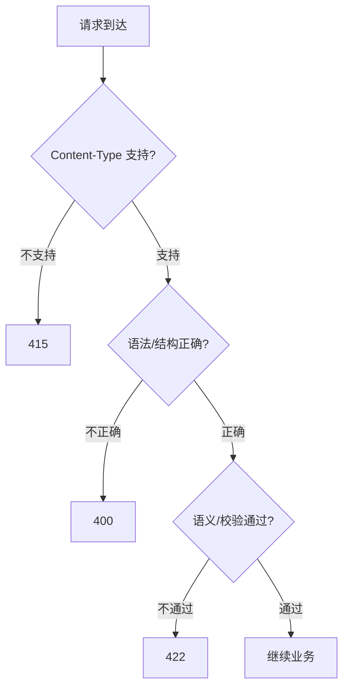

## 422 的身世

422 是 HTTP 状态码中**身世最曲折**的码之一。它从一个 WebDAV 扩展码演进为 RFC 9110 正式标准码，名字也从 "Unprocessable Entity" 改为 "Unprocessable Content"。

---

## 演进时间线

### 1999: RFC 2518 (WebDAV)

- 422 首次定义为 WebDAV 扩展码

- 名称：**Unprocessable Entity**

- 定义："The server understands the content type of the request entity, and the syntax of the request entity is correct, but was unable to process the contained instructions."

- 重点在 "Entity"（实体）——WebDAV 时代的概念

### 2007: RFC 4918 (WebDAV 更新)

- 沿用 422 定义，仍然是 WebDAV 专属

- 此时 422 **不是** HTTP 核心标准的一部分

### 2015-2020: 实践中的广泛采用

- Ruby on Rails、Django、FastAPI 等框架开始使用 422 表示参数校验失败

- FastAPI/Pydantic 将 422 作为默认的验证错误状态码

- GitHub API、Stripe API 等知名 API 开始使用 422

- 社区形成共识：422 = "请求语法正确但语义不合法"

> [!faq] 为什么框架选择 422 而不是 400？

> 因为 400 的语义是"请求本身坏了"（语法/格式错误），而参数校验失败不是格式问题——JSON 能正确解析，只是里面的值不合法。422 精确表达了"我读懂了你的请求，但内容不合理"这个语义。FastAPI 选择 422 作为 Pydantic 校验失败的默认码，正是基于这个区分。

### 2022: RFC 9110 (HTTP Semantics)

- **422 正式纳入 HTTP 核心标准**

- 名称从 "Unprocessable Entity" 改为 **"Unprocessable Content"**

- RFC 9110 §15.5.21："The 422 (Unprocessable Content) status code indicates that the server understands the content type of the request content, and the syntax of the request content is correct, but was unable to process the contained instructions."

> [!important] 更名的意义

> "Entity" → "Content" 的更名不仅仅是文字游戏。RFC 9110 系统性地将 HTTP 中的 "entity"（实体）概念替换为 "content"（内容）和 "representation"（表示）。这反映了对 HTTP 消息模型的重新理解——HTTP 传输的不是"实体"，而是资源的"内容"或"表示"。

---

## 422 vs 400 的精确边界

### RFC 9110 的定义对比

**400 (Bad Request) §15.5.1**：

> "The 400 (Bad Request) status code indicates that the server cannot or will not process the request due to something that is perceived to be a client error (e.g., malformed request syntax, invalid request message framing, or deceptive request routing)."

**422 (Unprocessable Content) §15.5.21**：

> "The server understands the content type... and the syntax... is correct, but was unable to process the contained instructions."

### 决策流程



### 具体示例

```Python
# 400: JSON 语法错误（解析器无法处理）
# 请求体：{"name": "test"   ← 缺少闭合括号
# 服务器甚至无法将这个字符串解析为对象

# 400: 结构性错误（必需字段完全缺失）
# 某些框架会将缺失必需字段归类为 400 而非 422
# 这是灰色地带——取决于你的设计哲学

# 422: 字段值不合法
# {"email": "not-a-valid-email", "age": -5}
# JSON 语法完全正确，但字段值违反业务规则

# 422: 跨字段约束
# {"start_date": "2025-12-31", "end_date": "2025-01-01"}
# 每个字段单独看都合法，但组合起来不合理
```

---

## FastAPI 中 422 的实现细节

### 默认行为

FastAPI 使用 Pydantic 进行请求体校验。当校验失败时，返回 422 和详细的错误信息：

```Python
from fastapi import FastAPI
from pydantic import BaseModel, EmailStr, field_validator

app = FastAPI()

class UserCreate(BaseModel):
    name: str
    email: EmailStr
    age: int
    
    @field_validator("age")
    @classmethod
    def validate_age(cls, v):
        if v < 0 or v > 150:
            raise ValueError("年龄必须在 0-150 之间")
        return v

@app.post("/users")
async def create_user(data: UserCreate):
    return data
```

### 默认的 422 响应格式

```JSON
{
    "detail": [
        {
            "type": "value_error",
            "loc": ["body", "email"],
            "msg": "value is not a valid email address",
            "input": "not-email",
            "ctx": {"reason": "..."}
        },
        {
            "type": "value_error",
            "loc": ["body", "age"],
            "msg": "Value error, 年龄必须在 0-150 之间",
            "input": -5
        }
    ]
}
```

> [!tip] FastAPI 默认 422 格式的优缺点

> **优点**：详细、包含字段位置和输入值，方便调试。

> **缺点**：格式是 Pydantic 专属的，不适合跨语言/跨框架的统一约定。建议通过自定义 `RequestValidationError` 处理器将其转换为团队统一的错误格式（见 `[[1. FastAPI 统一异常处理与错误响应体实战]]`）。

---

## 争议：某些场景 400 还是 422？

以下场景在社区中存在争议：

|场景|倾向 400 的理由|倾向 422 的理由|建议|
|---|---|---|---|
|必需字段缺失|"结构不完整"|"语法正确，只是不满足约束"|**422**（JSON 本身合法）|
|字段类型错误（字符串传了数字）|"无法映射到目标类型"|"语法正确但语义不匹配"|**422**（JSON 值合法）|
|请求体为空但接口要求有 body|"结构问题"|"不好说"|**400**（报文层缺失）|
|URL 参数格式错误|"请求结构问题"|"可解析但值不合法"|**看具体情况**|

> [!important] 实用建议

> 不要在 400 和 422 的边界上纠结太久。选择一个团队一致的标准即可。**一致性比"绝对正确"更重要**。FastAPI 的选择（Pydantic 校验 → 422，解析失败 → 400）是一个合理的默认策略。