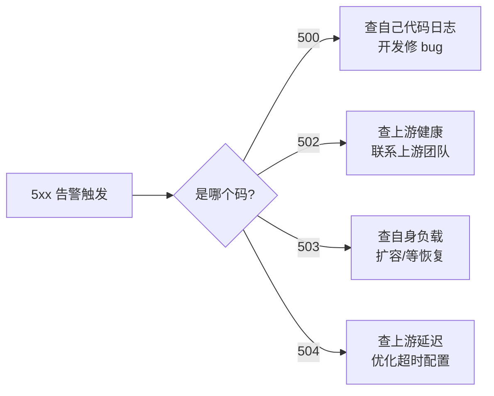

## 概述

5xx 表示**服务器未能完成一个看起来合法的请求**。关键在于——错不在客户端，客户端无需修改请求即可重试。

> [!important] 5xx 的运维价值

> 5xx 的精确使用直接决定运维排障效率。在微服务架构下，一个请求链路可能经过 API Gateway → BFF → Service A → Service B → Database。精确的 5xx 分类让告警系统能**立即定位故障层级**。

---

## 500 Internal Server Error

**语义**：服务器遇到了**意外情况**，无法完成请求。

**RFC 9110 §15.6.1**："The 500 (Internal Server Error) status code indicates that the server encountered an unexpected condition that prevented it from fulfilling the request."

**典型触发**：

- 未捕获的异常（NullPointerException、KeyError 等）

- 代码逻辑 bug

- 数据库连接池耗尽（自身问题）

- 配置错误

```Python
# FastAPI 全局异常捕获
@app.exception_handler(Exception)
async def global_exception_handler(request: Request, exc: Exception):
    logger.error(f"Unhandled exception: {exc}", exc_info=True)
    return JSONResponse(
        status_code=500,
        content={
            "code": "INTERNAL_ERROR",
            "message": "服务内部异常",
            "request_id": request.state.request_id
        }
    )
```

> [!tip] 500 应该是"兜底码"

> 在良好的异常处理体系中，500 只应该出现在**真正未预期的异常**。所有可预期的错误都应该映射到更精确的状态码（401/403/404/409/422/502/503/504）。如果你的系统 500 率居高不下，说明异常分类不够细。

---

## 502 Bad Gateway

**语义**：网关/代理从**上游服务器**收到了无效响应。

**关键**：502 说明**你自己的代码没问题**，但你依赖的上游返回了不合法的东西（乱码、连接重置、协议错误等）。

**微服务中的典型场景**：

- 上游服务崩溃，返回 HTML 错误页而非 JSON

- 上游服务返回了不合法的 HTTP 响应

- gRPC 调用收到 transport error

```Python
try:
    response = await httpx_client.post(upstream_url, json=payload)
    response.raise_for_status()
except httpx.HTTPStatusError as e:
    raise HTTPException(status_code=502, detail={
        "code": "UPSTREAM_ERROR",
        "message": f"上游服务返回异常: {e.response.status_code}"
    })
except httpx.RequestError as e:
    raise HTTPException(status_code=502, detail={
        "code": "UPSTREAM_UNREACHABLE",
        "message": "上游服务不可达"
    })
```

---

## 503 Service Unavailable

**语义**：服务器**临时**无法处理请求。

**典型触发**：

- 计划维护

- 过载保护（限流/熔断）

- 启动中尚未就绪

- 依赖的关键资源暂时不可用

**最佳实践**：

- 配合 `Retry-After` 头告知恢复时间

- 区分"维护中"和"过载"给出不同的 `Retry-After` 策略

```JavaScript
HTTP/1.1 503 Service Unavailable
Retry-After: 120

{"code": "MAINTENANCE", "message": "系统维护中，预计 2 分钟后恢复"}
```

> [!faq] 503 vs 429

> **429** = 你（个人/IP）请求太多，被限流了；**503** = 整个服务对所有人都不可用。429 是针对特定客户端的惩罚，503 是全局性的不可用状态。

---

## 504 Gateway Timeout

**语义**：网关/代理**等待上游响应超时**。

**与 502 的区别**：502 = 上游返回了坏响应；504 = 上游**什么都没返回**（超时了）。

**调优方向**：

- 增加网关的超时配置（临时缓解）

- 优化上游服务的响应时间（根本解决）

- 引入异步机制避免长时间同步等待

---

## 补充码速览

|码|语义|实际使用|
|---|---|---|
|501|不支持该功能/方法|服务器未实现请求的 HTTP 方法（如不支持 PATCH）|
|505|HTTP 版本不支持|极罕见|
|507|存储不足|WebDAV 专用|
|508|循环检测|WebDAV 专用|
|511|网络认证|WiFi Portal 等网络接入层|

> [!tip] 501 的常见误用

> 501 表示"服务器根本不支持这个 HTTP 方法"，**不是**"这个业务功能还没开发"。如果功能未开发但方法本身是支持的，应该返回 404（资源不存在）或 403（无权限）。

---

## 5xx 与监控告警



> [!important] 思辨：为什么不全用 500？

> 如果所有服务端错误都是 500，运维收到告警后需要**打开日志逐条排查**才能判断问题在哪里。而精确的 502/503/504 让运维在告警 Dashboard 上就能**一眼看出**问题类型：502 → 上游挂了，503 → 自己过载了，504 → 上游慢了。每秒钟的排障效率在 P0 事故中都是金钱。