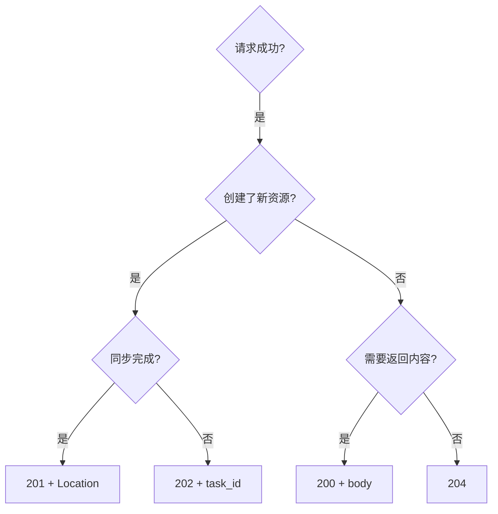

## 深度辨析

四个成功码的核心区别在于**对客户端后续行为的指引**。

---

## 200 vs 201："结果"与"创造"

**200**：请求处理完毕，结果在 body 里。客户端只需解析响应。

**201**：**新资源被创造了**。这不仅是状态通知，更是一个**承诺**——新资源可以通过 `Location` 头或 body 中的信息访问到。

> [!tip] 思辨：POST 成功到底该用 200 还是 201？

> 取决于 POST 是否**创建了新资源**。如果 POST 是"触发一个计算并返回结果"（如 `/api/calculate`），用 200；如果 POST 是"创建一个新实体"（如 `POST /users`），用 201。判断标准是：**服务器上是否因此多了一个可独立寻址的资源？**

---

## 201 vs 202："已完成"与"已接受"

|维度|201 Created|202 Accepted|
|---|---|---|
|处理状态|**已完成**|仅**已接受**|
|资源是否已存在|✅ 新资源已可访问|❌ 可能还没创建|
|客户端后续|直接使用新资源|需要轮询/等回调|
|`Location` 头|指向新资源|可指向任务状态查询|

> [!important] 202 的核心承诺

> 202 只承诺"我收到了你的请求"，**不承诺最终结果**。这意味着最终可能成功也可能失败。客户端必须有能力查询最终状态。

---

## 200 vs 204："有话说"与"没话说"

|维度|200 OK|204 No Content|
|---|---|---|
|响应体|✅ 有（通常是请求的结果）|❌ **禁止有**|
|客户端行为|解析并使用 body|不尝试解析任何 body|
|常见场景|GET 查询、更新后返回新值|DELETE 成功、空更新|

> [!faq] DELETE 用 200 还是 204？

> **推荐 204**。DELETE 成功后通常不需要返回什么（资源已删除）。如果确实需要返回被删除的资源快照（如审计需求），可以用 200。但这种场景不常见——大多数时候 204 是最干净的选择。

---

## 决策树



---

## Python/FastAPI 完整示例

```Python
from fastapi import FastAPI, HTTPException
from fastapi.responses import JSONResponse, Response

app = FastAPI()

# 200: 查询成功
@app.get("/users/{user_id}")
async def get_user(user_id: int):
    user = await user_repo.find(user_id)
    if not user:
        raise HTTPException(status_code=404)
    return user  # 默认 200

# 201: 创建成功
@app.post("/users", status_code=201)
async def create_user(data: UserCreate):
    user = await user_repo.create(data)
    return JSONResponse(
        status_code=201,
        content=user.dict(),
        headers={"Location": f"/api/users/{user.id}"}
    )

# 202: 异步任务
@app.post("/reports", status_code=202)
async def generate_report(config: ReportConfig):
    task_id = await task_queue.enqueue(config)
    return {"task_id": task_id, "status_url": f"/api/tasks/{task_id}"}

# 204: 删除成功
@app.delete("/users/{user_id}", status_code=204)
async def delete_user(user_id: int):
    await user_repo.delete(user_id)
    return Response(status_code=204)
```