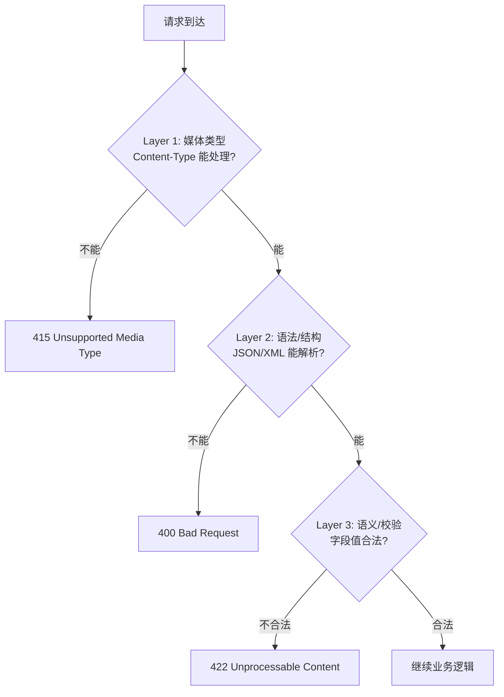

## 三层模型

请求到达服务器后，会经历三层"关卡"。每一层的失败对应不同的状态码：



---

## Layer 1: 415 — 我不认识这种格式

**触发条件**：服务器根本不支持请求中的 `Content-Type`。

**示例**：

- 接口只接受 `application/json`，客户端发 `application/xml`

- 接口只接受 `multipart/form-data`，客户端发 `application/json`

```Python
# 415 在 FastAPI 中通常由框架自动处理
# 如果需要手动校验：
@app.post("/upload")
async def upload(request: Request):
    if request.headers.get("content-type") not in ["multipart/form-data"]:
        raise HTTPException(
            status_code=415,
            detail="Only multipart/form-data is accepted"
        )
```

---

## Layer 2: 400 — 我读不懂你的请求

**触发条件**：Content-Type 正确，但请求体的**语法/结构**有问题。

**示例**：

- JSON 缺少闭合括号：`{"name": "test"`

- 必需的字段完全缺失（结构层面）

- URL 中包含非法字符

- 请求头格式错误

> [!tip] 400 的边界

> 400 应该仅用于**解析层面**的问题。如果 JSON 能成功解析为一个对象，只是某个字段的值不合法（如 email 格式错误），那不应该是 400，而是 422。

---

## Layer 3: 422 — 我读懂了但办不了

**触发条件**：请求语法正确、可解析，但**字段值/语义/业务规则**不通过。

**示例**：

- email 格式无效

- age 为负数

- 日期范围不合逻辑（end < start）

- 枚举值不在允许列表中

- 密码不满足复杂度要求

```Python
# FastAPI + Pydantic 自动返回 422
from pydantic import BaseModel, EmailStr, field_validator

class UserCreate(BaseModel):
    name: str
    email: EmailStr  # 格式无效 → 422
    age: int

    @field_validator("age")
    @classmethod
    def age_must_be_positive(cls, v):
        if v < 0 or v > 150:
            raise ValueError("年龄必须在 0-150 之间")
        return v
```

---

## 实战对比

|请求|Content-Type|Body|结果|
|---|---|---|---|
|`text/xml`|❌ 不支持|—|**415**|
|`application/json`|✅|`{invalid json`|**400**|
|`application/json`|✅|`{"email": "not-email"}`|**422**|
|`application/json`|✅|`{"email": "a@b.com", "age": 25}`|**继续处理**|

> [!important] 思辨：为什么这个三层模型重要？

> 因为每一层失败后，客户端的**修复策略完全不同**：

> - 415 → 改 Content-Type 头

> - 400 → 检查序列化/格式代码

> - 422 → 检查具体字段值

> 如果全用 400，客户端需要解析 body 中的错误消息才能判断该怎么修复。而精确的状态码让客户端在看到 HTTP 状态码的瞬间就能锁定问题范围。

---

## 子页面

- `[[1. 422 语义演进与 RFC 9110 精确定义]]`