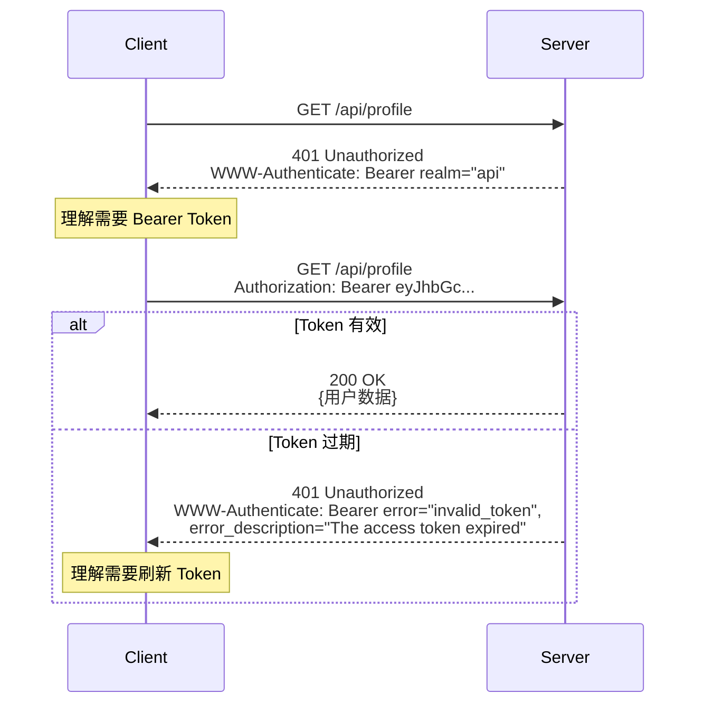
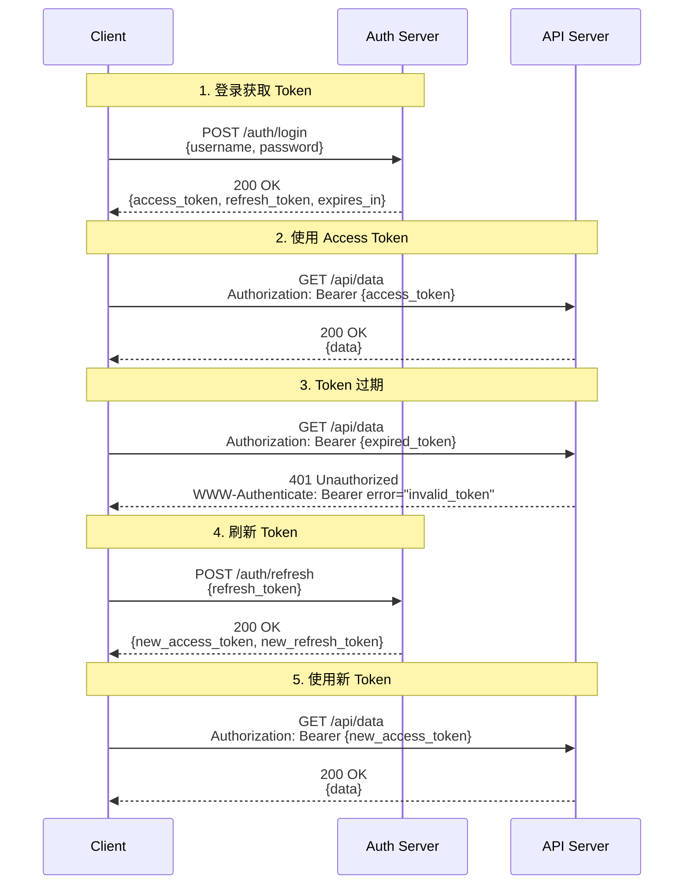

## 核心机制

HTTP 认证框架的核心交互：服务器通过 `WWW-Authenticate` 头发起**挑战（challenge）**，客户端通过 `Authorization` 头提供**凭证（credentials）**。

---

## RFC 9110 认证框架

### 挑战-响应流程



### WWW-Authenticate 头格式

```JavaScript
WWW-Authenticate: <scheme> [realm="<realm>"] [, <param>=<value>]*
```

---

## Bearer Token 方案（RFC 6750）

### 标准参数

```JavaScript
# 基础挑战
WWW-Authenticate: Bearer realm="api"

# 带错误信息的挑战
WWW-Authenticate: Bearer realm="api",
  error="invalid_token",
  error_description="The access token expired",
  scope="read write"
```

**RFC 6750 定义的 error 值**：

|error|含义|典型场景|
|---|---|---|
|`invalid_request`|请求缺少必需参数|没带 Authorization 头|
|`invalid_token`|Token 无效|过期、签名错误、被撤销|
|`insufficient_scope`|Token 权限不足|有效 token 但 scope 不够|

> [!important] `insufficient_scope` 应该返回 403 而非 401

> RFC 6750 §3.1 明确指出：当 token 有效但权限不足时，应返回 **403** + `WWW-Authenticate: Bearer error="insufficient_scope"`。这符合 401/403 的语义边界——401 是认证问题，403 是授权问题。

---

## 完整的 JWT 认证流程

### Token 生命周期



---

## FastAPI 完整实现

```Python
import jwt
from datetime import datetime, timedelta
from fastapi import FastAPI, Depends, HTTPException
from fastapi.security import HTTPBearer, HTTPAuthorizationCredentials
from pydantic import BaseModel

app = FastAPI()

# 配置
SECRET_KEY = "your-secret-key"
ALGORITHM = "HS256"
ACCESS_TOKEN_EXPIRE_MINUTES = 30

security = HTTPBearer(auto_error=False)


class TokenPayload(BaseModel):
    sub: str
    exp: int
    scopes: list[str] = []


def create_access_token(user_id: str, scopes: list[str]) -> str:
    expire = datetime.utcnow() + timedelta(minutes=ACCESS_TOKEN_EXPIRE_MINUTES)
    payload = {"sub": user_id, "exp": expire, "scopes": scopes}
    return jwt.encode(payload, SECRET_KEY, algorithm=ALGORITHM)


async def get_current_user(
    credentials: HTTPAuthorizationCredentials = Depends(security)
) -> TokenPayload:
    """认证依赖：验证 Bearer Token"""
    
    # 情况 1：没有提供 Token
    if credentials is None:
        raise HTTPException(
            status_code=401,
            detail={"code": "AUTH_REQUIRED", "message": "需要认证"},
            headers={"WWW-Authenticate": 'Bearer realm="api"'}
        )
    
    token = credentials.credentials
    
    try:
        payload = jwt.decode(token, SECRET_KEY, algorithms=[ALGORITHM])
        return TokenPayload(**payload)
    except jwt.ExpiredSignatureError:
        # 情况 2：Token 过期
        raise HTTPException(
            status_code=401,
            detail={"code": "TOKEN_EXPIRED", "message": "令牌已过期"},
            headers={
                "WWW-Authenticate": 'Bearer realm="api", '
                'error="invalid_token", '
                'error_description="The access token expired"'
            }
        )
    except jwt.InvalidTokenError:
        # 情况 3：Token 无效（签名错误、格式错误等）
        raise HTTPException(
            status_code=401,
            detail={"code": "INVALID_TOKEN", "message": "无效的令牌"},
            headers={
                "WWW-Authenticate": 'Bearer realm="api", '
                'error="invalid_token"'
            }
        )


def require_scope(required: str):
    """权限检查依赖工厂"""
    async def check_scope(
        user: TokenPayload = Depends(get_current_user)
    ) -> TokenPayload:
        if required not in user.scopes:
            raise HTTPException(
                status_code=403,  # 注意：权限不足是 403 不是 401
                detail={
                    "code": "INSUFFICIENT_SCOPE",
                    "message": f"需要 {required} 权限"
                },
                headers={
                    "WWW-Authenticate": f'Bearer realm="api", '
                    f'error="insufficient_scope", '
                    f'scope="{required}"'
                }
            )
        return user
    return check_scope


# 使用示例
@app.get("/api/profile")
async def get_profile(user: TokenPayload = Depends(get_current_user)):
    return {"user_id": user.sub}


@app.delete("/api/users/{user_id}")
async def delete_user(
    user_id: str,
    user: TokenPayload = Depends(require_scope("admin"))
):
    await user_service.delete(user_id)
    return Response(status_code=204)
```

---

## 认证方案对比

|**方案**|**WWW-Authenticate**|**适用场景**|**安全性**|
|---|---|---|---|
|Basic|`Basic realm="..."`|内部工具、简单场景|低（明文 Base64）|
|Bearer (JWT)|`Bearer realm="..."`|SPA、移动端、微服务|中高（取决于密钥管理）|
|Bearer (Opaque)|`Bearer realm="..."`|需要即时撤销的场景|高（服务端验证）|
|API Key|`ApiKey realm="..."`（自定义）|服务间调用、第三方集成|中（取决于传输方式）|

> [!tip] 为什么 Bearer Token 成为主流？

> Bearer Token 的优势在于**无状态验证**——JWT 自包含用户信息和过期时间，服务器不需要查数据库就能验证。这对微服务架构至关重要——每个服务都能独立验证 token，不需要集中式 session 存储。代价是无法即时撤销（需要等 token 过期或引入黑名单机制）。