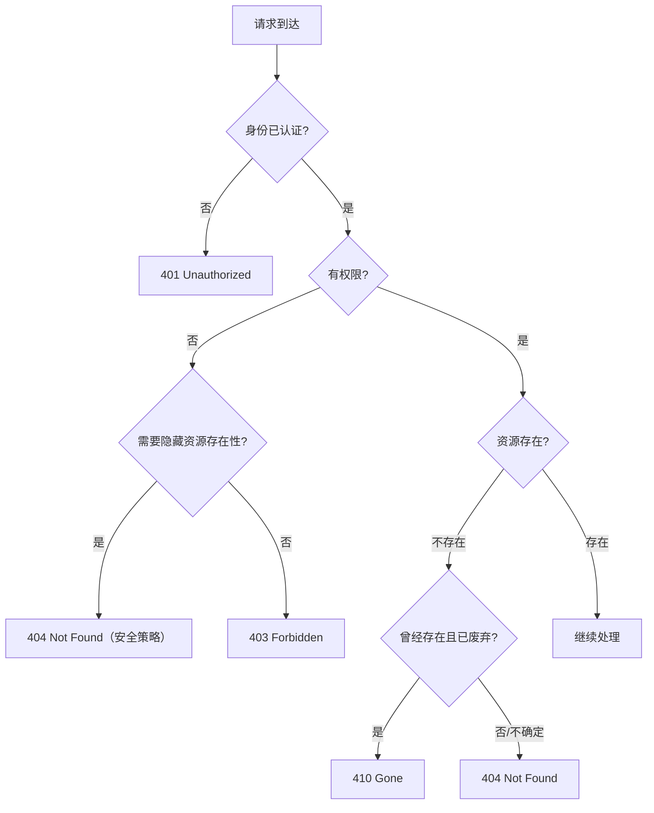

## 四码关系图



---

## 401 Unauthorized 深度解析

### 语义精确定义

RFC 9110 §15.5.2: "The 401 (Unauthorized) status code indicates that the request has not been applied because it lacks valid authentication credentials for the target resource."

### `WWW-Authenticate` 头

401 响应**必须**包含此头。常见方案：

```JavaScript
# Bearer Token（OAuth 2.0）
WWW-Authenticate: Bearer realm="api"
WWW-Authenticate: Bearer error="invalid_token", error_description="The access token expired"

# Basic Auth
WWW-Authenticate: Basic realm="admin"

# API Key（自定义）
WWW-Authenticate: ApiKey realm="api"
```

> [!faq] 为什么 401 叫 "Unauthorized" 而不是 "Unauthenticated"？

> 这是 HTTP 规范中公认的**命名失误**。401 的实际语义是"未认证"（unauthenticated），而非"未授权"（unauthorized）。"未授权"的语义其实由 403 承担。RFC 9110 没有修正这个历史命名，但在描述中明确使用了 "authentication credentials" 来澄清。

---

## 403 Forbidden 深度解析

### 与 401 的精确边界

|场景|401|403|
|---|---|---|
|没带 token|✅||
|token 过期|✅||
|token 有效但角色不够||✅|
|token 有效但 IP 被封||✅|
|token 有效但功能付费未开通||✅|

### 安全策略：403 vs 404

> [!important] GitHub 策略

> 对私有仓库，GitHub 返回 404 而非 403。原因：403 确认了"资源存在但你无权访问"，泄露了资源存在性。404 则让攻击者无法判断资源是否存在。

**实践建议**：

- 对**敏感资源**（如其他用户的私有数据）→ 用 404 隐藏

- 对**公开已知但需权限的资源**（如管理后台）→ 用 403 明确告知

---

## 404 Not Found 深度解析

### 语义

"服务器没有找到与请求 URI 匹配的资源。不承诺未来是否会存在。"

### 多重用途

1. **真实不存在**：请求的 ID 不在数据库中

1. **路由不匹配**：URL 路径写错了

1. **安全隐藏**：资源存在但不想暴露（替代 403）

> [!tip] 404 的模糊性是特性不是 bug

> 404 不区分"资源从未存在"和"你没有权限看到它"——这种模糊性在安全场景下是**有意为之**的。

---

## 410 Gone 深度解析

### 与 404 的区别

|维度|404|410|
|---|---|---|
|承诺|不承诺任何事|**明确承诺永久消失**|
|缓存|通常不缓存|可以缓存|
|SEO 影响|搜索引擎会继续回访|搜索引擎会从索引中删除|

### 典型使用场景

- API v1 下线，v2 已上线 → `/api/v1/*` 返回 410

- 用户主动删除并要求永久清除的数据

- 法律要求移除的内容

> [!info] 实践建议

> 绝大多数场景用 404 就够了。410 只在**需要明确告诉客户端和搜索引擎"别再来了"**时使用。

---

## 子页面

- `[[1. WWW-Authenticate 与 Bearer Token 认证流程]]`

[[1. WWW-Authenticate 与 Bearer Token 认证流程]]