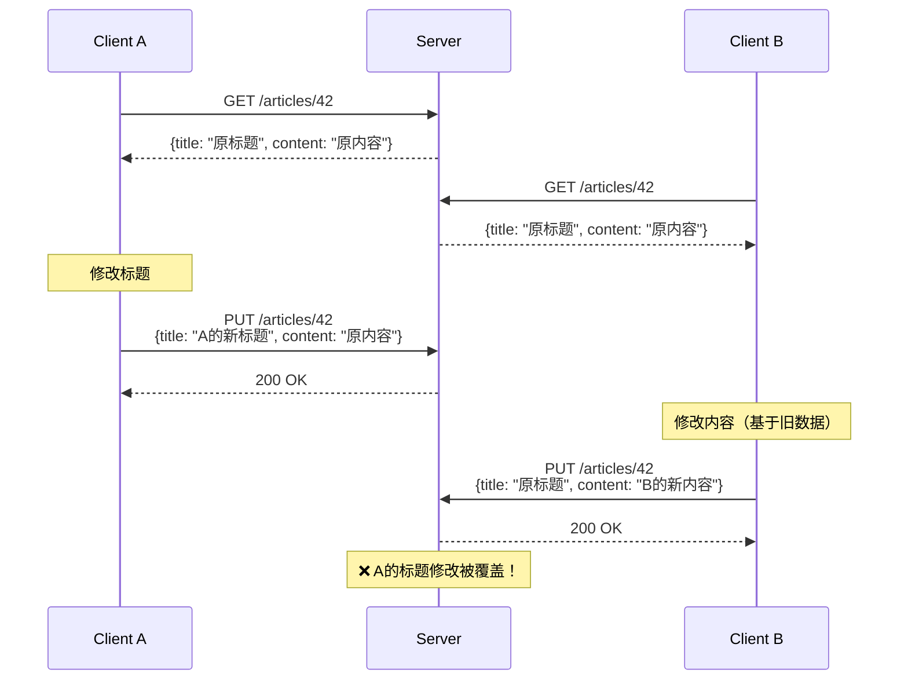
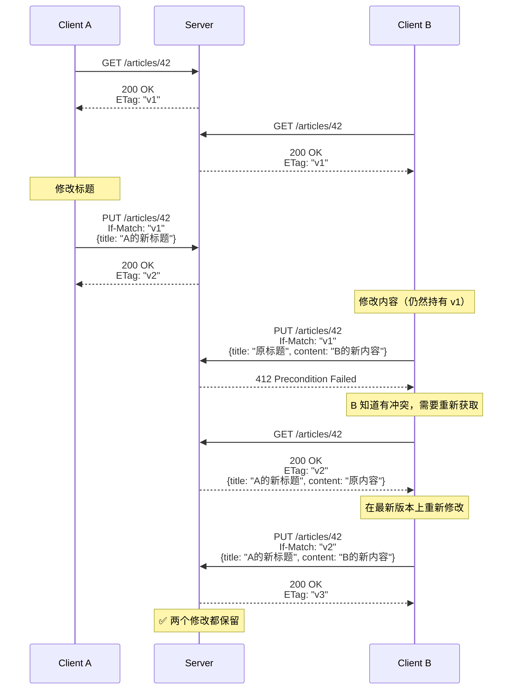

## 问题：丢失更新（Lost Update）

当两个客户端同时编辑同一资源时，后写入的会覆盖先写入的修改，导致数据丢失。



---

## 解决方案：ETag + 条件请求

### 正确的交互流程



---

## 三个相关状态码

|码|触发条件|客户端应对|
|---|---|---|
|**428**|服务端要求 `If-Match` 但客户端没带|重新 GET 获取 ETag 后重试|
|**412**|客户端带了 `If-Match` 但 ETag 不匹配|重新 GET 获取最新版本后合并修改|
|**409**|与条件请求无关的资源状态冲突|根据错误信息处理|

---

## FastAPI 完整实现

### 服务端

```Python
import hashlib
import json
from fastapi import FastAPI, Request, HTTPException, Response
from fastapi.responses import JSONResponse
from pydantic import BaseModel
from typing import Optional

app = FastAPI()

# 模拟数据存储
db: dict[int, dict] = {
    42: {"id": 42, "title": "原标题", "content": "原内容", "version": 1}
}


def compute_etag(data: dict) -> str:
    """基于内容生成 ETag"""
    content = json.dumps(data, sort_keys=True, default=str).encode()
    return f'"{hashlib.md5(content).hexdigest()}"'


class ArticleUpdate(BaseModel):
    title: Optional[str] = None
    content: Optional[str] = None


@app.get("/articles/{article_id}")
async def get_article(article_id: int, request: Request):
    article = db.get(article_id)
    if not article:
        raise HTTPException(status_code=404)
    
    etag = compute_etag(article)
    
    # 缓存协商
    if_none_match = request.headers.get("if-none-match")
    if if_none_match == etag:
        return Response(status_code=304, headers={"ETag": etag})
    
    return JSONResponse(
        content=article,
        headers={"ETag": etag}
    )


@app.put("/articles/{article_id}")
async def update_article(
    article_id: int,
    data: ArticleUpdate,
    request: Request
):
    article = db.get(article_id)
    if not article:
        raise HTTPException(status_code=404)
    
    current_etag = compute_etag(article)
    
    # 检查是否提供了 If-Match
    if_match = request.headers.get("if-match")
    
    if if_match is None:
        # 428: 服务端要求条件请求但客户端没带
        raise HTTPException(
            status_code=428,
            detail={
                "code": "PRECONDITION_REQUIRED",
                "message": "更新操作要求 If-Match 头",
                "current_etag": current_etag
            }
        )
    
    if if_match != current_etag:
        # 412: 条件不满足（ETag 不匹配）
        raise HTTPException(
            status_code=412,
            detail={
                "code": "PRECONDITION_FAILED",
                "message": "资源已被修改，请获取最新版本",
                "current_etag": current_etag
            }
        )
    
    # 更新
    if data.title is not None:
        article["title"] = data.title
    if data.content is not None:
        article["content"] = data.content
    article["version"] += 1
    
    new_etag = compute_etag(article)
    
    return JSONResponse(
        content=article,
        headers={"ETag": new_etag}
    )
```

### 客户端使用

```Python
import httpx

async def safe_update(client: httpx.AsyncClient, article_id: int, updates: dict):
    """安全更新：自动处理乐观锁"""
    max_retries = 3
    
    for attempt in range(max_retries):
        # 1. 获取最新版本和 ETag
        resp = await client.get(f"/articles/{article_id}")
        resp.raise_for_status()
        current_data = resp.json()
        etag = resp.headers["etag"]
        
        # 2. 合并修改
        merged = {**current_data, **updates}
        
        # 3. 带条件更新
        resp = await client.put(
            f"/articles/{article_id}",
            json=merged,
            headers={"If-Match": etag}
        )
        
        if resp.status_code == 200:
            return resp.json()  # 成功
        elif resp.status_code == 412:
            print(f"冲突，重试 {attempt + 1}/{max_retries}")
            continue  # 重试
        else:
            resp.raise_for_status()
    
    raise Exception("多次重试后仍然冲突")
```

---

## ETag vs 版本号

|维度|ETag|版本号 (version)|
|---|---|---|
|来源|内容哈希或服务器生成|数据库自增字段|
|协议支持|HTTP 标准（`If-Match`/`If-None-Match`）|需要自定义实现|
|额外用途|缓存协商（304）|仅用于并发控制|
|实现复杂度|中等（需要计算哈希）|简单（数据库字段）|
|颗粒度|基于完整内容|仅反映版本号|

> [!important] 思辨：为什么推荐 ETag 而非版本号？

> 版本号更简单，但 ETag 有两个版本号做不到的事：

> 1. **缓存协商**——同一个 ETag 值既用于乐观锁又用于 304 缓存，一举两得

> 2. **HTTP 标准**——所有 HTTP 客户端和代理都理解 `If-Match`/`If-None-Match`，不需要自定义 header 或 body 字段

> 如果你的系统不需要 HTTP 缓存协商，版本号完全够用。但如果你想利用 HTTP 协议的全部能力，ETag 是更优的选择。