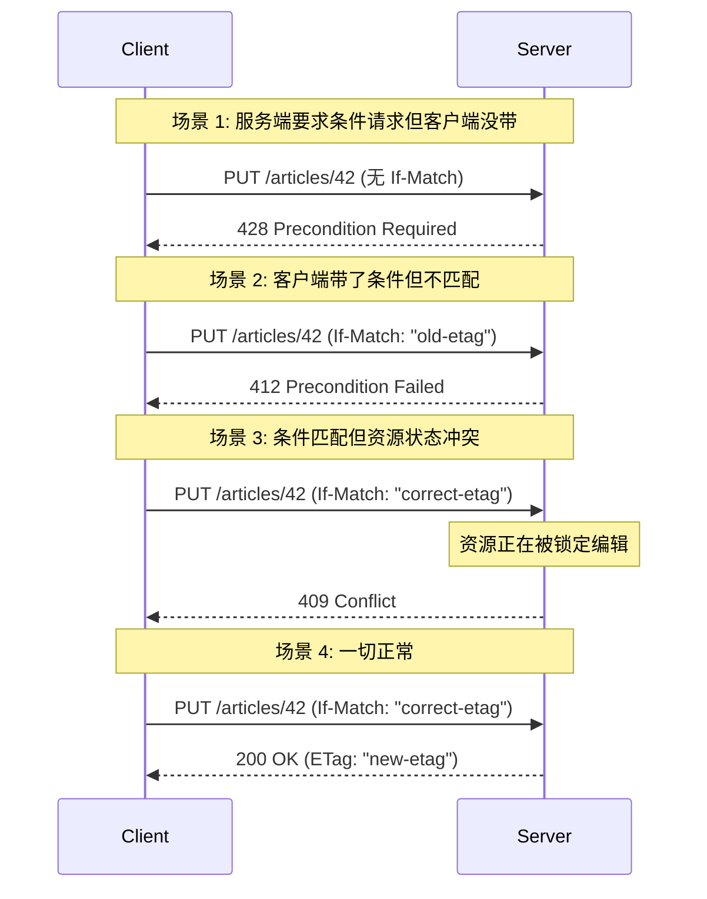
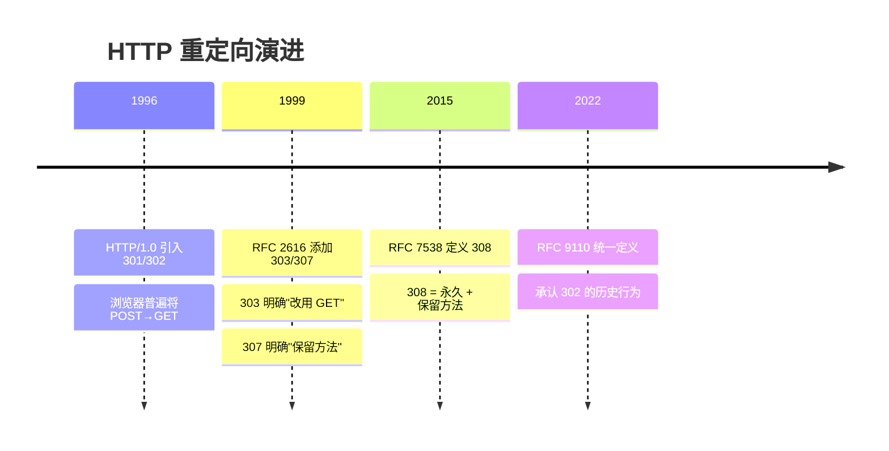
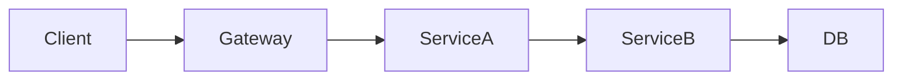

## Part 1: 并发条件三角 409/412/428

### 完整链路

### 精确定义

|码|触发条件|RFC 定义核心|
|---|---|---|
|**428**|客户端**没带**条件请求头，但服务器**要求**必须带|"The origin server requires the request to be conditional"|
|**412**|客户端**带了**条件头，但条件**不满足**|"One or more conditions given in the request header fields evaluated to false"|
|**409**|条件无关，资源**当前状态**与操作意图冲突|"The request could not be completed due to a conflict with the current state of the target resource"|

> [!important] 三者的本质区别

> - **428** 是**服务端的要求**：你必须带条件才能操作（防止 lost update）

> - **412** 是**条件检查的结果**：你带了条件但没过（乐观锁失败）

> - **409** 是**资源本身的问题**：不管你带不带条件，当前状态就不允许这个操作

---

## Part 2: 重定向边界 301/302/303/307/308

### 演进时间线

### 二维矩阵

||**临时**|**永久**|
|---|---|---|
|**可能改方法**|302 Found|301 Moved Permanently|
|**强制 GET**|303 See Other|—|
|**保留方法**|307 Temporary Redirect|308 Permanent Redirect|

> [!tip] API 开发者记住这两条就够了

> 1. **非 GET 方法的重定向 → 307/308**

> 2. **POST 后查看结果 → 303**

---

## Part 3: 服务端错误边界 500/502/503/504

### 微服务链路视角

|故障位置|现象|Gateway 返回|
|---|---|---|
|ServiceA 代码 bug|ServiceA 返回 500|**502**（上游坏响应）|
|ServiceA 启动中|连接被拒绝|**503**（不可用）|
|ServiceB 响应慢|ServiceA 等待超时|**504**（上游超时）|
|Gateway 自身 bug|Gateway 崩溃|**500**（自己炸了）|
|ServiceA 过载|ServiceA 主动返回 503|**503**（透传）|

> [!important] 思辨：上游的 500 在我这里是 502

> 这是一个关键的认知点。当你的上游返回 500 时，对你来说这是一个"上游坏响应"——你的代码没有问题，是上游出了问题。所以你应该返回 **502** 给你的调用方，而不是把上游的 500 直接透传。透传 500 会让调用方误以为问题在你这里。

### 可重试性

|码|是否应重试|策略|
|---|---|---|
|500|❌ 通常不应（可能是确定性 bug）|检查日志后修复|
|502|✅ 可重试（上游可能恢复）|指数退避，最多 3 次|
|503|✅ 应重试（临时性）|尊重 `Retry-After` 头|
|504|✅ 可重试（可能是瞬时）|延长间隔重试|

---

## 子页面

- `[[1. ETag 乐观锁与条件请求实战]]`

[[1. ETag 乐观锁与条件请求实战]]