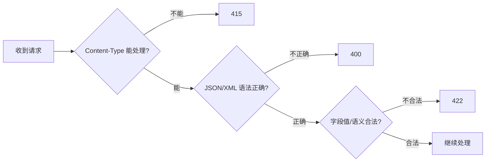
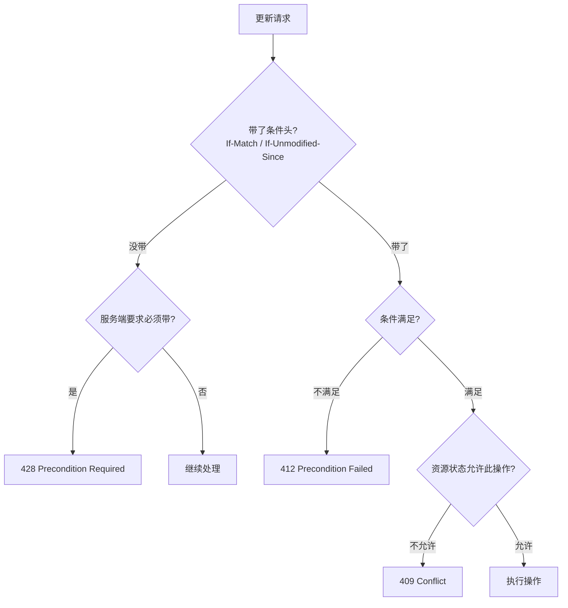

## 概述

状态码选择中最常犯的错误不是不知道某个码的存在，而是**把语义相近的码用混**。本页聚焦 7 组最容易混淆的状态码边界，给出清晰的判定准则与口诀。

> [!important] 思辨：为什么边界辨析如此重要？

> 状态码的价值在于**可预测性**。如果同一类错误在项目中有时返回 400，有时返回 422，客户端就无法建立稳定的错误处理策略。边界不清 → 用码不一致 → 前后端扯皮 → 监控失真 → 告警无效。**一致性比精确性更重要**，但精确性是一致性的前提。

---

## 3.1 成功码边界：200 / 201 / 202 / 204

|**码**|**核心语义**|**是否有 body**|**客户端后续行为**|
|---|---|---|---|
|200|成功且有内容|✅ 通常有|解析响应体|
|201|**新资源已创建**|✅ 建议有|读取 `Location` 头或 body 中的新资源|
|202|**已接收，不表示完成**|✅ 建议有（任务 ID）|轮询或等回调|
|204|成功但**禁止有 body**|❌ 禁止|什么都不解析|

> [!tip] 判定口诀

> 有新东西 → 201 ｜ 还在处理 → 202 ｜ 啥也不返回 → 204 ｜ 其余 → 200

---

## 3.2 请求解析边界：400 / 415 / 422

|层级|码|口诀|
|---|---|---|
|媒体类型不对|415|我不会读这种格式|
|语法/结构坏了|400|我读不懂你写的东西|
|语义/校验失败|422|我读懂了但办不了|

> [!faq] 为什么不统一用 400？

> 因为 400 给客户端的信号是"你的请求在**协议/格式层面**就有问题"，而 422 的信号是"格式没问题，但**业务规则不允许**"。这直接影响客户端的修复策略：400 需要检查报文结构，422 需要检查字段值。如果全用 400，客户端无法区分是序列化问题还是业务规则问题。

---

## 3.3 认证授权边界：401 / 403

|维度|401 Unauthorized|403 Forbidden|
|---|---|---|
|核心问题|你是谁？（身份未确认）|你不能做这个（权限不足）|
|典型触发|没带 token / token 过期 / 签名无效|token 有效但角色无权|
|响应头|应带 `WWW-Authenticate`|不需要|
|客户端后续|重新登录/刷新 token|联系管理员/升级权限|

> [!important] 口诀

> **先认证，再授权；认证失败看 401，授权失败看 403。**

> [!tip] GitHub 的安全策略

> GitHub 对私有仓库返回 404 而非 403——因为 403 会**泄露资源存在性**。这是一个安全优先于语义精确的经典权衡案例。在安全敏感场景下，可以用 404 替代 403 来隐藏资源的存在。

---

## 3.4 资源消失边界：404 / 410

|维度|404 Not Found|410 Gone|
|---|---|---|
|语义|没找到（可能将来会有）|明确永久消失|
|缓存行为|通常不缓存|可以缓存|
|使用场景|通用默认|明确废弃的 API 版本/资源|

> [!info] 实践建议

> 公开 API 默认用 404；只有**主动废弃**资源（如 API v1 下线）时才用 410。410 给搜索引擎的信号是"别再爬了"。

---

## 3.5 并发条件三角：409 / 412 / 428

> [!tip] 口诀

> **缺条件 = 428 → 条件没过 = 412 → 一般性状态冲突 = 409**

---

## 3.6 服务端错误四分：500 / 502 / 503 / 504

|码|问题在哪|是否临时|典型场景|
|---|---|---|---|
|500|**自己**|可能不是|未捕获异常、空指针、逻辑 bug|
|502|**上游**|通常是|网关收到上游返回的坏响应|
|503|**自己**|是|维护中、过载、熔断保护|
|504|**上游**|通常是|网关等上游响应超时|

> [!important] 运维视角

> 500 → 查自己代码日志 → **开发修 bug**

> 502 → 查上游健康状态 → **找上游团队**

> 503 → 查自身负载/部署状态 → **扩容或等待恢复**

> 504 → 查上游响应时间 → **优化上游性能或调整超时**

---

## 3.7 重定向五兄弟：301 / 302 / 303 / 307 / 308

|**码**|**持久性**|**方法保留**|**适用场景**|
|---|---|---|---|
|301|永久|❌ 不保证|SEO 永久迁移（仅 GET）|
|302|临时|❌ 不保证|浏览器临时跳转（历史兼容）|
|303|临时|**强制 GET**|POST 后跳转到结果页|
|307|临时|✅ 保留|API 临时跳转（保留 POST body）|
|308|永久|✅ 保留|API 永久迁移（保留 POST body）|

> [!important] 核心结论

> - 纯 GET 场景：301/302 没问题

> - 涉及 POST/PUT/PATCH/DELETE：**只用 307/308**

> - POST 后看结果：**用 303**

---

## 子页面

- `[[1. 成功码边界：200/201/202/204 语义辨析]]`

- `[[2. 请求解析边界：400/415/422 三层判定]]`

- `[[3. 身份权限与资源存在性：401/403/404/410]]`

- `[[4. 并发条件与重定向与服务端错误边界]]`

[[1. 成功码边界：200-201-202-204 语义辨析]]

[[2. 请求解析边界：400-415-422 三层判定]]

[[3. 身份权限与资源存在性：401-403-404-410]]

[[4. 并发条件与重定向与服务端错误边界]]