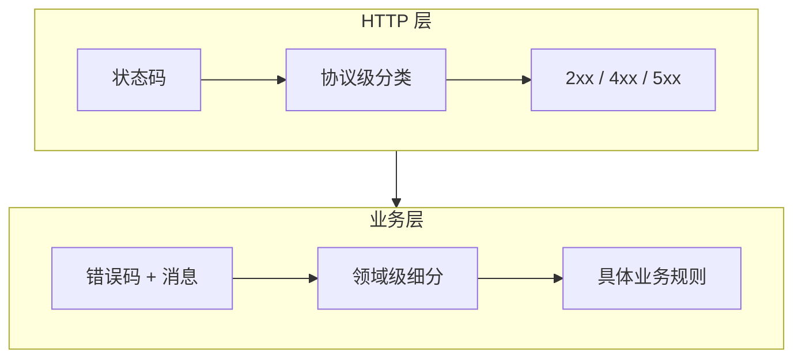

## 核心问题

一个 API 返回 409 Conflict，但 409 不能告诉客户端是**用户名重复**还是**邮箱重复**还是**版本冲突**。这就是为什么需要双层设计。

---

## 双层架构



### HTTP 层的职责

- **受众**：所有基础设施（网关、CDN、负载均衡器、监控系统、浏览器）

- **粒度**：粗粒度分类（成功/客户端错误/服务端错误/限流/重定向）

- **标准**：全球统一，所有 HTTP 实现都理解

### 业务层的职责

- **受众**：你的应用代码和客户端 SDK

- **粒度**：细粒度分类（具体是哪个业务规则失败）

- **标准**：团队/项目内统一

> [!important] 思辨：为什么不能只用业务码？

> 因为基础设施**不读 body**。Nginx 看状态码决定是否重试；Prometheus 按状态码统计错误率；CDN 按状态码决定缓存策略；Sentry 按状态码决定是否告警。如果所有错误都是 200 + body 里的业务码，这些基础设施全部失效。

---

## 业务错误码设计规范

### 命名风格

```Python
# ✅ 推荐：大写蛇形 + 领域前缀
"USER_ALREADY_EXISTS"
"INVALID_EMAIL_FORMAT"
"ORDER_ALREADY_CANCELLED"
"PAYMENT_GATEWAY_TIMEOUT"

# ❌ 避免：纯数字码（含义不自明）
"10001"
"20003"
```

> [!tip] 为什么推荐字符串而非数字？

> 字符串错误码**自描述**——开发者看到 `USER_ALREADY_EXISTS` 不需要查文档就知道含义。数字码需要查映射表，增加认知负担。字符串码在日志、告警中也更易读。

### 推荐的错误响应结构

```Python
from pydantic import BaseModel
from typing import Optional, List
from datetime import datetime

class FieldError(BaseModel):
    field: str              # 出错的字段
    message: str            # 人类可读描述
    code: Optional[str] = None  # 字段级错误码

class ErrorResponse(BaseModel):
    code: str               # 业务错误码
    message: str            # 人类可读消息
    detail: Optional[str] = None  # 调试信息
    errors: Optional[List[FieldError]] = None  # 多字段错误
    request_id: Optional[str] = None  # 链路追踪
    timestamp: datetime = datetime.now()
```

---

## 典型组合映射表

|**场景**|**HTTP 状态码**|**业务错误码**|**message 示例**|
|---|---|---|---|
|用户名已存在|409|`USER_ALREADY_EXISTS`|用户名已被注册|
|邮箱格式无效|422|`INVALID_EMAIL_FORMAT`|邮箱格式不正确|
|套餐不支持此功能|403|`PLAN_NOT_ALLOWED`|当前套餐不支持此功能|
|请求频率超限|429|`RATE_LIMIT_EXCEEDED`|请求过于频繁|
|支付网关异常|502|`PAYMENT_GATEWAY_ERROR`|支付服务暂时不可用|
|乐观锁版本冲突|409|`VERSION_CONFLICT`|资源已被其他人修改|
|密码复杂度不足|422|`WEAK_PASSWORD`|密码必须包含大写字母和数字|
|订单已取消|409|`ORDER_ALREADY_CANCELLED`|该订单已取消，无法操作|

---

## Python/FastAPI 完整实现

```Python
from fastapi import FastAPI, Request
from fastapi.responses import JSONResponse
from fastapi.exceptions import RequestValidationError
from starlette.exceptions import HTTPException as StarletteHTTPException
import uuid
from datetime import datetime

app = FastAPI()

# 自定义业务异常
class BizError(Exception):
    def __init__(self, status_code: int, code: str, message: str, detail: str = None):
        self.status_code = status_code
        self.code = code
        self.message = message
        self.detail = detail

# 全局异常处理器：业务异常
@app.exception_handler(BizError)
async def biz_error_handler(request: Request, exc: BizError):
    return JSONResponse(
        status_code=exc.status_code,
        content={
            "code": exc.code,
            "message": exc.message,
            "detail": exc.detail,
            "request_id": getattr(request.state, 'request_id', str(uuid.uuid4())),
            "timestamp": datetime.now().isoformat()
        }
    )

# 全局异常处理器：Pydantic 校验失败
@app.exception_handler(RequestValidationError)
async def validation_error_handler(request: Request, exc: RequestValidationError):
    return JSONResponse(
        status_code=422,
        content={
            "code": "VALIDATION_ERROR",
            "message": "参数校验失败",
            "errors": [
                {"field": ".".join(str(x) for x in e["loc"]), "message": e["msg"]}
                for e in exc.errors()
            ],
            "request_id": getattr(request.state, 'request_id', str(uuid.uuid4())),
            "timestamp": datetime.now().isoformat()
        }
    )

# 全局异常处理器：未知异常兜底
@app.exception_handler(Exception)
async def global_error_handler(request: Request, exc: Exception):
    return JSONResponse(
        status_code=500,
        content={
            "code": "INTERNAL_ERROR",
            "message": "服务内部异常",
            "request_id": getattr(request.state, 'request_id', str(uuid.uuid4())),
            "timestamp": datetime.now().isoformat()
        }
    )

# 使用示例
@app.post("/users", status_code=201)
async def create_user(data: dict):
    if await user_exists(data["username"]):
        raise BizError(409, "USER_ALREADY_EXISTS", "用户名已被注册")
    # ...
```

> [!faq] 为什么不直接用 FastAPI 的 HTTPException？

> FastAPI 的 `HTTPException` 只有 `detail` 字段，无法携带结构化的 `code`/`errors`/`request_id` 等信息。自定义 `BizError` 让错误响应结构统一且可扩展，同时保持了 HTTP 状态码的正确使用。