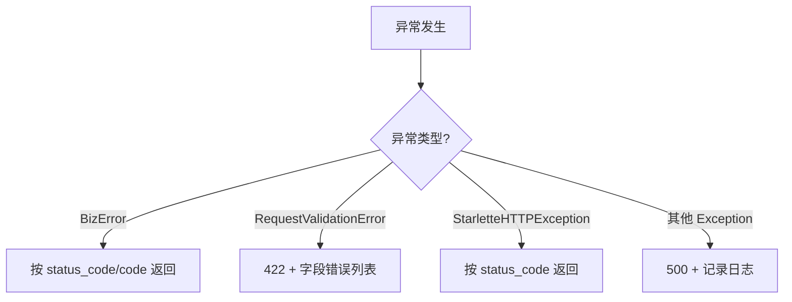

## 核心目标

在 FastAPI 项目中实现**全局统一**的异常处理体系：

- 所有错误响应共用一个固定结构

- 所有异常类型有明确的状态码映射

- Pydantic 校验错误、业务错误、未知错误全部覆盖

---

## 完整实现

### Step 1: 定义统一错误响应模型

```Python
from pydantic import BaseModel
from typing import Optional, List
from datetime import datetime


class FieldError(BaseModel):
    """字段级错误"""
    field: str
    message: str
    code: Optional[str] = None


class ErrorResponse(BaseModel):
    """统一错误响应"""
    code: str                          # 业务错误码
    message: str                       # 人类可读消息
    detail: Optional[str] = None       # 调试信息（生产环境可隐藏）
    errors: Optional[List[FieldError]] = None  # 多字段错误
    request_id: Optional[str] = None   # 链路追踪
    timestamp: str = datetime.now().isoformat()
```

### Step 2: 定义业务异常类

```Python
class BizError(Exception):
    """业务异常基类"""
    def __init__(
        self,
        status_code: int,
        code: str,
        message: str,
        detail: str = None,
        headers: dict = None
    ):
        self.status_code = status_code
        self.code = code
        self.message = message
        self.detail = detail
        self.headers = headers


# 预定义常用异常
class AuthenticationError(BizError):
    def __init__(self, message: str = "认证失败", detail: str = None):
        super().__init__(
            status_code=401,
            code="AUTH_FAILED",
            message=message,
            detail=detail,
            headers={"WWW-Authenticate": 'Bearer realm="api"'}
        )

class ForbiddenError(BizError):
    def __init__(self, message: str = "无权限", code: str = "FORBIDDEN"):
        super().__init__(status_code=403, code=code, message=message)

class NotFoundError(BizError):
    def __init__(self, resource: str = "资源"):
        super().__init__(
            status_code=404,
            code="NOT_FOUND",
            message=f"{resource}不存在"
        )

class ConflictError(BizError):
    def __init__(self, code: str = "CONFLICT", message: str = "资源状态冲突"):
        super().__init__(status_code=409, code=code, message=message)

class UpstreamError(BizError):
    def __init__(self, service: str = "上游服务"):
        super().__init__(
            status_code=502,
            code="UPSTREAM_ERROR",
            message=f"{service}返回异常"
        )

class UpstreamTimeoutError(BizError):
    def __init__(self, service: str = "上游服务"):
        super().__init__(
            status_code=504,
            code="UPSTREAM_TIMEOUT",
            message=f"{service}响应超时"
        )
```

### Step 3: 注册全局异常处理器

```Python
import uuid
import logging
from fastapi import FastAPI, Request
from fastapi.responses import JSONResponse
from fastapi.exceptions import RequestValidationError
from starlette.exceptions import HTTPException as StarletteHTTPException

logger = logging.getLogger(__name__)
app = FastAPI()

def _make_error_response(
    status_code: int,
    code: str,
    message: str,
    request: Request,
    detail: str = None,
    errors: list = None,
    headers: dict = None
) -> JSONResponse:
    """构造统一错误响应"""
    request_id = getattr(request.state, 'request_id', str(uuid.uuid4()))
    content = {
        "code": code,
        "message": message,
        "request_id": request_id,
        "timestamp": datetime.now().isoformat()
    }
    if detail:
        content["detail"] = detail
    if errors:
        content["errors"] = errors
    return JSONResponse(
        status_code=status_code,
        content=content,
        headers=headers
    )


# 1. 业务异常
@app.exception_handler(BizError)
async def biz_error_handler(request: Request, exc: BizError):
    return _make_error_response(
        status_code=exc.status_code,
        code=exc.code,
        message=exc.message,
        request=request,
        detail=exc.detail,
        headers=exc.headers
    )

# 2. Pydantic 校验异常 → 422
@app.exception_handler(RequestValidationError)
async def validation_error_handler(request: Request, exc: RequestValidationError):
    errors = [
        {
            "field": ".".join(str(x) for x in e["loc"]),
            "message": e["msg"],
            "code": e["type"]
        }
        for e in exc.errors()
    ]
    return _make_error_response(
        status_code=422,
        code="VALIDATION_ERROR",
        message="参数校验失败",
        request=request,
        errors=errors
    )

# 3. Starlette HTTP 异常（兼容 FastAPI HTTPException）
@app.exception_handler(StarletteHTTPException)
async def http_error_handler(request: Request, exc: StarletteHTTPException):
    return _make_error_response(
        status_code=exc.status_code,
        code=f"HTTP_{exc.status_code}",
        message=str(exc.detail) if exc.detail else "请求错误",
        request=request
    )

# 4. 未知异常兜底 → 500
@app.exception_handler(Exception)
async def global_error_handler(request: Request, exc: Exception):
    logger.error(f"Unhandled exception: {exc}", exc_info=True)
    return _make_error_response(
        status_code=500,
        code="INTERNAL_ERROR",
        message="服务内部异常",
        request=request
    )
```

### Step 4: 使用示例

```Python
from fastapi import Depends

@app.post("/users", status_code=201)
async def create_user(
    data: UserCreate,
    current_user = Depends(get_current_user)
):
    # 权限检查
    if not current_user.is_admin:
        raise ForbiddenError(code="ADMIN_REQUIRED", message="需要管理员权限")
    
    # 唯一性检查
    if await user_repo.exists(username=data.username):
        raise ConflictError(
            code="USER_ALREADY_EXISTS",
            message="用户名已被注册"
        )
    
    # 调用外部服务
    try:
        await email_service.verify(data.email)
    except TimeoutError:
        raise UpstreamTimeoutError(service="邮件验证服务")
    except Exception:
        raise UpstreamError(service="邮件验证服务")
    
    # 创建用户
    user = await user_repo.create(data)
    return JSONResponse(
        status_code=201,
        content=user.dict(),
        headers={"Location": f"/api/v1/users/{user.id}"}
    )
```

---

## 异常映射总览



> [!important] 思辨：为什么需要四层异常处理？

> - **BizError** 处理所有**可预期的业务错误**（认证、权限、冲突、上游等）

> - **RequestValidationError** 处理 **Pydantic/FastAPI 自动校验**的错误

> - **StarletteHTTPException** 兜底 FastAPI 内部抛出的 HTTP 异常

> - **Exception** 兜底**所有未预期的异常**（防止堆栈泄露到客户端）

> 四层从具体到通用，确保没有任何异常能"逃逸"返回原始堆栈给客户端。