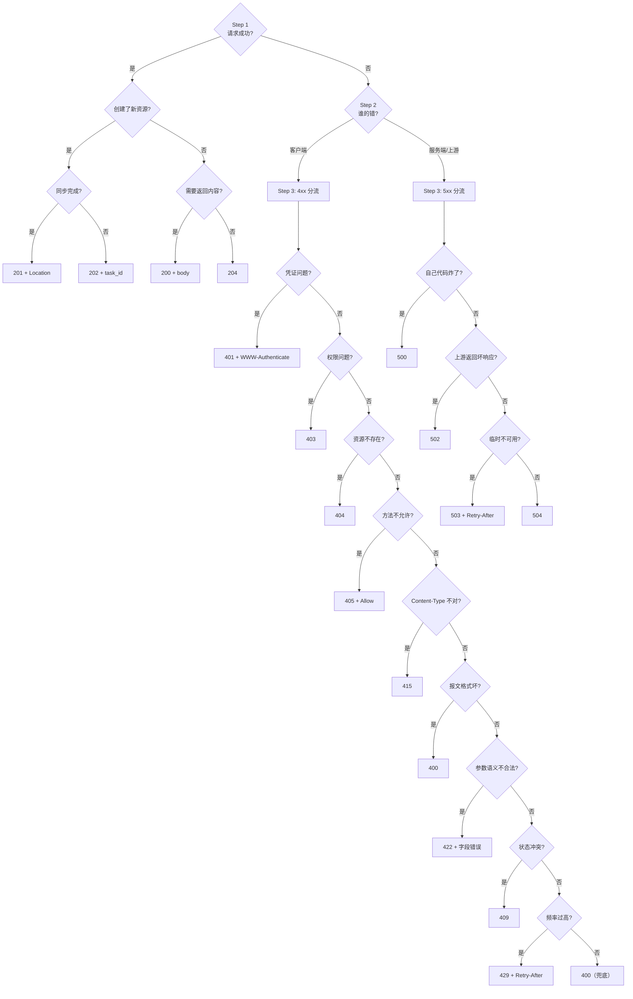
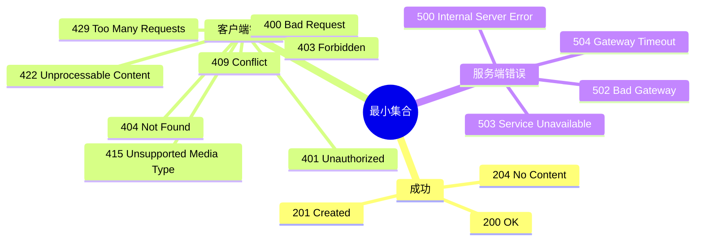

## 五步决策流程

### 完整流程图



---

## Step 4: 响应契约检查清单

选定状态码后，逐项检查是否需要配合响应头：

|**状态码**|**是否需要 body**|**Location**|**Retry-After**|**WWW-Authenticate**|**其他头**|
|---|---|---|---|---|---|
|200|✅ 是|||||
|201|✅ 建议|✅ 推荐||||
|202|✅ 建议(task_id)|可选||||
|204|❌ 禁止|||||
|304|❌ 禁止||||ETag, Cache-Control|
|3xx 重定向|可选|✅ 必须||||
|401|✅ 建议|||✅ 必须||
|405|✅ 建议||||Allow (必须)|
|429|✅ 建议||✅ 强烈推荐|||
|503|✅ 建议||✅ 强烈推荐|||

---

## Step 5: 文档 = 实现

### OpenAPI 声明

```Python
from fastapi import FastAPI

@app.post(
    "/users",
    status_code=201,
    responses={
        201: {"description": "用户创建成功"},
        401: {"description": "未认证", "model": ErrorResponse},
        403: {"description": "无权限", "model": ErrorResponse},
        409: {"description": "用户名已存在", "model": ErrorResponse},
        422: {"description": "参数校验失败", "model": ErrorResponse},
        500: {"description": "服务内部异常", "model": ErrorResponse},
    }
)
async def create_user(data: UserCreate):
    ...
```

### 测试覆盖矩阵

```Python
import pytest
from httpx import AsyncClient

@pytest.mark.asyncio
class TestCreateUser:
    async def test_success(self, client: AsyncClient):
        """正常路径 → 201"""
        resp = await client.post("/users", json={"name": "test", "email": "a@b.com"})
        assert resp.status_code == 201
        assert "Location" in resp.headers

    async def test_validation_error(self, client: AsyncClient):
        """参数错误 → 422"""
        resp = await client.post("/users", json={"name": "", "email": "invalid"})
        assert resp.status_code == 422
        assert resp.json()["code"] == "VALIDATION_ERROR"

    async def test_unauthenticated(self, client: AsyncClient):
        """未认证 → 401"""
        resp = await client.post("/users", json={"name": "test"})
        assert resp.status_code == 401
        assert "WWW-Authenticate" in resp.headers

    async def test_forbidden(self, client: AsyncClient):
        """无权限 → 403"""
        resp = await client.post("/users", json={"name": "test"}, headers={"Authorization": "Bearer user_token"})
        assert resp.status_code == 403

    async def test_conflict(self, client: AsyncClient):
        """重复创建 → 409"""
        await client.post("/users", json={"name": "existing"})
        resp = await client.post("/users", json={"name": "existing"})
        assert resp.status_code == 409
        assert resp.json()["code"] == "USER_ALREADY_EXISTS"

    async def test_rate_limit(self, client: AsyncClient):
        """限流 → 429"""
        for _ in range(100):
            await client.post("/users", json={"name": "test"})
        resp = await client.post("/users", json={"name": "test"})
        assert resp.status_code == 429
        assert "Retry-After" in resp.headers
```

---

## 最小状态码集合

### 基础集（15 个码 → 99% 场景）



### 进阶扩展（按需引入）

|引入条件|码|说明|
|---|---|---|
|有异步任务/消息队列|202|Accepted|
|有大文件上传/下载|206|Partial Content|
|有 ETag/缓存协商|304|Not Modified|
|有 API 迁移/版本切换|307/308|方法保留重定向|
|有乐观锁/版本控制|412/428|条件请求|
|有法规/地域限制|451|Legal Reasons|

> [!important] 思辨：为什么推荐"最小集合 + 按需扩展"？

> 每增加一个状态码，就需要**所有参与者**（前端、后端、QA、运维、文档）都理解它的语义和触发条件。15 个码的团队对齐成本远低于 30 个码。"按需引入"确保了每个新增码都有明确的业务驱动，而不是"万一用到"的预防性铺开。