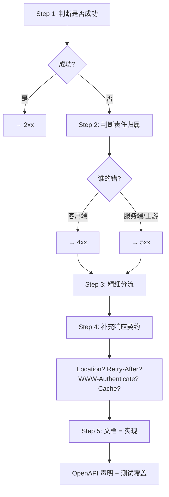

## 概述

FastAPI 框架下的状态码实用约定 + 统一异常处理 + 从"判断成功/失败"到"文档/测试一致"的完整落地流程。

---

## 5.1 FastAPI 常见默认 / 推荐

|操作|推荐状态码|FastAPI 默认|备注|
|---|---|---|---|
|GET 成功|200|200|默认一致|
|POST 创建|201|200|需手动设置 `status_code=201`|
|DELETE 成功无内容|204|200|需手动设置|
|Pydantic 校验失败|422|422|FastAPI 自动处理|
|主动抛客户端错误|4xx|—|使用 `HTTPException`|

> [!tip] FastAPI 默认 422 的背景

> FastAPI 基于 Pydantic 做参数校验，当 JSON body 的字段类型/格式不匹配时自动返回 422。这与 RFC 9110 的 422 语义完全一致："请求语法正确，但语义内容无法处理"。FastAPI 是少数**天然正确使用 422**的框架。

---

## 5.2 建议统一错误响应体

```Python
from pydantic import BaseModel
from typing import Optional, List
from datetime import datetime

class ErrorDetail(BaseModel):
    field: Optional[str] = None
    message: str
    code: Optional[str] = None

class ErrorResponse(BaseModel):
    code: str              # 业务错误码，如 "INVALID_EMAIL"
    message: str           # 人类可读消息
    detail: Optional[str] = None  # 调试信息（生产环境可隐藏）
    errors: Optional[List[ErrorDetail]] = None  # 多字段错误
    request_id: Optional[str] = None  # 链路追踪 ID
    timestamp: datetime = datetime.now()
```

**设计原则**：

- **人类可读**：`message` 可直接展示给用户

- **机器可解析**：`code` 用于客户端条件分支

- **前后端稳定契约**：结构固定，字段不随意增删

> [!faq] 为什么 `errors` 是数组？

> 表单提交场景下，多个字段可能同时校验失败。如果只返回第一个错误，用户需要反复提交才能发现所有问题。数组形式一次性告知所有错误字段。

---

## 5.3 建议统一异常映射

|**异常类型**|**HTTP 状态码**|**业务码示例**|
|---|---|---|
|参数校验异常（Pydantic）|422|`VALIDATION_ERROR`|
|认证异常|401|`AUTH_FAILED`|
|权限异常|403|`FORBIDDEN`|
|资源不存在|404|`NOT_FOUND`|
|唯一约束 / 版本冲突|409|`CONFLICT`|
|第三方依赖超时|504|`UPSTREAM_TIMEOUT`|
|第三方依赖错误响应|502|`UPSTREAM_ERROR`|
|未知异常|500|`INTERNAL_ERROR`|

---

## 5.4 综合使用流程（五步落地法）



### Step 3 精细分流速查

**客户端 4xx**：

- 凭证问题 → 401

- 权限问题 → 403

- 不存在 → 404

- 方法不允许 → 405

- 内容类型不支持 → 415

- 参数/语义校验失败 → 422

- 资源状态冲突 → 409

- 缺条件 → 428 / 条件失败 → 412

- 频率过高 → 429

**服务端 5xx**：

- 服务内部异常 → 500

- 上游坏响应 → 502

- 临时不可用 → 503

- 上游超时 → 504

### Step 4 响应契约检查清单

- [ ] 201 → 是否需要 `Location` 头？

- [ ] 301/308 → 是否需要 `Location` 头？

- [ ] 304 → 是否包含缓存相关头（`ETag`/`Cache-Control`）？

- [ ] 401 → 是否包含 `WWW-Authenticate` 头？

- [ ] 429 → 是否包含 `Retry-After` 头？

- [ ] 503 → 是否包含 `Retry-After` 头？

### Step 5 测试用例覆盖矩阵

- [ ] 正常路径（200/201/204）

- [ ] 参数错误（400/422）

- [ ] 认证失败（401）

- [ ] 权限失败（403）

- [ ] 资源不存在（404）

- [ ] 状态冲突（409）

- [ ] 限流（429）

- [ ] 上游异常（502/504）

- [ ] 未知异常（500）

---

## 5.5 项目级最小状态码集合

### 基础集（~15 个码覆盖 99% 场景）

|分类|码|
|---|---|
|成功|200, 201, 204|
|客户端错误|400, 401, 403, 404, 409, 415, 422, 429|
|服务端错误|500, 502, 503, 504|

### 进阶补充（按需引入）

|场景|码|引入条件|
|---|---|---|
|异步任务|202|有后台任务/队列|
|文件分块|206|有大文件上传/下载|
|缓存协商|304|有 ETag/Last-Modified|
|方法保留重定向|307/308|有 API 迁移需求|
|并发控制/乐观锁|412/428|有版本号/ETag 并发控制|
|合规/法律限制|451|有地域/法规限制|

> [!important] 思辨：最小集合的价值

> 最小集合不是"偷懒"，而是**降低认知负担和对齐成本**。团队中每增加一个状态码，就需要所有前端开发、后端开发、QA、运维都理解它的语义和触发条件。"按需引入"而非"预先全量铺开"是工程上的正确策略。

---

## 子页面

- `[[1. FastAPI 统一异常处理与错误响应体实战]]`

- `[[2. 综合决策流程与最小状态码集合]]`

[[1. FastAPI 统一异常处理与错误响应体实战]]

[[2. 综合决策流程与最小状态码集合]]