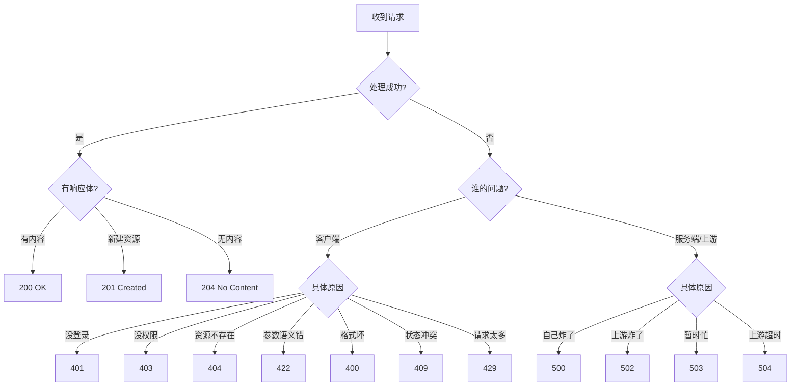

## 总原则

> [!important] 状态码的本质定位

> 状态码表达的是 **HTTP 协议层的语义结果**，不是业务逻辑细节本身。RFC 9110（2022 年 6 月发布，统一取代 RFC 7231 等旧规范）明确指出：状态码是一个三位整数，描述请求的结果与响应的语义。

**设计顺序**：先定状态码 → 再定响应体中的业务错误码/消息

**选码核心**：

- **2xx**：请求已成功处理

- **3xx**：需要重定向 / 缓存协商

- **4xx**：客户端请求需要修改

- **5xx**：服务端自身或上游出错

> [!tip] 为什么先定状态码？

> HTTP 状态码是**所有中间件、网关、CDN、监控系统**共同识别的标准信号。如果业务失败却返回 200，那么 Nginx、Prometheus、Sentry 等工具都无法正确识别错误率、无法触发告警、无法做熔断。状态码是基础设施层面的"通用语言"，业务码只是应用层的"方言"。

---

## 分类全景速览

|**类别**|**范围**|**语义**|
|---|---|---|
|1xx|信息类|请求已收到，继续处理（REST API 极少主动设计）|
|2xx|成功类|请求已成功接收、理解并接受|
|3xx|重定向类|需要客户端进一步操作以完成请求|
|4xx|客户端错误|请求有误，客户端需修正后重试|
|5xx|服务端错误|服务端未能完成一个看起来合法的请求|

---

## 一句话决策树

---

## 最小够用项目级状态码集合

> [!info] 思辨：为什么要定义"最小集合"？

> 状态码不是越多越好。过多的状态码会增加前后端对齐成本、测试覆盖成本、文档维护成本。一个中小型项目，用好以下 ~15 个码就能覆盖 99% 的场景。多出来的码应该是**按需引入**而非预先全量铺开。

**最小成功集**：`200` / `201` / `204`

**最小客户端错误集**：`400` / `401` / `403` / `404` / `409` / `415` / `422` / `429`

**最小服务端错误集**：`500` / `502` / `503` / `504`

**进阶补充**：`202`（异步）/ `206`（分块）/ `304`（缓存）/ `307`/`308`（方法保留重定向）/ `412`/`428`（条件请求）/ `451`（合规）

---

## 子页面导航

> [!tip] 阅读路径

> 按 L2 → L3 → L4 的层级逐步深入。L2 是主干概览，L3 是分类细化，L4 是对关键技术概念的严谨论述与代码实战。

**L2 层级**（主干展开）：

- `[[1. 状态码分类全景与设计哲学]]` — 五大类完整枚举 + RFC 9110 背景

- `[[2. 经典/流行状态码场景速查]]` — CRUD / Web / 并发 场景映射

- `[[3. 核心混淆边界深度辨析]]` — 7 组最易混淆的状态码对比

- `[[4. 使用注意事项与反模式]]` — 9 条实战军规 + 双层设计

- `[[5. FastAPI 实战约定与综合落地流程]]` — 框架约定 + 决策流程 + 测试覆盖

[[4. 使用注意事项与反模式]]

[[3. 核心混淆边界深度辨析]]

[[2. 经典-流行状态码场景速查]]

[[1. 状态码分类全景与设计哲学]]

[[5. FastAPI 实战约定与综合落地流程]]