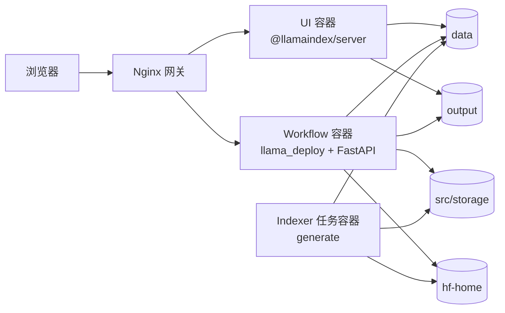

# rag-llama-app

一个面向本地知识库的 Deep Research 项目，基于 LlamaIndex Workflow 构建，当前主链路已经从单路 dense 检索升级为可运行的 Hybrid RAG：
`rewrite + step-back + dense + BM25 + rerank`

本仓库现在采用 Docker-first 的交付方式，优先服务于以下场景：

- 本机开发优先
- 单机长期运行优先
- 保留后续上云时继续沿用分层边界的可能性

## Docker 分层架构



### 容器职责

- `gateway`
  - 单一对外入口
  - 负责路径转发与首页重定向
- `ui`
  - 独立运行 `@llamaindex/server`
  - 提供聊天 UI、自定义组件与附件文件访问
- `workflow`
  - 运行 `llama_deploy` API Server
  - 加载 `src/workflow.py` 并对外提供 Deep Research 工作流
- `indexer`
  - 一次性任务容器
  - 负责重建 dense + BM25 索引，不常驻

## 目录与配置文件

### 新增的 Docker 资产

- `compose.yaml`
  - 单机长期运行默认入口
- `compose.dev.yaml`
  - 开发模式覆盖文件
- `compose.gpu.yaml`
  - GPU 可选覆盖文件
- `llama_deploy.docker.yml`
  - Docker 专用 deployment 配置，只保留 workflow 服务
- `.llamactl.config.docker.yaml`
  - Docker 内部使用的 `llamactl` 配置
- `docker/Dockerfile.python`
  - `workflow` 与 `indexer` 共享镜像
- `docker/Dockerfile.ui`
  - `ui` 容器镜像
- `docker/nginx/default.conf`
  - Nginx 单入口转发规则
- `docker/patches/llama_deploy_cli_serve.py`
  - 构建镜像时应用的补丁，使 `llamactl serve` 可监听 `0.0.0.0`
- `.dockerignore`
  - Docker build context 精简规则
- `.env.example`
  - 可复制的 Docker 环境变量模板

### 持久化目录

- `data`
  - 原始知识库文档
- `src/storage`
  - dense + BM25 索引落盘目录
- `hf-home`
  - Hugging Face / llama-index 缓存目录
- `output`
  - 预留给报告、附件或后续生成物

## 访问约定

默认入口：

- `http://localhost:8080`

对外路径固定为：

- `/`
  - 重定向到 `/deployments/chat/ui/`
- `/deployments/chat/ui/`
  - 聊天 UI
- `/docs`
  - 后端 API 文档

开发模式下额外暴露：

- `http://localhost:3000/deployments/chat/ui/`
  - 直接访问 UI 容器
- `http://localhost:4501/docs`
  - 直接访问 workflow 容器

## 环境变量准备

### 1. 准备 `.env`

如果你还没有自己的 `.env`，先从模板复制：

```powershell
Copy-Item .env.example .env
```

如果仓库里已经有 `.env`，请至少确认以下变量存在且值正确：

```env
APP_PORT="8080"
LLM_PROVIDER="compatible"
LLM_MODEL="qwen3-235b-a22b-instruct-2507"
LLM_API_KEY="..."
LLM_BASE_URL="https://dashscope.aliyuncs.com/compatible-mode/v1"
EMBED_PROVIDER="huggingface"
EMBED_MODEL="BAAI/bge-m3"
EMBED_DEVICE="cpu"
RERANK_MODEL="BAAI/bge-reranker-v2-m3"
RERANK_DEVICE="cpu"
HF_HOME="hf-home"
LLAMA_INDEX_CACHE_DIR="hf-home"
DATA_DIR="data/note"
DATA_EXTENSIONS=".md,.txt,.pdf,.docx,.csv,.py"
WORKFLOW_TIMEOUT_SECONDS="600"
```

说明：

- Compose 统一通过 `env_file: .env` 向 `workflow` 和 `indexer` 注入环境变量
- `ui` 的容器内运行参数由 compose 显式写死，不依赖 `.env`
- 如果你要改外部访问端口，只需要修改 `APP_PORT`

### 2. GPU 可选模式

默认方案走 CPU，不需要修改 `.env`。

如果后续要启用 GPU：

- 通过 `compose.gpu.yaml` 将 `EMBED_DEVICE` 和 `RERANK_DEVICE` 覆盖为 `cuda`
- 需要宿主机安装 Docker Desktop + NVIDIA 容器运行支持

## 首次构建步骤

### 1. 构建镜像

```powershell
docker compose build
```

### 2. 先重建索引

首次运行或知识库有变化时，先执行：

```powershell
docker compose run --rm indexer
```

完成后你应该能在以下目录看到持久化结果：

- `src/storage`
- `src/storage/bm25`
- `hf-home`

### 3. 启动长期运行模式

```powershell
docker compose up -d
```

### 4. 验证访问

```powershell
docker compose ps
docker compose logs -f gateway
```

浏览器访问：

- `http://localhost:8080`
- `http://localhost:8080/docs`

## 开发模式启动步骤

开发模式的目标是：

- UI 源码直接 bind mount
- UI 使用 `npm run dev`
- workflow 暴露 `4501`，便于单独调试
- UI 暴露 `3000`，便于绕过网关直接查看

启动命令：

```powershell
docker compose -f compose.yaml -f compose.dev.yaml up --build
```

开发模式下的建议工作流：

1. 修改 `ui/components`、`ui/layout`、`ui/index.ts`
2. 直接观察 `http://localhost:3000/deployments/chat/ui/`
3. 修改 Python 工作流代码后，执行：

```powershell
docker compose restart workflow
```

说明：

- 这套开发模式保证 UI 热更新
- Python 端当前不做自动 reload，推荐通过 `docker compose restart workflow` 快速生效

## 长期运行模式步骤

长期运行模式使用单入口网关，命令如下：

```powershell
docker compose up -d --build
```

常见操作：

```powershell
docker compose ps
docker compose logs -f workflow
docker compose logs -f ui
docker compose logs -f gateway
docker compose down
docker compose up -d
```

如果知识库更新，需要重新建库：

```powershell
docker compose run --rm indexer
docker compose restart workflow
```

## GPU 可选模式步骤

如果宿主机已经满足 NVIDIA 容器运行条件，可以这样启动：

```powershell
docker compose -f compose.yaml -f compose.gpu.yaml up -d --build
```

如果要在开发模式同时启用 GPU：

```powershell
docker compose -f compose.yaml -f compose.dev.yaml -f compose.gpu.yaml up --build
```

GPU 模式下建议额外确认：

- `docker info` 能看到 GPU runtime
- `workflow` 和 `indexer` 容器能成功拿到 `cuda`
- `hf-home` 有足够磁盘空间缓存模型

## 常用运维命令

### 查看配置渲染结果

注意：这组命令会展开 `.env` 里的真实环境变量，包含密钥时不要直接截图或粘贴输出。

```powershell
docker compose config
docker compose -f compose.yaml -f compose.dev.yaml config
docker compose -f compose.yaml -f compose.gpu.yaml config
```

### 启动与停止

```powershell
docker compose up -d
docker compose down
docker compose down --remove-orphans
```

### 日志

```powershell
docker compose logs -f workflow
docker compose logs -f ui
docker compose logs -f gateway
docker compose logs -f indexer
```

### 重建单个服务镜像

```powershell
docker compose build workflow
docker compose build ui
```

### 重启服务

```powershell
docker compose restart workflow
docker compose restart ui
docker compose restart gateway
```

## 技术路线说明

### 为什么拆成 4 层

- `workflow` 与 `indexer` 生命周期不同
  - 一个是常驻在线服务
  - 一个是按需执行任务
- `ui` 独立后，开发和长期运行都更清晰
- `gateway` 单独存在后，外部入口稳定，后续上云只需要替换入口层

### 为什么没有继续把 UI 放回 `llama_deploy`

当前仓库的长期目标不是继续堆本地进程补丁，而是把运行职责拆清楚：

- `workflow` 只负责推理与工作流
- `ui` 只负责交互
- `gateway` 负责路径治理

这样后续上云时可以自然演进为：

- Nginx / Caddy / 云网关
- 独立 UI 服务
- 独立 workflow 服务
- 单独的离线建库 Job

### 为什么镜像里补了一个 `llamactl serve` 补丁

当前 `llama_deploy` 版本的 `llamactl serve` 在内部把 Uvicorn host 写死成了 `localhost`。这在宿主机本地单进程场景没有问题，但在容器网络里会导致其它容器无法访问 backend。

因此本仓库采用构建期补丁：

- 不修改你的本地 `.venv`
- 只在 Docker 镜像里替换 `llama_deploy.cli.serve`
- 保持容器启动命令仍然是 `llamactl serve`

## 数据持久化说明

以下目录会保留在宿主机：

- `data`
- `src/storage`
- `hf-home`
- `output`

意味着：

- 容器重启后索引不会丢
- Hugging Face 模型缓存不会重复下载
- 后续接入 GPU 或迁移到另一台机器时，目录边界也能保留

迁移单机环境时，建议至少一起迁移：

1. 代码仓库
2. `.env`
3. `data`
4. `src/storage`
5. `hf-home`

## 故障排查

### `docker compose run --rm indexer` 很慢

通常是首次下载 embedding / reranker 模型：

- 检查 `hf-home` 是否在持续增长
- 首次缓存完成后，后续会明显变快

### `workflow` 已启动但页面报 502

先看日志：

```powershell
docker compose logs -f workflow
docker compose logs -f gateway
```

常见原因：

- 索引还没生成
- `.env` 中 `LLM_API_KEY` / `LLM_BASE_URL` 不正确
- 模型首次初始化还没完成

### 页面能打开但聊天失败

优先检查：

```powershell
docker compose logs -f workflow
```

重点确认：

- `src/storage` 是否存在
- `src/storage/bm25` 是否存在
- `.env` 中模型、API Key、Base URL 是否可用

### UI 改了但开发模式没有热更新

先确认你用的是开发命令：

```powershell
docker compose -f compose.yaml -f compose.dev.yaml up --build
```

如果仍然不刷新，先看 UI 日志：

```powershell
docker compose logs -f ui
```

### Python 改了但没有生效

当前默认开发模式不做 Python 热重载，直接重启即可：

```powershell
docker compose restart workflow
```

## 附录：保留的非 Docker 路线

仓库仍然保留原生 Windows / `.venv` 运行方式，但主文档不再以它作为首选路径。

如果你必须继续使用本地原生方式，可参考以下核心入口：

- `src/generate.py`
- `src/workflow.py`
- `llama_deploy.yml`
- `.llamactl.config.yaml`

当前推荐顺序仍然是：

1. 用 Docker 路线开发和长期运行
2. 只在需要排查底层依赖时再回退到原生方式
