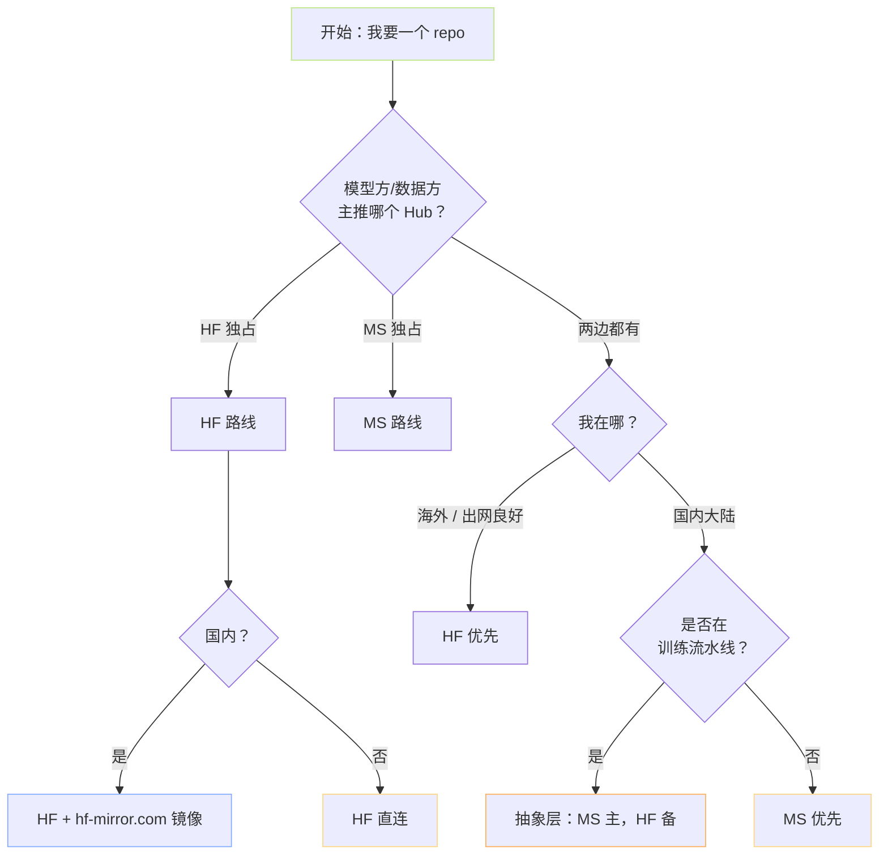
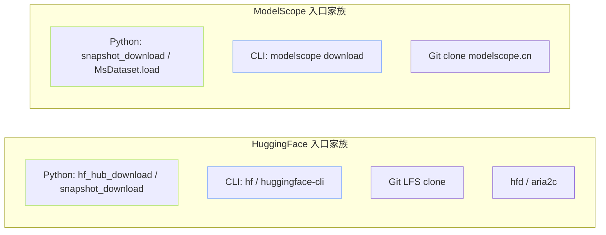

> [!important]
> 
> **前置知识**：本页是「HuggingFace × ModelScope 下载生态」总纲的入口。建议先熟悉 Python 虚拟环境、`pip` 包管理，以及「模型权重 / 数据集」基本概念。

## 0. 定位

> 一句话：本页用一张对比矩阵、一棵决策树、一份误区清单，回答**「同一个模型/数据集，到底该从哪儿下、用什么入口下」**。

## 1. 两大生态的「物理事实」

| 维度     | **HuggingFace Hub**               | **ModelScope Hub**                 |
| ------ | --------------------------------- | ---------------------------------- |
| 主体     | Hugging Face Inc.（法 / 美）          | 阿里达摩院 / 通义实验室                      |
| 主域名    | `huggingface.co`                  | `www.modelscope.cn`                |
| 国内可达性  | ❌ 直连大概率被墙                         | ✅ 国内 CDN，稳定                        |
| 核心 SDK | `huggingface_hub`                 | `modelscope`                       |
| 底层存储   | **Git LFS** → 新 **Xet**（块级去重）     | Git LFS + 自研对象存储                   |
| 主流模型覆盖 | 📈 国际开源最完整（Llama / Mistral / SD…） | 📈 国内开源最完整（Qwen / DeepSeek / GLM…） |
| 镜像     | `hf-mirror.com`（社区维护）             | 无需镜像                               |

## 2. 决策树：到底从哪里下？

> [!important]
> 
> **工程优先级**：海外 → 直连 HF；国内通用 → MS 直连；国内 HF 独占 → 镜像；CI/训练 → 抽象层 fallback。三层兜底保证「下载一定能成功」。

## 3. 入口家族图

## 4. 子页面导航

- ModelScope Docs. <[https://modelscope.cn/docs](https://modelscope.cn/docs)>

[[1.1 HF vs MS 生态对比矩阵]]

- HF-Mirror. <[https://hf-mirror.com/](https://hf-mirror.com/)>

## 参考文献

- HuggingFace Hub Docs. <[https://huggingface.co/docs/hub](https://huggingface.co/docs/hub)>

[[1.2 下载入口选型决策树]]

[[1.3 常见误区与坑位清单]]