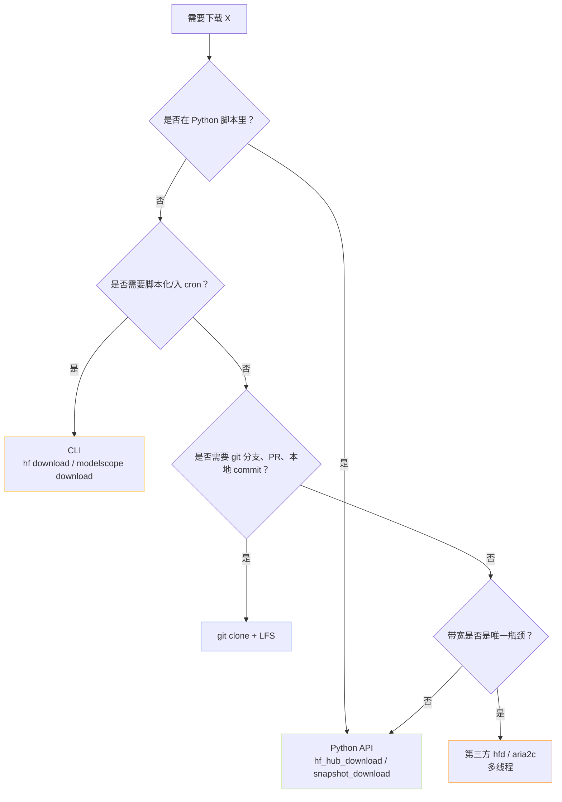

> [!important]
> 
> **前置知识**：[[1.1 HF vs MS 生态对比矩阵]]。

## 0. 定位

> 一句话：在「Hub 选完」之后，本页回答「同一个 Hub 里，到底用 Python / CLI / Git / 镜像 / 第三方哪个入口」。

## 1. 下载入口五谷图



## 2. 五个入口的工程画像

|入口|优势|劣势|典型场景|
|---|---|---|---|
|**Python API**|可编程、与训练代码同进程、可捕获异常|需要 import、启动溢价|训练脚本、Notebook|
|**CLI**|一句话、Shell 可组合、支持交互式 progress|参数名漂移（新版 vs 旧版）|交互式调试、cron|
|**Git LFS**|原生版本控制、branch/tag/PR|不可断点续，大模型独热门|贡献、狭义版本控制|
|**hfd / aria2c**|多线程、断点续、极高吞吐|依赖第三方脚本、无官方保证|国内拉 100GB+ 全量模型|
|**镜像下的任一**|逆向包装现有 API 不动|额外环境变量管理|国内 + HF 独占|

## 3. 反常识判断

> [!important]
> 
> **「git clone 最简单」是个幻觉**。在 70B 模型场景下，`git clone` 是劰动最师险的路线：
> 
> - 无断点续【LFS 不支持 Range传输的中间状态恢复】。
> 
> - 本地多一份「.git/lfs/objects」指针拷贝，磁盘×2。
> 
> - 无法按文件过滤（除非配 sparse-checkout，设置成本高）。
> 
> **默认请选 Python** `**snapshot_download**`，只在明确需要 git 语义时才走 LFS。

## 4. 一个「同仓库五路线」示例

以 `Qwen/Qwen2.5-0.5B-Instruct` 为例，同时给出五种入口：

```bash
# 路线 1：Python API (推荐默认)
python -c "from huggingface_hub import snapshot_download; \
  snapshot_download('Qwen/Qwen2.5-0.5B-Instruct', local_dir='./qwen_hf')"

# 路线 2：HF CLI
hf download Qwen/Qwen2.5-0.5B-Instruct --local-dir ./qwen_hf_cli

# 路线 3：Git LFS
git lfs install
git clone https://huggingface.co/Qwen/Qwen2.5-0.5B-Instruct ./qwen_hf_git

# 路线 4：aria2c 多线程镜像加速
export HF_ENDPOINT=https://hf-mirror.com
bash <(curl -fsSL https://hf-mirror.com/hfd/hfd.sh) \
  Qwen/Qwen2.5-0.5B-Instruct --tool aria2c -x 8 --local-dir ./qwen_hf_hfd

# 路线 5：ModelScope 同名仓库 (国内优选)
modelscope download --model Qwen/Qwen2.5-0.5B-Instruct --local_dir ./qwen_ms
```

## 5. 选型总结

> [!important]
> 
> **优先级链**：Python `snapshot_download` → CLI `download` → `hfd + aria2c`（国内加速）→ git clone（仅版本控制场景）。

## 参考文献

- HF Download Guide. <[https://huggingface.co/docs/huggingface_hub/guides/download](https://huggingface.co/docs/huggingface_hub/guides/download)>

- HF-Mirror hfd script. <[https://hf-mirror.com/](https://hf-mirror.com/)>

- aria2 docs. <[https://aria2.github.io/](https://aria2.github.io/)>