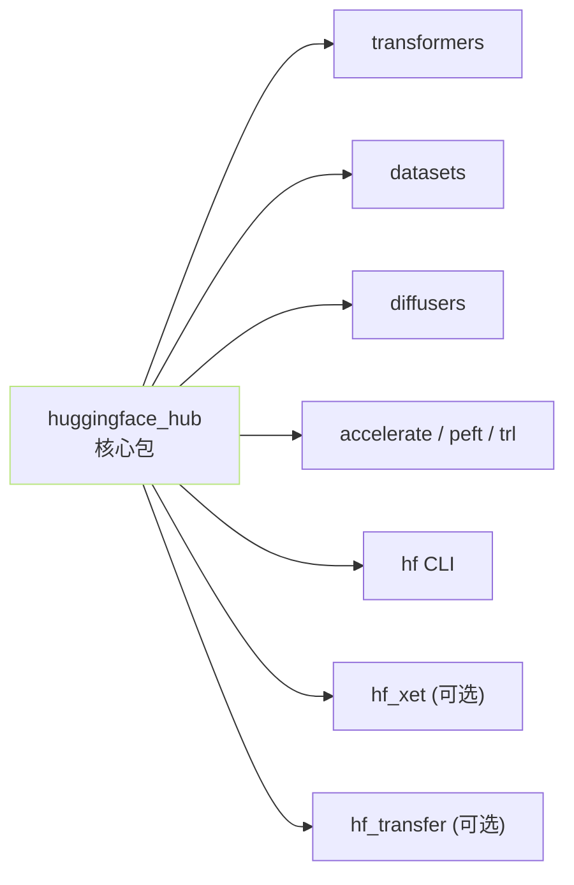

> [!important]
> 
> **前置知识**：[[2. HuggingFace 下载生态]]。

## 0. 定位

> 一句话：本页建立「包 · 鉴权 · 缓存」三块基础，是后续 2.2～2.7 的共同前置。

## 1. `huggingface_hub` 包在生态中的位置



`huggingface_hub` 提供：REST 封装、缓存管理、身份认证、CLI 入口。**几乎所有类似** `**from_pretrained**` **的隐式下载都调这个包**。

## 2. 三块基础概念

|概念|子页|一句话|
|---|---|---|
|**安装方式**|2.1.1|pip / conda / uv 三个渠道，extras【cli, hf_xet, hf_transfer】控制可选能力|
|**认证体系**|2.1.2|`HF_TOKEN` 环境变量与 `hf auth login` 存本地文件，优先级明确|
|**缓存目录**|2.1.3|`blobs/` 存实体、`snapshots/` 存软链、`refs/` 存分支指针|

## 3. 一句话安装 + 最小验证

```bash
# 安装：核心 + CLI + Xet + hf_transfer
pip install -U "huggingface_hub[cli,hf_xet,hf_transfer]"

# 验证 SDK
python -c "from huggingface_hub import HfApi; print(HfApi().whoami() or 'anonymous OK')"
```

## 4. 版本选型建议

> [!important]
> 
> **三条原则**：
> 
> 1. `**huggingface_hub >= 0.26**` 才有新的 `hf` CLI。
> 
> 1. `**transformers**` **与** `**huggingface_hub**` **同步升级**，防同名 API 不同语义。
> 
> 1. **不要** `**pip install --no-deps**`，除非调试；extras 里的加速包需要二进制轮子（wheels）。

## 5. 子页导航

[[2.1.1 安装方式（pip - conda - uv）]]

[[2.1.2 认证体系（HF_TOKEN - hf auth login）]]

[[2.1.3 缓存目录结构（blobs - snapshots - refs）]]

## 参考文献

- huggingface_hub Installation. <[https://huggingface.co/docs/huggingface_hub/installation](https://huggingface.co/docs/huggingface_hub/installation)>

- huggingface_hub Quickstart. <[https://huggingface.co/docs/huggingface_hub/quick-start](https://huggingface.co/docs/huggingface_hub/quick-start)>