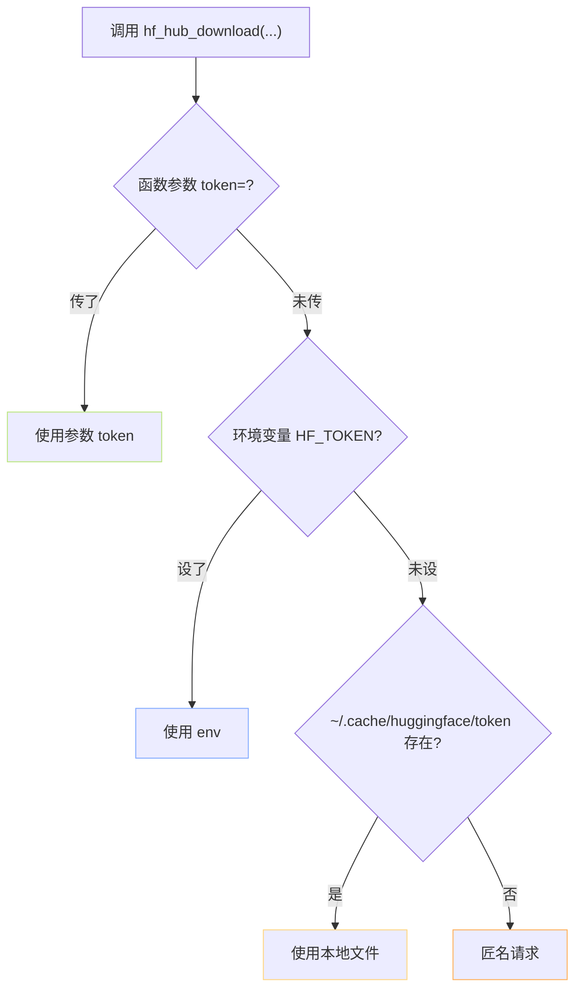

> [!important]
> 
> **前置知识**：[[2.1 huggingface_hub 安装与基础概念]]。

## 0. 定位

> 一句话：调透 HF 鉴权的三种供选、优先级、以及「什么场景该选谁」。

## 1. 三种 token 供选与优先级



|供选|设置方式|优势|劣势|
|---|---|---|---|
|**函数参数**|`hf_hub_download(..., token="hf_xxx")`|最明确|易被代码中硬编码|
|**环境变量**|`export HF_TOKEN=hf_xxx`|适合 docker/CI|多用户机上会泄露|
|**本地文件**|`hf auth login` 交互式产生|个人机首选|不适合无头 server|

## 2. `hf auth login` 下面发生了什么

```python
# 交互式输入 token 后，huggingface_hub 调用以下伪代码
import os, json
from pathlib import Path

def save_token(token: str):
    home = Path(os.getenv("HF_HOME", Path.home() / ".cache" / "huggingface"))
    home.mkdir(parents=True, exist_ok=True)
    p = home / "token"
    p.write_text(token)
    p.chmod(0o600)        # 仅当前用户可读
    print(f"token saved at {p}")
```

读取顺序：fn arg → `HF_TOKEN` env → 该文件。三者都没是匿名请求 (仅公开 repo 可拉)。

## 3. 生产推荐：`.env` + secret

```bash
# .env (添加到 .gitignore)
HF_TOKEN=hf_xxxxxxxxxxxxxxxxxxxx

# 加载
set -a; source .env; set +a
python train.py
```

在 K8s/docker 中，用原生 secret：

```yaml
env:
  - name: HF_TOKEN
    valueFrom:
      secretKeyRef:
        name: hf-tokens
        key: token
```

## 4. 验证脚本

```python
# probe_auth.py —— 查试当前 token
from huggingface_hub import HfApi, login
import os

api = HfApi()
try:
    user = api.whoami()
    print("鉴权成功，用户名 =", user["name"])
except Exception as e:
    print("未鉴权或令牌无效:", e)
    print("请设置 HF_TOKEN 或调 hf auth login")
```

## 5. 踩过的坊

> [!important]
> 
> **1) 把另外另外人的 token 装贱查看**。Token 是个人鉴权凭证，不是「仓库凭证」，丢了能被别人拿去代饰 push。
> 
> **2)** `**token**` **不能报 401**—— 检查：是否在 [huggingface.co](http://huggingface.co) 访问令牌页里别别贤起了 read 权限，是否过期。
> 
> **3) jupyter 混多用户** —— 请仅走 env，不使用 `hf auth login` (会在公共账号下写文件)。

## 参考文献

- HF Authentication. <[https://huggingface.co/docs/huggingface_hub/quick-start#login](https://huggingface.co/docs/huggingface_hub/quick-start#login)>

- Personal Access Tokens. <[https://huggingface.co/settings/tokens](https://huggingface.co/settings/tokens)>