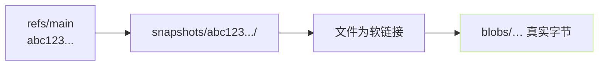

> [!important]
> 
> **前置知识**：[[2.1 huggingface_hub 安装与基础概念]]。

## 0. 定位

> 一句话：看懂 `~/.cache/huggingface/hub/` 里那些 `blobs/` `snapshots/` `refs/`、怎么生成、为什么会出软链接。

## 1. 一张「肉身」图

以仓库 `Qwen/Qwen2.5-0.5B-Instruct` 为例，下会后缓存目录的结构：

```jsx
~/.cache/huggingface/hub/
  models--Qwen--Qwen2.5-0.5B-Instruct/
    refs/                         # 分支 / tag 指针，内容是 commit hash
      main                        # 文件内容 = abc123...
    snapshots/
      abc123.../                  # 一个 commit 一个目录
        config.json -> ../../blobs/89a/…   (软链接)
        model.safetensors -> ../../blobs/ef5/…
    blobs/
      89a3b…                      # 真实文件内容，名为 sha256 前几位
      ef5c1…
```



## 2. 三个目录的职责

|目录|装什么|作用|
|---|---|---|
|`blobs/`|真实文件内容（底层以 sha256 命名）|去重存储。同一个 `.safetensors` 不同 commit 使用同一个 blob|
|`snapshots/<commit>/`|软链接表，反映该 commit 的文件布局|多 commit 共存、可理解的路径|
|`refs/`|文本文件，内容 = commit 指针|main / v1.0 / pull/3 等别名|

## 3. 为什么要软链接？

> [!important]
> 
> **最大动机 = 多 commit 互不干扰且去重**。
> 
> - 同一个 `tokenizer.json` 应在五个 commit 都未变，只需存一份 blob，五个 snapshot 都指过去。
> 
> - 切换 commit 只需换一个软链表，不重拷贝 GB 级文件。
> 
> 另一个动机 = 避免与 Git LFS 本身的「objects」机制类每，避免额外拷贝。

## 4. 控制是否走软链接

|参数|行为|
|---|---|
|`snapshot_download(repo_id, cache_dir=...)`|默认软链，返回 `snapshots/<c>/` 路径|
|`snapshot_download(repo_id, local_dir=...)`|**拷贝真文件**到该目录（默认 `local_dir_use_symlinks=False`）|
|`snapshot_download(repo_id, local_dir=..., local_dir_use_symlinks=True)`|在 `local_dir/` 里贵软链指向 `blobs/`|

## 5. 检查与清理脚本

```python
# inspect_cache.py —— 检查与取 blob 真实大小
from huggingface_hub import scan_cache_dir

info = scan_cache_dir()
print(f"总存 = {info.size_on_disk_str}")
for repo in sorted(info.repos, key=lambda r: -r.size_on_disk):
    print(f"{repo.size_on_disk_str:>10}  {repo.repo_id}")
    for rev in repo.revisions:
        print(f"    rev {rev.commit_hash[:8]}  {rev.size_on_disk_str}")
```

```bash
# CLI 等价
hf cache scan
hf cache delete --revision-hash <hash>
```

## 6. 踩过的坊

> [!important]
> 
> **1)** `**rsync -a**` **拷缓存 → 拷成空壳**。必要时加 `-L` 跳软链。
> 
> **2) Windows 上软链需管理员权限**，不难脟门上会退化为拷贝。
> 
> **3) 手动删** `**blobs/**` **某个文件 → snapshot 里软链变空**。请用 `hf cache delete`。

## 参考文献

- HF Hub Cache. <[https://huggingface.co/docs/huggingface_hub/guides/manage-cache](https://huggingface.co/docs/huggingface_hub/guides/manage-cache)>