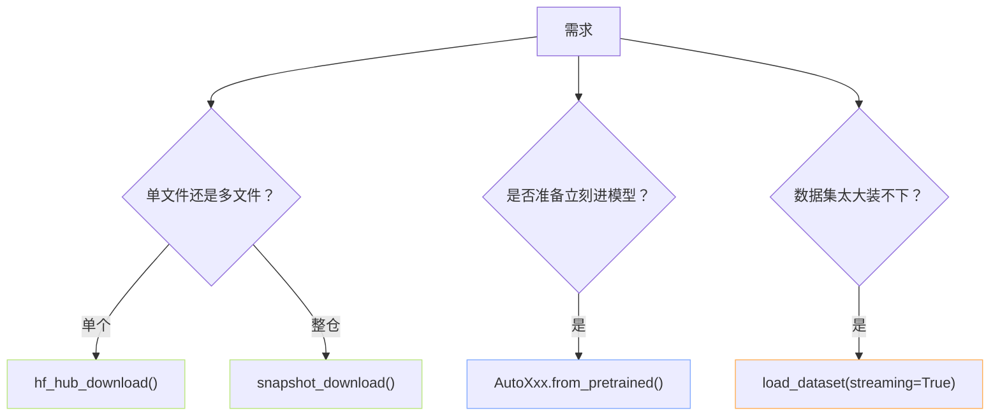

> [!important]
> 
> **前置知识**：[[2.1 huggingface_hub 安装与基础概念]]。

## 0. 定位

> 一句话：Python API 是训练流水线里默认选择。本页贯穿「单文件 · 整仓 · from_pretrained 隐式调 · 流式加载」四种调用语义。

## 1. API 如何选择



## 2. 四种入口对比

|API|返回|是否下到本地|场景|
|---|---|---|---|
|`hf_hub_download`|本地文件路径|是|指定 tokenizer.json 、某个 shard|
|`snapshot_download`|本地目录路径|是|全量拉权重（主用途）|
|`from_pretrained`|模型实例|隐式下到 cache|一句话拉模型 + 加载|
|`load_dataset(streaming=True)`|iterable Dataset|不落盘|TB 级数据集、在线预处理|

## 3. 一个「一脚本全覆盖」示例

```python
# four_apis_demo.py —— 一个脚本走透四种入口
from huggingface_hub import hf_hub_download, snapshot_download
from transformers import AutoTokenizer
from datasets import load_dataset

REPO = "sentence-transformers/all-MiniLM-L6-v2"

# (1) 拉单文件：config.json
p1 = hf_hub_download(repo_id=REPO, filename="config.json")
print("单文件 →", p1)

# (2) 拉整仓库但只要权重与 tokenizer
p2 = snapshot_download(
    repo_id=REPO,
    allow_patterns=["*.safetensors", "tokenizer.*", "*.json"],
    local_dir="./mini",
)
print("整仓 →", p2)

# (3) from_pretrained：隐式下载加载一步到位
tok = AutoTokenizer.from_pretrained(REPO)
print("词表大小 =", tok.vocab_size)

# (4) 流式加载数据集（不落盘）
ds = load_dataset("wikipedia", "20220301.simple", streaming=True, split="train")
print("流式取首条:", next(iter(ds))["title"])
```

## 4. 调用顺序与嵌套

> [!important]
> 
> `AutoModel.from_pretrained` 本质上是 `snapshot_download` 的包装：先下载同一个 `repo_id` 的所需文件，再调 `transformers` 的 `from_pretrained_low_cpu_mem`。所以所有镜像 / 加速 / 离线环境变量**需要在调** `**from_pretrained**` **之前设好**。

## 5. 子页导航

[[2.2.1 hf_hub_download（单文件）]]

[[2.2.2 snapshot_download（整仓）]]

[[2.2.3 transformers - datasets - diffusers 的 from_pretrained]]

[[2.2.4 流式加载（datasets streaming）]]

## 参考文献

- HF Download Guide. <[https://huggingface.co/docs/huggingface_hub/guides/download](https://huggingface.co/docs/huggingface_hub/guides/download)>

- datasets streaming. <[https://huggingface.co/docs/datasets/stream](https://huggingface.co/docs/datasets/stream)>