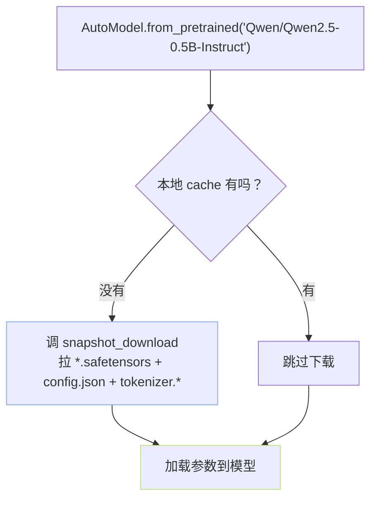

> [!important]
> 
> **前置知识**：[[2.2.2 snapshot_download（整仓）]]。

## 0. 定位

> 一句话：`transformers` / `datasets` / `diffusers` 三大库都提供 `from_pretrained(repo_id)` 语义，它们都是 `snapshot_download` 的「下载 + 加载」封装。

## 1. 下面发生了什么



## 2. 三库对照

|库|API|隐含拉取的文件|
|---|---|---|
|**transformers**|`AutoModel.from_pretrained` / `AutoTokenizer` / `AutoConfig`|`config.json`、`*.safetensors`/`pytorch_model.bin`、`tokenizer.*`|
|**datasets**|`load_dataset("squad")`|`dataset_info.json` • Parquet / Arrow 分片|
|**diffusers**|`DiffusionPipeline.from_pretrained`|多个子组件：UNet 、VAE 、text encoder 等|

## 3. transformers 示例

```python
# transformers_demo.py —— 隐式下载 + 加载一步到位
from transformers import AutoTokenizer, AutoModelForCausalLM
import torch

MODEL = "Qwen/Qwen2.5-0.5B-Instruct"

# (1) tokenizer 仅拉 `tokenizer.*` `merges.txt` `special_tokens_map.json`
tok = AutoTokenizer.from_pretrained(MODEL)

# (2) 模型拉全量权重
model = AutoModelForCausalLM.from_pretrained(
    MODEL,
    torch_dtype=torch.bfloat16,    # 节省显存
    device_map="auto",              # accelerate 自动布置
)

prompt = "用一句话描述量子纠缠。"
inputs = tok(prompt, return_tensors="pt").to(model.device)
out = model.generate(**inputs, max_new_tokens=64)
print(tok.decode(out[0], skip_special_tokens=True))
```

## 4. diffusers 示例与「子组件」机制

```python
# diffusers_demo.py
from diffusers import StableDiffusionPipeline
import torch

pipe = StableDiffusionPipeline.from_pretrained(
    "runwayml/stable-diffusion-v1-5",
    torch_dtype=torch.float16,
    # 可选：只拉需要的子组件。例子略。
).to("cuda")

image = pipe("a cat sitting on a quantum computer", num_inference_steps=20).images[0]
image.save("./out.png")
```

「一个仓库下会拉多个子目录」：`unet/`、`vae/`、`text_encoder/`、`tokenizer/`、`scheduler/`，每个子目录都是一个独立组件。

## 5. datasets 示例

```python
from datasets import load_dataset

# 默认下载到 ~/.cache/huggingface/datasets/
ds = load_dataset("squad", split="validation")
print(len(ds), ds[0]["question"])
```

## 6. 踩过的坊

> [!important]
> 
> **1) 不要在** `**from_pretrained**` **之后设镜像 env**。SDK 在加载时读 env。需在**调用前**设。
> 
> **2)** `**torch_dtype="auto"**` **vs** `**torch.bfloat16**` —— 后者明确。前者依赖 config.json 里的 `torch_dtype` 字段，可能为 None。
> 
> **3)** `**pytorch_model.bin**` **与** `**model.safetensors**` **同存 → 会二者都拉** —— 用 `allow_patterns` 锁定 `*.safetensors`。

## 参考文献

- transformers AutoModel. <[https://huggingface.co/docs/transformers/model_doc/auto](https://huggingface.co/docs/transformers/model_doc/auto)>

- diffusers from_pretrained. <[https://huggingface.co/docs/diffusers/api/loaders/from_pretrained](https://huggingface.co/docs/diffusers/api/loaders/from_pretrained)>