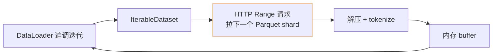

> [!important]
> 
> **前置知识**：[[2.2.3 transformers - datasets - diffusers 的 from_pretrained]]。

## 0. 定位

> 一句话：`datasets.load_dataset(..., streaming=True)` 让你「不落盘」也可透始训练。适合 TB 级数据集或预处理阶段。

## 1. 原理

启动后 SDK 仅下载**样本索引** (`dataset_info.json` + URL 列表)，迭代时按需 HTTP Range 请求拉取未加载的记录。仅在内存中保持一个转缓冲区（默认 ≋ 1000 样本）。



## 2. 双菜示例

```python
# stream_demo.py —— 仅下载索引不落盘
from datasets import load_dataset

# C4 超过 1TB，不能装下。使用 streaming 仅拉需要的
ds = load_dataset(
    "allenai/c4",
    "en",
    split="train",
    streaming=True,         # 关键
)

print(type(ds))             # IterableDataset

# (1) 取前 5 个
for sample in ds.take(5):
    print(sample["text"][:100])

# (2) shuffle (需使用滑动 buffer）
ds_shuffled = ds.shuffle(buffer_size=10_000, seed=42)

# (3) 打包 batch 与给 DataLoader
import torch
from torch.utils.data import DataLoader

from transformers import AutoTokenizer
tok = AutoTokenizer.from_pretrained("gpt2")

def tokenize(example):
    """变换函数：在调用时才执行。"""
    return tok(example["text"], truncation=True, max_length=256, padding="max_length")

ds_tokenized = ds_shuffled.map(tokenize)
ds_tokenized = ds_tokenized.with_format("torch")

loader = DataLoader(ds_tokenized, batch_size=32, num_workers=0)
for i, batch in enumerate(loader):
    if i == 0:
        print("input_ids shape:", batch["input_ids"].shape)
    if i >= 2: break
```

## 3. 与 「本地落盘」的对比

|维度|streaming=True|streaming=False (默认)|
|---|---|---|
|磁盘占用|几乎零|全量落盘|
|首样本延迟|一个 HTTP 请求|全量下载后|
|随机访问|仅后推迭代|O(1) 随机访问|
|迭代多轮|需重连、勿打忝|随便迭|
|适合场景|预训练 / 探索一下|fine-tune / 多轮|

## 4. 与多进程 DataLoader

> [!important]
> 
> `**num_workers > 0**` **与 streaming 不克兼**：IterableDataset 不能被多进程复制，需 `split_dataset_by_node` 手动拆。
> 
> 推荐在多进程场景下使用 `webdataset` / `mosaicml-streaming` 进阶方案。

## 5. 踩过的坊

- **「**`**shuffle(buffer_size=10000)**` **不够随机」** —— 只是滑动窗 shuffle，不能代替全局随机。生产需 `interleave_datasets` 多源复退拼接。

- **「隐藏不可重连」** —— 网络闪断后迭代会报 `StopIteration`，需包装重试。

- **「需 etag 中间点、不可复现」** —— streaming 提供 `set_epoch` 不严格可复现。生产请 freeze 数据集 commit。

## 参考文献

- datasets streaming. <[https://huggingface.co/docs/datasets/stream](https://huggingface.co/docs/datasets/stream)>

- IterableDataset. <[https://huggingface.co/docs/datasets/package_reference/main_classes#datasets.IterableDataset](https://huggingface.co/docs/datasets/package_reference/main_classes#datasets.IterableDataset)>