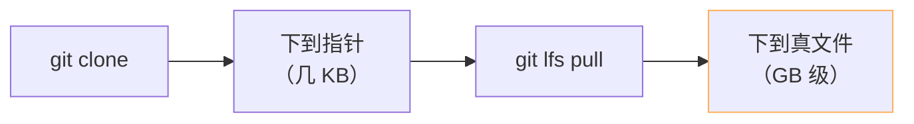

> [!important]
> 
> **前置知识**：[[2.1 huggingface_hub 安装与基础概念]]、[[1.2 下载入口选型决策树]]。

## 0. 定位

> 一句话：Git/LFS 是 HF 的**原生存储语义**，但作为下载入口 **它应该是最后选项**。本页讲清何时选、怎么避坊。

## 1. Git LFS 是什么

**Git LFS（Large File Storage）** 是 Git 的大文件扩展：`.gitattributes` 里标记为 `lfs` 的文件，提交时只会在 Git 仓中存一个指针（sha256 + size），真实字节放在 LFS 存储后端。`git clone` 后 `git lfs pull` 才会领取真实文件。



## 2. 何时该走 Git 路线

> [!important]
> 
> 选 Git 仅在以下场景：
> 
> 1. **需要提交 PR 或 提交自己的订正 commit**。
> 
> 1. **需要在本地在多个分支 / commit 之间切换**，而不是仅下载。
> 
> 1. **镜像站的 HTTPS Git 代理可用且带宽充足**。
> 
> 其他场景一律走 `snapshot_download`。

## 3. 一个「准备提 PR」的完整流程

```bash
# 1) 安装 git-lfs（一次性）
sudo apt-get install git-lfs    # Debian / Ubuntu
git lfs install                  # 注册 hooks 到全局 git

# 2) 鉴权后克隆（需预先 hf auth login，生成 credential helper）
export HF_HOME=$HOME/.cache/huggingface
hf auth login
git clone https://huggingface.co/Qwen/Qwen2.5-0.5B-Instruct

# 3) 修改后提交
cd Qwen2.5-0.5B-Instruct
echo "# Hot-fix" >> README.md
git add README.md
git commit -m "docs: typo"
git push                          # LFS 大文件被 push 加是增量上传
```

## 4. 常见坍场

|现象|原因|避免实践|
|---|---|---|
|克隆中断，重跑要从 0%|LFS 不支持 Range 状态恢复|走 `snapshot_download`，它内部滑动窗可续|
|本地占用×2|LFS 在 `.git/lfs/objects/` 多一份拷贝|`git lfs prune` 或仓库初始化时 `--filter=blob:none`|
|`HF_ENDPOINT` 不生效|git 不读 env|用 `git config --global url.<mirror>.insteadOf <orig>`|
|克隆后文件是文本指针|未装 git-lfs 或 hooks 未启用|装后重新 `git lfs install && git lfs pull`|

## 5. 子页导航

[[2.4.1 git clone + git lfs install]]

[[2.4.2 部分克隆与稀疏检出]]

## 参考文献

- Git LFS. <[https://git-lfs.com/](https://git-lfs.com/)>

- HF Repo 入门. <[https://huggingface.co/docs/hub/repositories-getting-started](https://huggingface.co/docs/hub/repositories-getting-started)>