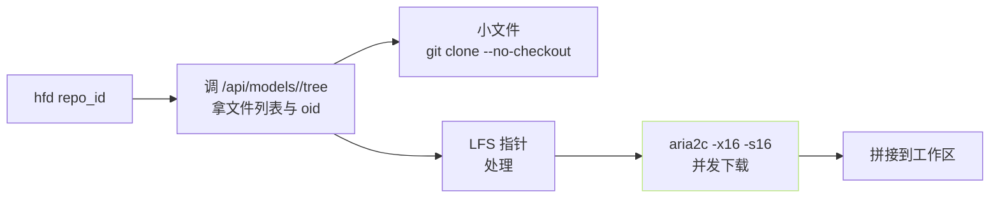

> [!important]
> 
> **前置知识**：[[2.4.1 git clone + git lfs install]]。

## 0. 定位

> 一句话：`hfd` 是个 200 行的 bash 脚本，在 `aria2c` + `git` 上拼了多线程传输，是镜像场景下「仅靠命令行」能跨越弱网的重要工具。

## 1. 安装

```bash
# 1) 装依赖
sudo apt-get install -y aria2 git git-lfs jq
brew install aria2 git git-lfs jq      # macOS
# Windows: 推荐 WSL2 + apt 装以上。原生 cmd 不支持。

# 2) 拉 hfd 脚本
curl -sL https://hf-mirror.com/hfd/hfd.sh -o hfd.sh
chmod +x hfd.sh
sudo mv hfd.sh /usr/local/bin/hfd
```

## 2. 常用调用

```bash
# (1) 拉模型到当前目录
hfd Qwen/Qwen2.5-0.5B-Instruct

# (2) 拉数据集
hfd HuggingFaceH4/MATH-500 --dataset

# (3) 拉到指定目录
hfd Qwen/Qwen2.5-0.5B-Instruct --local-dir /data/qwen

# (4) 仅拉指定后缀
hfd Qwen/Qwen2.5-0.5B-Instruct --include "*.safetensors" "tokenizer*"

# (5) 提高并发 (默认 4，高带宽可提 16)
hfd Qwen/Qwen2.5-0.5B-Instruct -x 16

# (6) 鉴权
hfd meta-llama/Meta-Llama-3-8B --hf_token $HF_TOKEN

# (7) 走镜像 (默认已用 hf-mirror.com)
HF_ENDPOINT=https://hf-mirror.com hfd Qwen/Qwen2.5-0.5B-Instruct
```

## 3. 下面发生了什么



## 4. 包装脚本：带重试 + 镜像 + 鉴权

```bash
#!/usr/bin/env bash
# safe_hfd.sh —— 增加稳定的 hfd 包装
set -e

REPO="$1"
DIR="${2:-./$(echo $REPO | tr / _)}"
MAX_TRIES=5

export HF_ENDPOINT=${HF_ENDPOINT:-https://hf-mirror.com}
export HF_TOKEN=${HF_TOKEN:-}

for i in $(seq 1 $MAX_TRIES); do
    echo "[$i/$MAX_TRIES] downloading $REPO -> $DIR"
    if hfd "$REPO" \
        --local-dir "$DIR" \
        --include "*.safetensors" "tokenizer*" "*.json" "merges.txt" \
        -x 16 \
        --hf_token "$HF_TOKEN"; then
        echo "✅ 成功"
        exit 0
    fi
    sleep $((i * 5))
done
echo "❌ 重试 $MAX_TRIES 次全部失败"
exit 1
```

## 5. 与 Python API 、CLI 的对比

|维度|hfd|hf download|snapshot_download|
|---|---|---|---|
|多线程|aria2c 多连接|requests 多线程|同上|
|镜像默认|✅ hf-mirror|需设 env|需设 env|
|断点续|aria2c 原生|HTTP Range|HTTP Range|
|依赖|aria2c jq git|Python|Python|
|适用场景|镜像 + 足带宽|脚本首选|训练脚本|

## 6. 踩过的坊

> [!important]
> 
> **1)** `**-x**` **调越高越慢** — CDN 判红限速到 16 已够。
> 
> **2) macOS 上** `**brew install aria2**` **可能要** `**--HEAD**` — 某些旧版会报 SSL 问题。
> 
> **3) hfd 不验证文件完整** — 完成后需 `sha256sum` 手动校验。

## 参考文献

- hfd 脚本. <[https://gist.github.com/padeoe/697678ab8e528b85a2a7bddafea1fa4f](https://gist.github.com/padeoe/697678ab8e528b85a2a7bddafea1fa4f)>

- [hf-mirror.com](http://hf-mirror.com). <[https://hf-mirror.com](https://hf-mirror.com)>