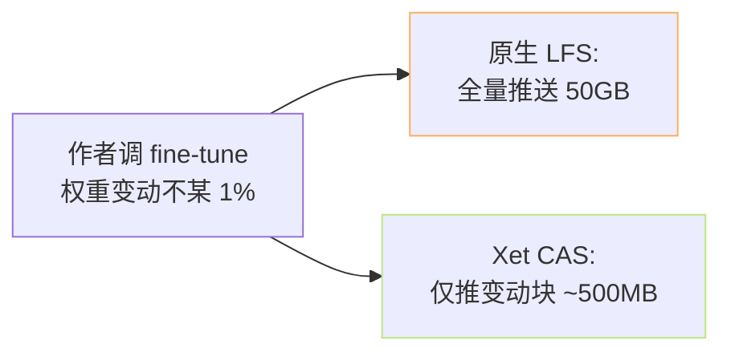

> [!important]
> 
> **前置知识**：[[2.5.1 hf_xet（块级去重、新一代）]]、了解 content-addressed storage (CAS)。

## 0. 定位

> 一句话：Xet 是 HF 推出的「块级去重 2.0」。能让 50GB 权重重推一个小版本后仅下载 **<1GB 变动部分**。

## 1. 为什么 Xet



> [!important]
> 
> **原理**：Xet 将每个大文件切为可变长块 (~16MB)，以 BLAKE3 哈希寻址。上传与下载时，仅传「本地还没有」的块。与 Restic / borg 同类，但以 object-store 机制接出。

## 2. 启用

```bash
# 1) 装 Rust wheel
pip install -U "huggingface_hub[hf_xet]"

# 2) 验证
python -c "import hf_xet; print('xet ok', hf_xet.__version__)"

# 3) 下载 Xet-enabled repo
hf download Qwen/Qwen2.5-0.5B-Instruct
```

Xet 是透明的：装 `hf_xet` wheel 后 `hf_hub_download` / `snapshot_download` / `hf download` 都会自动走 Xet，不需额外 env。

## 3. Xet vs LFS

|维度|LFS|Xet|
|---|---|---|
|去重粒度|文件级|块级 (默认 16MB)|
|哈希|SHA-256|BLAKE3|
|增量上传|文件变则全量|仅变动块|
|增量下载|同上|同上|
|服务器端|Git LFS|HF CAS server|
|客户端|git lfs|hf_xet (Rust)|
|默认|旧仓库|新仓库 (2024·1 后)|

## 4. 场景：fine-tune 检查点

```python
# upload_checkpoint.py —— Xet 上重复 push checkpoint 几乎零成本
from huggingface_hub import HfApi, upload_folder

for epoch in range(1, 11):
    train_one_epoch()
    save_to("./out")
    upload_folder(
        repo_id="my-org/lora-finetune",
        folder_path="./out",
        commit_message=f"epoch {epoch}",
    )
    # 服务端 Xet 仅会接取变动块，带宽费 ≊ 5%
```

## 5. 检查是否走 Xet

```bash
hf env | grep -i xet
# hf_xet: 1.x.y 或 not installed

# 从仓库元信息查
curl -s https://huggingface.co/api/models/Qwen/Qwen2.5-0.5B-Instruct | jq '.xetEnabled'
```

## 6. 踩过的坊

> [!important]
> 
> **1) Apple Silicon 装 hf_xet 报错** — 需 huggingface_hub ≥0.27，会提供 universal2 wheel。
> 
> **2) 走镜像时 Xet 可能被退化为 LFS** — 镜像服务器未部署 CAS。
> 
> **3) Xet 不与** `**hf_transfer**` **同时生效** — 上传路径互排，但下载可多路并行。

## 参考文献

- HF Xet announce. <[https://huggingface.co/blog/xet](https://huggingface.co/blog/xet)>

- hf_xet. <[https://github.com/huggingface/xet-core](https://github.com/huggingface/xet-core)>