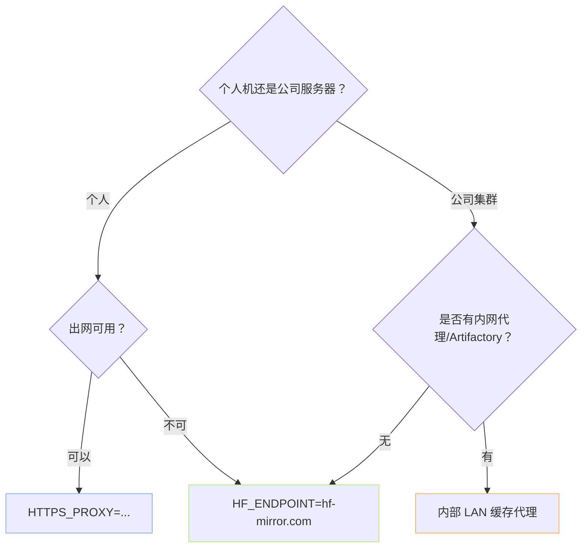

> [!important]
> 
> **前置知识**：[[1.3 常见误区与坑位清单]]（镜像三件套）。

## 0. 定位

> 一句话：中国大陆直连 `huggingface.co` 大概率被墙。本页讲透「镜像站 · HTTP/SOCKS 代理 · 企业内网」三条路。

## 1. 选型决策树



## 2. 三条路能力对比

|方案|作用范围|优势|劣势|
|---|---|---|---|
|**HF_ENDPOINT 镜像**|仅 `huggingface_hub` SDK|零网络成本|不覆盖 git/Xet/老脚本|
|**HTTPS_PROXY 代理**|全系统 HTTP 调用|覆盖面最广|需要出网资源、额外延迟|
|**内网 LAN 缓存**|集群内部多机共享|二次下载几乎即时|需要运维 / Artifactory|

## 3. 三件套环境变量

```bash
# (a) 镜像路线（首选）
export HF_ENDPOINT=https://hf-mirror.com
export HF_HUB_ENABLE_HF_TRANSFER=0   # 镜像多线程会 429
export HF_HUB_DISABLE_XET=1          # 避免镜像未镜 Xet 报错

# (b) 代理路线
export HTTPS_PROXY=http://127.0.0.1:7890
export HTTP_PROXY=http://127.0.0.1:7890
export NO_PROXY=localhost,127.0.0.1,.cluster.local
```

> [!important]
> 
> **不要同时设** `**HF_ENDPOINT**` **+** `**HTTPS_PROXY**`，双重转发常见 SSL Cert 不匹配。选一个。

## 4. Python 代码验证镜像生效

```python
# probe_endpoint.py —— 验证当前 HF SDK 走的是哪个端点
import os
from huggingface_hub.constants import ENDPOINT
print("HF_ENDPOINT env =", os.getenv("HF_ENDPOINT", "<unset>"))
print("SDK 实际端点   =", ENDPOINT)

# 拉个微型件验证连通
from huggingface_hub import hf_hub_download
p = hf_hub_download("sentence-transformers/all-MiniLM-L6-v2", "config.json")
print("下载到 →", p)
```

## 5. 子页导航

[[2.6.1 HF_ENDPOINT 与 hf-mirror.com]]

[[2.6.2 HTTP-HTTPS 代理与 NO_PROXY]]

[[2.6.3 自建 LAN 缓存代理 - Artifactory]]

## 参考文献

- HF Hub Env Vars. <[https://huggingface.co/docs/huggingface_hub/package_reference/environment_variables](https://huggingface.co/docs/huggingface_hub/package_reference/environment_variables)>

- HF-Mirror. <[https://hf-mirror.com/](https://hf-mirror.com/)>