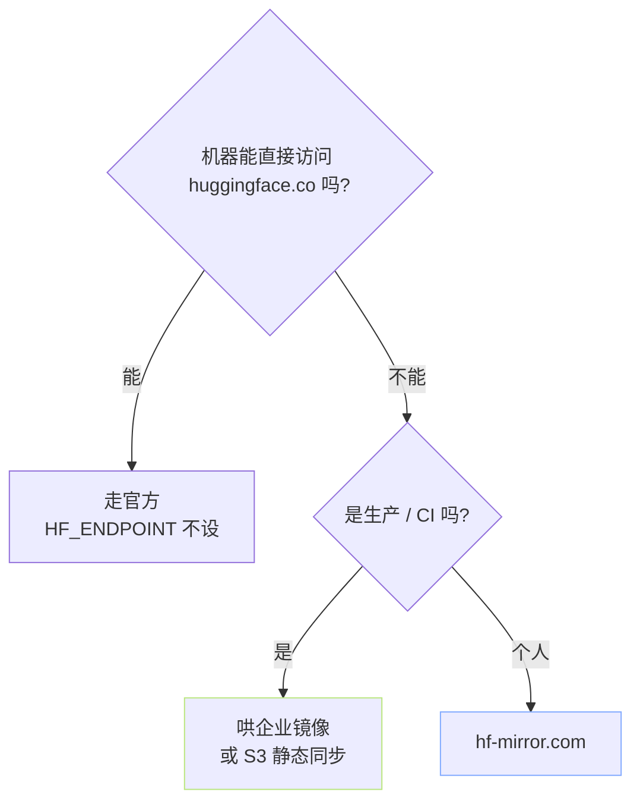

> [!important]
> 
> **前置知识**：[[2.6.1 HF_ENDPOINT 与 hf-mirror.com]]、[[2.6.2 HTTP-HTTPS 代理与 NO_PROXY]]。

## 0. 定位

> 一句话：镜像不是只有 hf-mirror。本页梳理公布镜像、哄设镜像、公司内网镜像三类选型。

## 1. 公布镜像

|镜像|类型|说明|
|---|---|---|
|**[hf-mirror.com](http://hf-mirror.com)**|社区公共|高可用、支持鉴权部分 gated|
|**[modelscope.cn](http://modelscope.cn)**|同类仓库|不是镜像是独立仓库，调法不同|
|**[openi.pcl.ac.cn](http://openi.pcl.ac.cn)**|鹏城实验室|部分仓库同步|
|**[wisemodel.cn](http://wisemodel.cn)**|社区|部分哄设|

## 2. hf-mirror 使用

```bash
export HF_ENDPOINT=https://hf-mirror.com
hf download Qwen/Qwen2.5-0.5B-Instruct --local-dir ./qwen
```

鉴权 gated：

```bash
export HF_ENDPOINT=https://hf-mirror.com
export HF_TOKEN=hf_xxx
hf download meta-llama/Meta-Llama-3-8B   # 镜像会透传 token 到 HF 本站鉴权
```

## 3. 哄设企业镜像 (反向代理方案)

```jsx
# /etc/nginx/conf.d/hf-mirror.conf
server {
    listen 443 ssl;
    server_name hf.internal.company.com;

    ssl_certificate     /etc/letsencrypt/live/hf.internal/fullchain.pem;
    ssl_certificate_key /etc/letsencrypt/live/hf.internal/privkey.pem;

    proxy_buffering off;
    proxy_request_buffering off;
    client_max_body_size 100G;   # 可用于上传

    location / {
        proxy_pass https://huggingface.co;
        proxy_set_header Host huggingface.co;
        proxy_set_header X-Real-IP $remote_addr;
        proxy_ssl_server_name on;
        # 跟踪 302 跳转到 cdn-lfs.huggingface.co
        proxy_redirect ~^https://(cdn-lfs[\w\-.]*\.huggingface\.co)/(.*)$ https://$server_name/__cdn/$1/$2;
        # 下面另堆一个 location 接 __cdn / ，略
    }
}
```

客户端：

```bash
export HF_ENDPOINT=https://hf.internal.company.com
# 企业 CA 可能需
export REQUESTS_CA_BUNDLE=/etc/ssl/certs/company-ca.pem
export CURL_CA_BUNDLE=/etc/ssl/certs/company-ca.pem
hf download Qwen/Qwen2.5-0.5B-Instruct
```

## 4. S3 / OSS 静态镜像

```python
# sync_to_s3.py —— 把一个 HF 仓库同步到 S3、供后续机器从 S3 拉
from huggingface_hub import snapshot_download
import subprocess

local = snapshot_download("Qwen/Qwen2.5-0.5B-Instruct", local_dir="/tmp/qwen")

subprocess.run([
    "aws", "s3", "sync", local,
    "s3://my-bucket/models/qwen2.5-0.5b/",
    "--storage-class", "INTELLIGENT_TIERING",
])
```

后续只需 boto3 拉 S3 即可，不再依赖 HF 生态。适合多机器训练节点。

## 5. 镜像选型决策树



## 6. 踩过的坊

> [!important]
> 
> **1) hf-mirror 不提供上传** — 走原站。
> 
> **2) 企业镜像存 LFS 302 问题** — 需重写重定向 URL，启一个 `/__cdn/` 转发。
> 
> **3)** `**modelscope.cn**` **不是 HF 镜像** — 调法、仓库名都不同，请走 `modelscope` SDK。

## 参考文献

- hf-mirror. <[https://hf-mirror.com](https://hf-mirror.com)>

- nginx reverse proxy. <[https://docs.nginx.com/nginx/admin-guide/web-server/reverse-proxy/](https://docs.nginx.com/nginx/admin-guide/web-server/reverse-proxy/)>