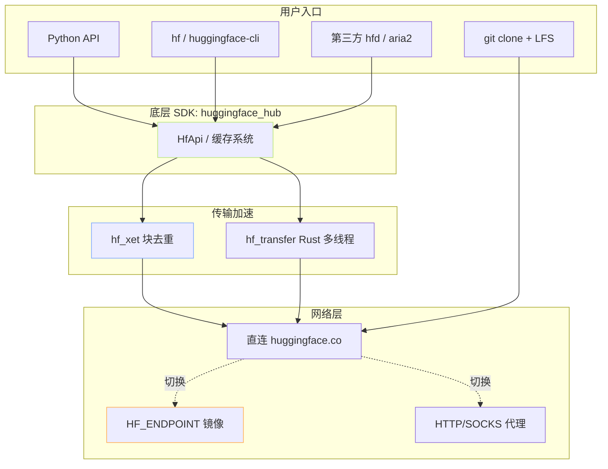

> [!important]
> 
> **前置知识**：先读 [[1. 总览与决策树]]，了解 HF 在「双生态」中的定位。

## 0. 定位

> 一句话：HuggingFace 是国际开源大模型的事实标准 Hub。本节按 **「安装 → Python API → CLI → Git → 加速 → 镜像 → 离线」** 七个子模块系统讲清整条下载链路。

## 1. HF 下载生态全景



## 2. 七大子模块速览

|子页|核心内容|适用场景|
|---|---|---|
|2.1 安装与基础概念|包定位、虚拟环境、Token、缓存路径|第一次接触|
|2.2 Python API 下载|`hf_hub_download` / `snapshot_download` / `from_pretrained`|脚本化、训练流水线|
|2.3 CLI 下载|`hf download` 新命令族|交互式终端、Shell 脚本|
|2.4 Git / Git LFS 路线|`git clone` 配 LFS|无 SDK 环境、版本控制需求|
|2.5 加速与传输优化|`hf_xet` / `hf_transfer` / `hfd`|大模型、带宽紧张|
|2.6 镜像与代理|`HF_ENDPOINT` / 代理|中国大陆访问|
|2.7 离线与可复现|`HF_HUB_OFFLINE` / 预热|内网集群、CI 缓存|

## 3. 同级方法对比（一句话工程判断）

> [!important]
> 
> **Python vs CLI vs Git**：
> 
> - **Python**：训练脚本里直接调，最灵活；选 `snapshot_download`。
> 
> - **CLI**：交互式终端、Shell 自动化；选 `hf download`。
> 
> - **Git LFS**：需要分支/版本切换；选 `git clone`，但**默认不要**——LFS 在大模型场景慢且不可断点续。

## 4. 安装一键命令

```bash
# 安装核心 SDK 与可选 CLI / 加速扩展
pip install -U "huggingface_hub[cli,hf_xet,hf_transfer]"

# 验证
hf --version          # 新版 CLI
huggingface-cli --version  # 旧版 CLI（仍可用）
```

## 5. 子页面导航

[[2.1 huggingface_hub 安装与基础概念]]

[[2.2 Python API 下载]]

[[2.3 CLI 下载]]

[[2.4 Git - Git LFS 路线]]

[[2.5 加速与传输优化]]

[[2.6 镜像与代理（中国大陆访问关键）]]

[[2.7 离线与可复现]]

## 参考文献

- huggingface_hub PyPI. <[https://pypi.org/project/huggingface-hub/](https://pypi.org/project/huggingface-hub/)>

- HuggingFace Hub Download Docs. <[https://huggingface.co/docs/huggingface_hub/guides/download](https://huggingface.co/docs/huggingface_hub/guides/download)>