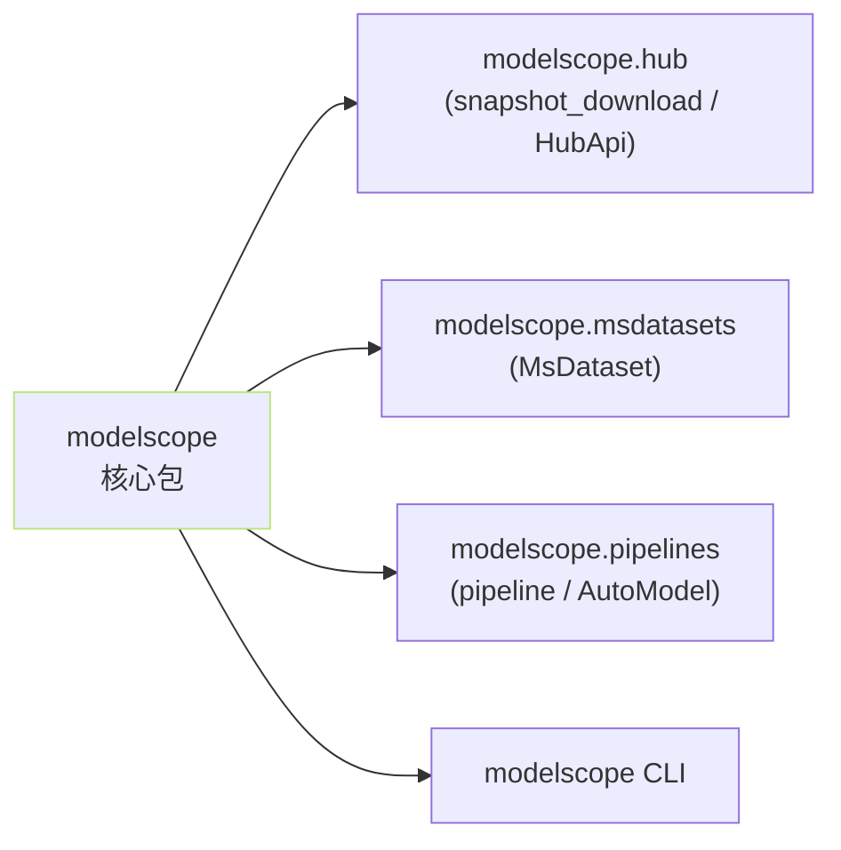

> [!important]
> 
> **前置知识**：[[3. ModelScope 下载生态]]、[[2.1 huggingface_hub 安装与基础概念]]（对照阅读）。

## 0. 定位

> 一句话：建立 `modelscope` 包、SDK Token 与缓存路径三块基础。与 HF 一一对应，但环境变量名不同。

## 1. 包结构



## 2. 与 HF 的三对应

|能力|HuggingFace|ModelScope|
|---|---|---|
|包名|`huggingface_hub`|`modelscope`|
|Token env|`HF_TOKEN`|`MODELSCOPE_API_TOKEN`|
|默认缓存|`~/.cache/huggingface/hub`|`~/.cache/modelscope/hub`|
|缓存 env|`HF_HOME` / `HF_HUB_CACHE`|`MODELSCOPE_CACHE`|
|CLI 入口|`hf` / `huggingface-cli`|`modelscope`|

## 3. 一句话安装 + 验证

```bash
# (a) 最小安装（snapshot_download / MsDataset 够用）
pip install -U modelscope

# (b) 含音频 / 多模态 / 全套依赖
pip install -U "modelscope[audio,multi-modal,nlp,cv]"

# 验证
modelscope --version
python -c "from modelscope import snapshot_download, HubApi; print('OK')"
```

> [!important]
> 
> **不要裸装** `**modelscope**` **期望跳出** `**funasr**` **能力**。音频 / 语音依赖是 extras。训练包需 `ms-swift` 单独装。

## 4. 子页导航

[[3.1.1 安装方式（pip - 源码）]]

[[3.1.2 SDK Token 与登录]]

[[3.1.3 缓存目录与环境变量]]

## 参考文献

- ModelScope GitHub. <[https://github.com/modelscope/modelscope](https://github.com/modelscope/modelscope)>

- ModelScope Hub docs. <[https://modelscope.cn/docs](https://modelscope.cn/docs)>