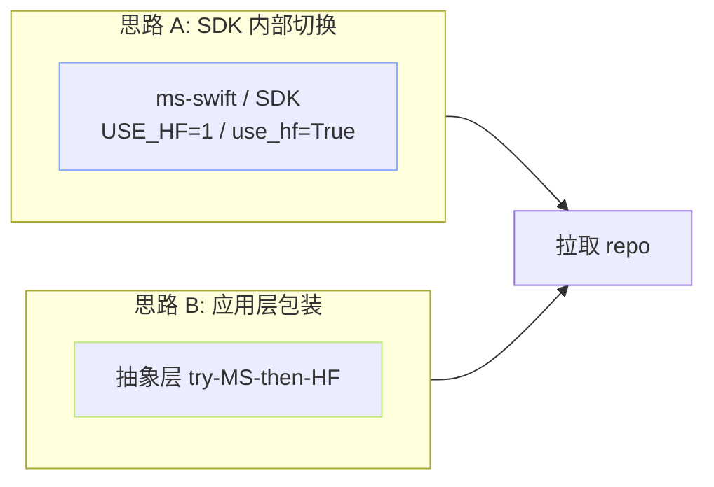

> [!important]
> 
> **前置知识**：[[2. HuggingFace 下载生态]]、[[3. ModelScope 下载生态]]。

## 0. 定位

> 一句话：本页解决「一训练脚本今天走 MS、明天走 HF」的问题，是作为 7.1 “HF/MS 双备份脚本” 的理论基础。

## 1. 两种「多源”思路



## 2. 思路 A：SDK 内部切换

`ms-swift` 提供 `USE_HF` 环境变量：

```bash
# 全局让 ms-swift / modelscope SDK 走 HF 后端
export USE_HF=1

# 或仅在某次调用设上下文
USE_HF=1 python train.py
```

`use_hf=True` 作为 `snapshot_download` 参数也可用（部分版本），表示「调用 MS API，但实际走 HF Hub」。

## 3. 思路 B：抽象层 fallback

```python
# dual_download.py —— MS 优先，失败后 fallback HF
from pathlib import Path

def download_dual(repo_id: str, out_dir: str) -> Path:
    """优先 MS，失败走 HF。任何一个成功都返回本地路径。"""
    out = Path(out_dir); out.mkdir(parents=True, exist_ok=True)
    # 路径 1：ModelScope
    try:
        from modelscope import snapshot_download as ms_snap
        p = ms_snap(model_id=repo_id, cache_dir=str(out / "_ms"))
        print(f"[MS ✓] {repo_id} → {p}"); return Path(p)
    except Exception as e:
        print(f"[MS ✗] {repo_id}: {e}")

    # 路径 2：HuggingFace + 镜像
    import os
    os.environ.setdefault("HF_ENDPOINT", "https://hf-mirror.com")
    os.environ.setdefault("HF_HUB_ENABLE_HF_TRANSFER", "0")
    from huggingface_hub import snapshot_download as hf_snap
    p = hf_snap(repo_id=repo_id, local_dir=str(out / "hf"))
    print(f"[HF ✓] {repo_id} → {p}"); return Path(p)

if __name__ == "__main__":
    download_dual("Qwen/Qwen2.5-0.5B-Instruct", "./dual_out")
```

## 4. 权重同构性

MS 上 Llama/Mistral 类模型一般**直接型同步 HF safetensors**，**可以互插拔**：

- `transformers.AutoModel` 能加载 MS 下载的权重。

- `modelscope.AutoModel` 也能加载 HF 下载的权重。

> [!important]
> 
> **例外**：FunASR / CosyVoice / Paraformer 这类**MS 原生**模型，权重格式是自定义 (`.pt` + `config.yaml`)，不能被 `transformers` 加载。需走 `funasr` / `cosyvoice` 原生加载器。

## 5. 子页导航

[[3.5.1 use_hf=True - USE_HF=1 切换]]

[[3.5.2 权重格式同构性]]

## 参考文献

- ms-swift docs. <[https://swift.readthedocs.io/](https://swift.readthedocs.io/)>

- ModelScope Hub api. <[https://modelscope.cn/docs/models/api](https://modelscope.cn/docs/models/api)>