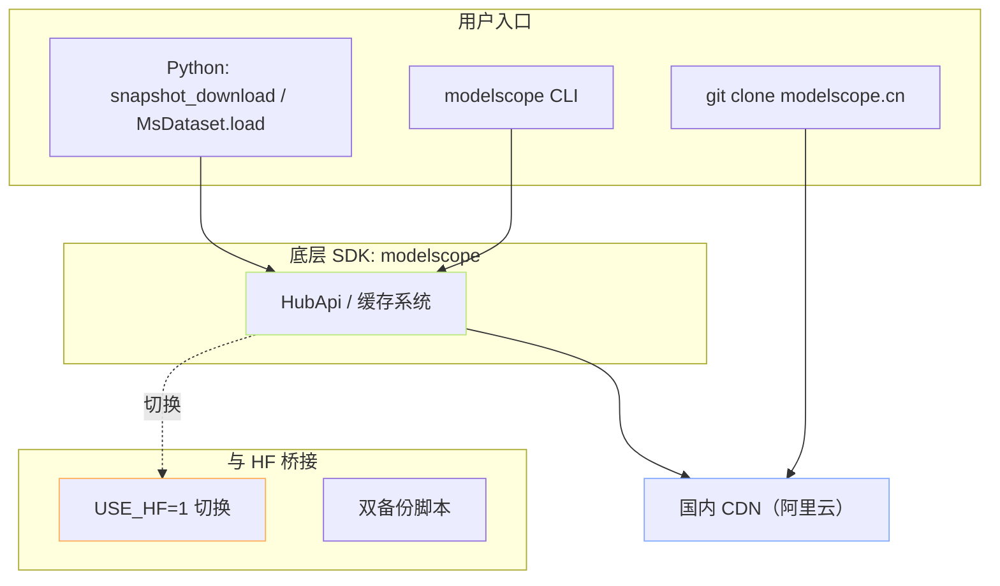

> [!important]
> 
> **前置知识**：先读 [[1. 总览与决策树]] 与 [[2. HuggingFace 下载生态]]。本节内容在结构上与 HF 对齐，方便对照阅读。

## 0. 定位

> 一句话：**ModelScope（魔搭）** 是阿里达摩院 / 通义实验室主导的 Model-as-a-Service 平台，在国内通用模型（Qwen / DeepSeek / 通义 / FunASR / CosyVoice…）覆盖度最高，且**国内直连无墙**。本节系统讲清 MS 的安装、Python、CLI、Git 与 HF 互转。

## 1. MS 下载生态全景



## 2. 五大子模块速览

|子页|核心内容|适用场景|
|---|---|---|
|3.1 安装与基础概念|包定位、SDK Token、缓存路径|首次接触|
|3.2 Python API 下载|`snapshot_download` / `MsDataset.load`|训练流水线|
|3.3 CLI 下载|`modelscope download` v1.36+ 新管线|交互式 + Shell|
|3.4 Git 路线|`git clone` [modelscope.cn](http://modelscope.cn)|无 SDK 环境|
|3.5 与 HF 的互转与混用|`USE_HF=1`、权重同构、双备份|多源训练流水线|

## 3. MS vs HF 关键差异（工程视角）

> [!important]
> 
> **三句话总结**：
> 
> 1. **API 风格高度相似**：`modelscope.snapshot_download` 几乎是 `huggingface_hub.snapshot_download` 的国内孪生版。
> 
> 1. **缓存路径不同**：MS 默认 `~/.cache/modelscope/hub`，HF 默认 `~/.cache/huggingface/hub`，二者**不互通**。
> 
> 1. **国内访问稳定**：MS 走阿里云 CDN，无需 `hf-mirror` 或代理。

## 4. 安装一键命令

```bash
# 仅装核心（足以使用 snapshot_download / MsDataset）
pip install -U modelscope

# 装多模态 / 音频依赖（FunASR、CosyVoice 等）
pip install -U "modelscope[audio,multi-modal]"

# 验证
modelscope --version
python -c "from modelscope import snapshot_download; print('OK')"
```

## 5. 子页面导航

[[3.1 modelscope 安装与基础概念]]

- ModelScope GitHub. <[https://github.com/modelscope/modelscope](https://github.com/modelscope/modelscope)>

[[3.2 Python API 下载]]

- ModelScope 模型下载文档. <[https://modelscope.cn/docs/models/download](https://modelscope.cn/docs/models/download)>

[[3.3 CLI 下载]]

## 参考文献

- ModelScope PyPI. <[https://pypi.org/project/modelscope/](https://pypi.org/project/modelscope/)>

[[3.4 Git 路线]]

[[3.5 与 HuggingFace 的互转与混用]]