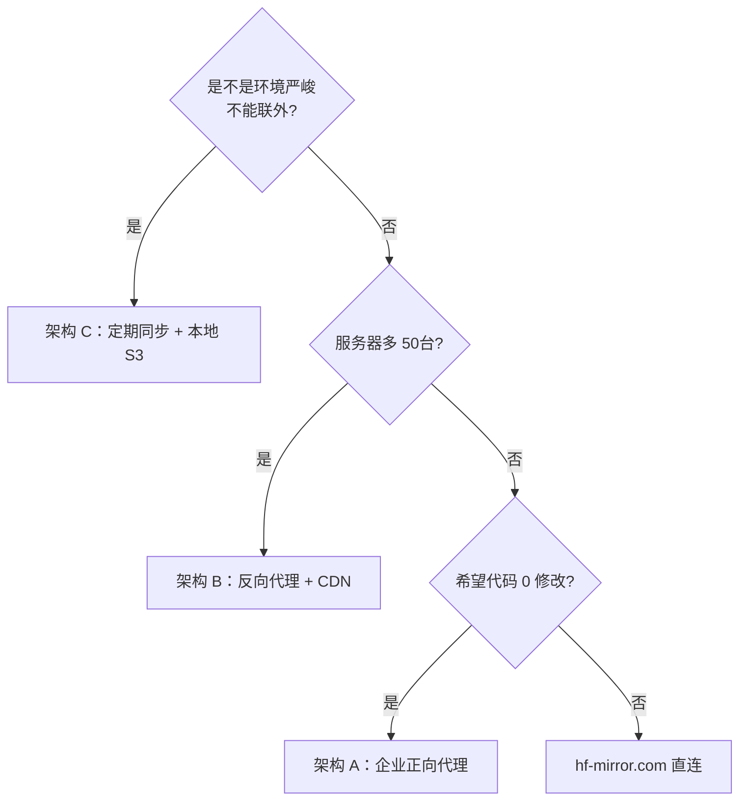

> 除了 [hf-mirror.com](http://hf-mirror.com)，国内还有另外几条「代码 / 权重 CDN」路径以及企业内网场景下的映射方案。该节梳理主要选项、资质与适用边界。

## 主要公共镜像 / CDN 选项

|名称|覆盖|入口|适用|
|---|---|---|---|
|[hf-mirror.com](http://hf-mirror.com)|HF 模型 + 数据集 + API|HF_ENDPOINT=[https://hf-mirror.com](https://hf-mirror.com)|默认首选|
|ModelScope|重点拻列模型、阶氏 / OpenBMB / IDEA 等企业模型|modelscope SDK|官方渠道，透明|
|WiseModel|部分中文 LLM、敢于拉起 / 错位仓库|web 手动下|補充渠道|
|OpenXLab 浦源|上海 AI Lab 生态|web / openxlab SDK|InternLM / InternVL 系首选|
|阶氏云 / DashScope|通义系列 + Embedding / Rerank API|dashscope SDK|仅 API，不提供原始权重下载|
|百度 BCE / 腾讯 TI / 华为 CCE / 阿里 OSS|企业镑位云存储|企业内部 SRE 配|多机多 Region，CDN 能力强|
|aria2 + 推荐跳板|任意镜像 URL 拼接|手工|严峻环境|

## 企业内网几种映射架构

### 架构 A：正向代理 / VPN

```jsx
开发机 → 代理服务器 → 出出 → hf-mirror.com / huggingface.co
```

- 优点：代码不改；HF SDK 原始行为。

- 缺点：当事人占出出带宽；HF token 隐私有被代理记录的风险。

### 架构 B：反向代理 + 本地 CDN（推荐）

```jsx
开发机 → 公司内网镜像服务器 → hf-mirror.com / 官站
                          ↑
                   本地 Nginx + cache，只穿透其他
```

示例（Nginx）：

```jsx
proxy_cache_path /data/hf-cache levels=1:2 keys_zone=hf:64m max_size=2t inactive=180d use_temp_path=off;

server {
  listen 80;
  server_name hf.internal;
  location / {
    proxy_pass https://hf-mirror.com;
    proxy_set_header Host hf-mirror.com;
    proxy_cache hf;
    proxy_cache_valid 200 30d;
    proxy_cache_key $request_uri;
    proxy_buffering on;
    client_max_body_size 0;
  }
}
```

客户端：

```bash
export HF_ENDPOINT=http://hf.internal
```

全公司共享一份热点 LFS，出出流量限于首次拉取。

### 架构 C：定期同步 + 本地 S3

```jsx
cron @daily: rsync類型工具拻取 huggingface-cli download 到 /data/local-models
开发机: HF_HOME=/data/local-models  (全本地读)
```

适合「模型集合固定、训练帖以够」的部门。可以与 MinIO / 内网 S3 集成，轻度 hf 类语义：

```bash
aws s3 sync /data/local-models s3://team-hf/models --endpoint-url http://minio.internal:9000
```

## 商业云服务接入 HF 生态

- **阿里云 OSS 加速**：订阅热点 HF 物件同步到 OSS；ECS 中内网拉取充分利用同 VPC 带宽。

- **腾讯云 COS**：需自己写同步脚本；作为“冷存储 + 本地快位”二级。

- **AWS S3 + CloudFront**：跨区域混合架构需要。

- **阶氏云 OSS + PAI**：直接与 ModelScope 同源，训练作业能零拷贝加载。

## 选型决策树



## 企业场景的额外关注

- **HF token 管理**：不要在共享开发机里明文。推荐走公司 Vault / 1Password Connect。

- **合规**：Gated 模型的许可谈判 / OpenRAIL 类许可是否需公司法务备案。

- **存储设计**：热数据放 SSD（PVC）；冷数据走 S3 / 对象存储。