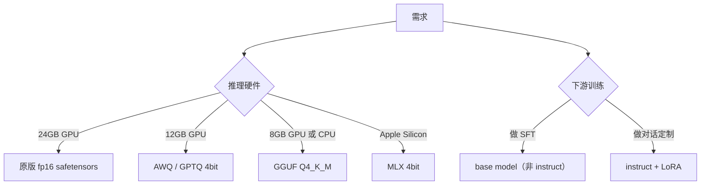

> 在 `Qwen/Qwen2.5-7B-Instruct` 页面的「Model tree」一栏，你会看到：`Base model: Qwen/Qwen2.5-7B`、`Finetunes: 142`、`Quantizations: 87`、`Adapters: 56`。本节解释这套谱系。

## 0. 定位

本节讲清 HF 的「Model tree」展示哪 4 种血缘关系，分别意味着什么、如何反查、怎么从衍生品回到 base 选最适合下载的版本。

## 1. 四种关系

|关系|frontmatter 标识|含义|
|---|---|---|
|finetune|`base_model: X` • `base_model_relation: finetune`（默认）|在 X 基础上继续训练|
|quantized|`base_model_relation: quantized`|权重量化版（GGUF / AWQ / GPTQ / EXL2 / MLX-Q）|
|adapter|`base_model_relation: adapter`|LoRA / IA3 / Adapter，只含小增量权重|
|merge|`base_model: [A, B]` • `base_model_relation: merge`|多个模型权重合并（MergeKit / model_stock）|

frontmatter 示例：

```yaml
base_model: Qwen/Qwen2.5-7B-Instruct
base_model_relation: quantized
tags:
  - awq
```

## 2. API 反查

```python
from huggingface_hub import HfApi
api = HfApi()
info = api.model_info("Qwen/Qwen2.5-7B-Instruct")
print("base_model:", info.cardData and info.cardData.get("base_model"))

# 反向：找所有以 Qwen2.5-7B-Instruct 为 base 的衍生品
for m in api.list_models(filter="base_model:Qwen/Qwen2.5-7B-Instruct",
                         sort="downloads", direction=-1, limit=20):
    print(m.modelId)
```

## 3. 选哪个版本下



## 4. 三类典型谱系图

**Llama 系**：

```jsx
meta-llama/Llama-3.1-8B            (base)
├─ meta-llama/Llama-3.1-8B-Instruct (finetune)
│   ├─ TheBloke/...-AWQ            (quantized)
│   ├─ lmstudio-community/...GGUF  (quantized)
│   └─ unsloth/...-bnb-4bit        (quantized)
└─ NousResearch/Hermes-3-Llama-3.1-8B (finetune)
    └─ ...继续衍生
```

**Qwen 系**：base 与 Instruct 完全分开；社区量化主要挂在 Instruct 上。

**SD/Flux 系**：base 是底模型，社区 LoRA 大量挂在 `base_model: stabilityai/stable-diffusion-xl-base-1.0` 下，单个 LoRA 仅 100 MB。

## 5. 「Spaces using this model」徽标

Model tree 下方还有「Spaces using X」与「Datasets used to train X」。这两块由 HF 后端自动统计：

- Spaces：基于 `app.py` 静态扫描 `from_pretrained("X")` 字符串；可能漏检（动态拼接 repo_id 时）。

- Datasets：基于 README frontmatter `datasets:`。

## 6. 给自己的衍生模型打标

```yaml
---
base_model: Qwen/Qwen2.5-7B-Instruct
base_model_relation: finetune
library_name: peft
pipeline_tag: text-generation
license: apache-2.0
datasets:
  - your-org/your-sft-dataset
tags:
  - lora
  - chat
---
```

这样上传后，Qwen 官方页面会自动把你的模型列在「Adapters / Finetunes」里。

## 参考文献

- Model tree 文档：[https://huggingface.co/docs/hub/model-cards#linking-a-paper](https://huggingface.co/docs/hub/model-cards#linking-a-paper)

- base_model 元数据：[https://huggingface.co/docs/hub/model-cards#base-model](https://huggingface.co/docs/hub/model-cards#base-model)