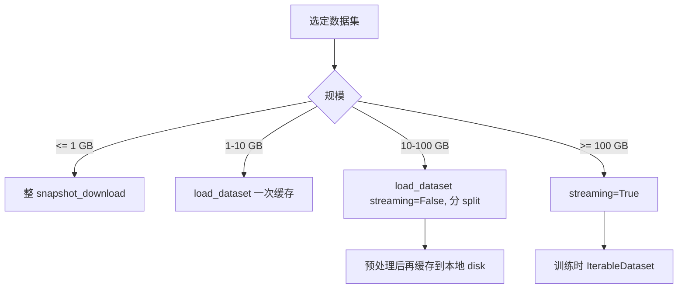

> 数据集列表里你常看到 `Size: 1M\<n\<10M` `Format: parquet` `Modalities: Text` 这类胶囊。本节专讲「规模分级」。

## 0. 定位

本节说明 HF 数据集的 `size_categories` 字段的 9 档枚举、统计单位、API 抽取方式，以及如何根据规模选择「全量下载 / streaming / 分片」。

## 1. size_categories 枚举

|胶囊文本|样本数范围|典型存储|
|---|---|---|
|n&lt;1K|&lt; 1,000|&lt; 10 MB，可整 git clone|
|1K&lt;n&lt;10K|1 千 – 1 万|&lt; 100 MB|
|10K&lt;n&lt;100K|1 万 – 10 万|&lt; 1 GB|
|100K&lt;n&lt;1M|10 万 – 100 万|1 – 10 GB|
|1M&lt;n&lt;10M|100 万 – 1 千万|10 – 100 GB|
|10M&lt;n&lt;100M|1 千万 – 1 亿|100 GB – 1 TB|
|100M&lt;n&lt;1B|1 亿 – 10 亿|1 – 10 TB|
|1B&lt;n&lt;10B|10 亿 – 100 亿|10 – 100 TB|
|n&gt;10B|&gt; 100 亿|PB 级|

frontmatter 写法：

```yaml
size_categories:
  - 1M<n<10M
```

## 2. 与 Croissant 元数据的关系

HF 自 2024 起对数据集页右侧自动展示 Croissant 标签：包含 `recordCount`、`distribution.contentSize` 等更精确数值。比 size_categories 准确，但需作者手动维护或 HF 自动推断。

## 3. API 抽取实际大小

```python
import requests
r = requests.get("https://datasets-server.huggingface.co/size?dataset=wikitext").json()
print(r["size"])
# {'num_bytes_original_files': ..., 'num_rows': ...}

r = requests.get("https://datasets-server.huggingface.co/info?dataset=wikitext").json()
for cfg, v in r["dataset_info"].items():
    print(cfg, v["splits"])
```

这套 datasets-server API 适用于**绝大多数公开数据集**，不依赖作者手动填字段。

## 4. 按规模决定下载策略



## 5. 实战代码

```python
from datasets import load_dataset

# 小数据集：直接加载
ds = load_dataset("imdb")

# 中等数据集：分 split 加载
ds = load_dataset("squad", split="train[:80%]")

# 大数据集：streaming
ds = load_dataset("HuggingFaceFW/fineweb", "sample-10BT", split="train", streaming=True)
for i, ex in enumerate(ds):
    if i >= 3: break
    print(ex["text"][:80])
```

## 6. 磁盘空间预估

```python
from datasets import load_dataset_builder
b = load_dataset_builder("wikitext", "wikitext-103-v1")
print("raw   :", b.info.download_size // 1024**2, "MB")
print("cached:", b.info.dataset_size // 1024**2, "MB")
```

注意：`download_size` 是原始压缩文件（parquet/jsonl.gz）；`dataset_size` 是 Arrow 解开后的体积，通常**比压缩大 2–3 倍**。要 prepare 流程的磁盘空间需准备两者之和。

## 参考文献

- size_categories 规范：[https://huggingface.co/docs/hub/datasets-cards#dataset-card-metadata](https://huggingface.co/docs/hub/datasets-cards#dataset-card-metadata)

- datasets-server API：[https://huggingface.co/docs/datasets-server](https://huggingface.co/docs/datasets-server)