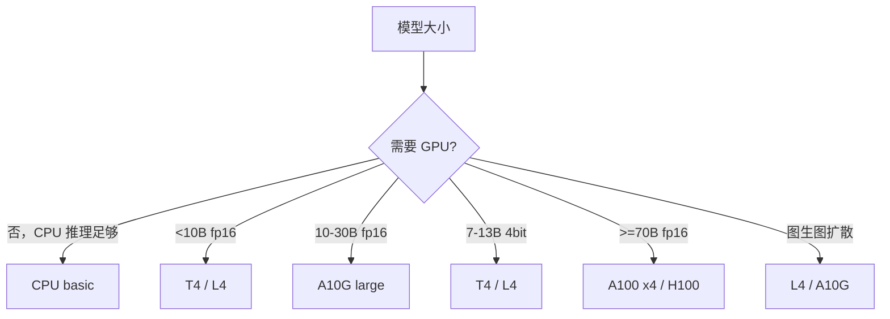

> Space 卡片右上角的 `CPU basic · 2 vCPU 16 GB` 或 `T4 small · 4 vCPU 15 GB` 是硬件徽标。它直接决定该 Space 的成本和你 fork 后要付多少钱。

## 0. 定位

本节给出 HF Spaces 的全部硬件 SKU、单价、显存、典型用途，并讲清「ZeroGPU」「Spaces Dev Mode」这两个特殊徽标。

## 1. SKU 全表（截至 2026）

|徽标|vCPU|RAM|GPU|显存|价格（按小时）|
|---|---|---|---|---|---|
|CPU basic|2|16 GB|—|—|免费|
|CPU upgrade|8|32 GB|—|—|$0.03|
|Nvidia T4 small|4|15 GB|T4|16 GB|$0.40|
|Nvidia T4 medium|8|30 GB|T4|16 GB|$0.60|
|Nvidia L4|8|30 GB|L4|24 GB|$0.80|
|Nvidia L4 x4|48|186 GB|4×L4|96 GB|$3.80|
|Nvidia A10G small|4|15 GB|A10G|24 GB|$1.00|
|Nvidia A10G large|12|46 GB|A10G|24 GB|$1.50|
|Nvidia A10G x4|48|184 GB|4×A10G|96 GB|$5.00|
|Nvidia A100 large|12|142 GB|A100|80 GB|$4.00|
|Nvidia A100 x4|48|568 GB|4×A100|320 GB|$15|
|Nvidia H100|24|240 GB|H100|80 GB|$10|
|Nvidia H100 x8|192|1920 GB|8×H100|640 GB|$80|
|TPU v5e|—|—|TPU v5e|—|$1.20|
|ZeroGPU|动态|动态|A100|40 GB（共享）|免费（Pro 用户）|

> ⚠️ 价格随时更新，以 [https://huggingface.co/pricing](https://huggingface.co/pricing) 为准。

## 2. ZeroGPU 徽标 ⚡（重点）

2024 起 HF 推出 ZeroGPU：**Pro 用户/企业用户专享，按调用秒数共享 A100 池**。

- 卡片显示 `ZeroGPU` 紫色徽标。

- 代码必须用装饰器：

```python
import spaces
@spaces.GPU(duration=60)  # 每次调用最多占 GPU 60 秒
def generate(prompt):
    ...
```

- 调用之间释放 GPU，因此**冷启动时间 0.5–2 秒**。

- 适合 demo / 短推理；不适合常驻服务。

## 3. Spaces Dev Mode 徽标 🛠

Pro 用户可对 Space 打开 Dev Mode，相当于一个 VS Code Web IDE 直连容器。卡片不显示，但你 fork 后能在 Settings 看到「Dev Mode」按钮。

## 4. 改硬件

```python
from huggingface_hub import HfApi
HfApi().request_space_hardware("<user>/<space>", hardware="a10g-small")
```

或在 Web UI：Space → Settings → Space hardware。

## 5. 选硬件公式



## 6. 在筛选器里使用

```jsx
https://huggingface.co/spaces?hardware=zero-a10g&sort=likes
https://huggingface.co/spaces?hardware=cpu-basic
```

## 7. Persistent storage 徽标 💾

硬件徽标右边偶尔会有 `Persistent Storage: 50 GB`。意味着该 Space 挂载了持久盘（`/data`），重启不丢。常见用途：图片生成 demo 缓存输入、向量库 demo 持久 Faiss 索引。

## 参考文献

- Spaces 硬件价目：[https://huggingface.co/pricing](https://huggingface.co/pricing)

- ZeroGPU 文档：[https://huggingface.co/docs/hub/spaces-zerogpu](https://huggingface.co/docs/hub/spaces-zerogpu)

- Persistent storage：[https://huggingface.co/docs/hub/spaces-storage](https://huggingface.co/docs/hub/spaces-storage)